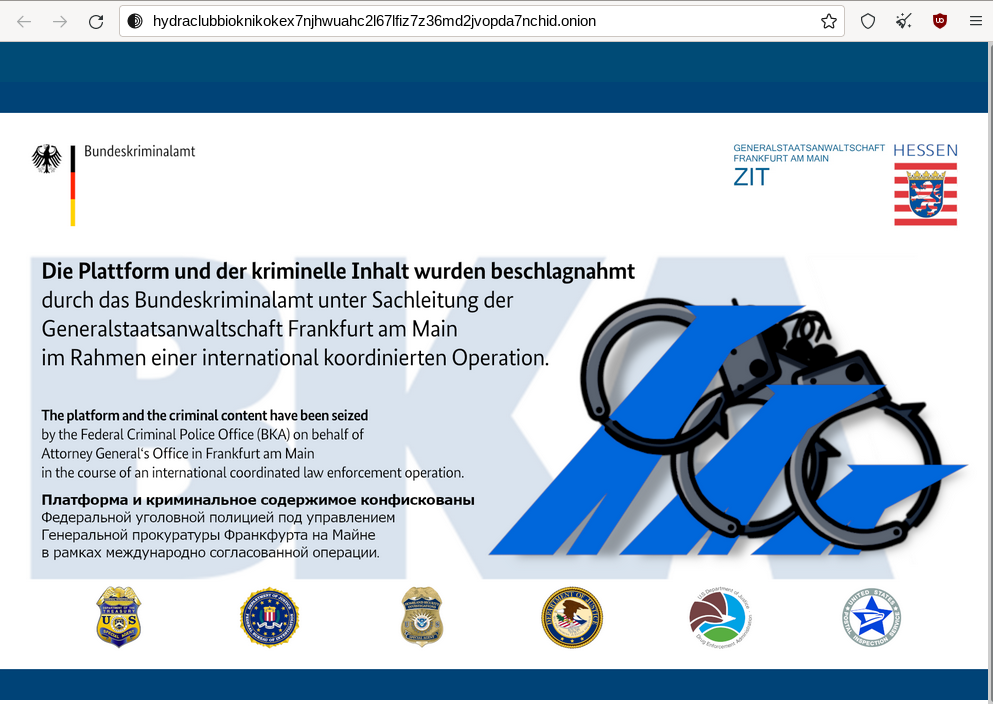

Chapter 1: Overview of The Dark Web
###################################

The Dark Web is often misunderstood, mixed with other layers (i.e., Surface Web and Deep Web), and sometimes even wrongly described as a parallel network to the Internet while entirely relying on the Internet. Many websites only list Tor to access the Dark Web, creating confusion for people curious to understand what the Dark Web is. This chapter is essential to clarify what the Dark Web is and introduces the concept of darknets, which will be further detailed in the following chapters. It also covers security considerations you should know when connecting to darknets.

Surface Web, Deep Web, and Dark Web
***********************************
Definitions
===========
Before exploring the Dark Web’s concepts, it is crucial to understand its different layers. The Internet can be represented as an iceberg divided into three sections, as described below.

The **Surface Web** is the visible portion of the iceberg. It is readily available to the public and searchable with standard web search engines. It is also called the “Visible Web” or “Clearnet,” representing only 4% of the global Internet. Examples are google.com, wikipedia.org, youtube.com, and aldeid.com.

The **Deep Web** is part of the World Wide Web that is still accessible with standard browsers by direct URL or IP address but whose contents are not indexed by standard search engines. Access to these contents is often only granted to authorized authenticated personnel, but sometimes, it is password-protected or not indexed. Examples: online banking, webmail, the admin backend of a web application, and password-protected private publications.

The **Dark Web** (formed by darknets) is defined as a layer of information and pages that you can typically only get access to through so-called “overlay networks” (the darknets), which run on top of the standard Internet and obscure access. You may find some definitions on the Internet or books that define the Dark Web as a subset of the Deep Web (because standard search engines do not index content on the Dark Web). Still, in my opinion, this should not be as it has its specifics, and as explained later in this book, some contents may be indexed by some specific search engines (e.g., Ahmia) available from the Surface Web. Bridges allow anyone to browse darknets from a standard Web browser without any particular configuration. In most cases, though, special software is required to access darknets, while you can access the Deep Web from any standard browser provided you are granted access and know the address.

   The iceberg view of the Internet (Surface Web, Deep Web, Dark Web) [#]_
   
Boundaries Are Not That Obvious
===============================
The proportion of websites exclusively on the Surface Web is likely very low, as most dynamic websites have one part of their content on the Surface Web (application frontend) and another part (application backend) on the Deep Web. The public part of the website is fully indexable. In contrast, other parts (e.g., administration, private content) are not indexed because robots are explicitly told not to index the directory (see an example below), access requires authentication, or access is limited to a given range of IP addresses.
 

   
   Example of robots.txt file that explicitly excludes some directories from indexing. All the directories followed by the "Disallow" statement are part of the "Deep Web."

Some websites are on both the Surface Web and the Dark Web. For example, Facebook, X, or ProPublica also have Onion Services, meaning you can browse them through the Tor darknet.

The Dark Web Is Composed of Darknets
************************************
What Is a Darknet?
==================
A darknet is an intentionally hidden overlay on top of the existing Internet infrastructure that can only be accessed using special software, configurations, or authorization. Darknets prioritize user anonymity, making tracing user activity or identifying individuals difficult. This anonymity is achieved through various techniques and often unique communication protocols, employing strong encryption and security measures to protect user privacy and data. As a result, darknets are less accessible to the general public than the Surface Web.

Darknets often host illegal activities, although this is not a mandatory criterion. However, they can also be platforms for free speech and privacy-focused communication.

A broader definition allows many closed networks to be considered darknets. These could include BitTorrent private trackers and darknets created and maintained by users with specific interests, often fostering niche communities.

The Different Darknets
======================
Many darknets exist, and together, they make up the Dark Web.
Below is a list of four widespread darknets that are detailed in this book:

- **Tor** [#]_ known as “The Onion Router,” an anonymity network offering a darknet through its Onion Services.
- **I2P** [#]_ known as the “Invisible Internet Project,” is an overlay proxy network that features hidden services called "Eepsites."
- **Hyphanet** [#]_, formerly known as Freenet, is a peer-to-peer platform for censorship-resistant and privacy-respecting publishing and communication.
- **ZeroNet** [#]_ is a decentralized web-like network of peer-to-peer users using Bitcoin crypto and the BitTorrent network.

Some examples of other less popular darknets are listed below.

- **anoNet** [#]_ is a decentralized friend-to-friend network built using Virtual Private Networks (VPNs) and software Border Gateway Protocol (BGP) routers. 
- **GNUnet** [#]_ is a network protocol stack for building secure, distributed, and privacy-preserving applications that can be utilized as a darknet if enabled by the “Friend-to-Friend (F2F) network topology" option.
- **Hyperboria Network** [#]_ formerly known as Project Meshnet, is a peer-to-peer (P2P) IPv6 network with automatic end-to-end encryption, distributed IP address allocation, and Distributed Hash Table (DHT-based) Source Routing.
- **Lokinet** [#]_ is a decentralized Onion Router that uses Oxen service nodes as relays, giving Lokinet the same market-based Sybil attack resistance as the Oxen blockchain.
- **Riffle** [#]_ is a client-server darknet system that simultaneously provides secure anonymity (as long as at least one server remains uncompromised), efficient computation, and minimal bandwidth burden.
- **Utopia P2P Ecosystem** [#]_ is a feature-rich platform based on P2P specifically designed to protect the privacy of communication, confidentiality, and security of personal data. It includes Instant Messaging, File Transfer, uWallet, and multiplayer games.

.. note::

    Some other networks are not considered inherently darknets but can be configured to function similarly to darknets under specific circumstances. For example, turning off the Distributed Hash Table (DHT) and Discovery features in RetroShare and IPFS can significantly increase anonymity, which is the reason why they are considered darknets by some sources. [#]_

Darknets' Purposes
==================
Darknets have been designed to focus on specific purposes (bypassing restrictions, censorship resistance, anonymity, privacy, resilience, speed, etc.). Therefore, each user's choice of a darknet will likely be motivated by what is most important to them.

For example, if your objective is anonymity or bypassing restrictions, Tor may be a good candidate. In contrast, if your objective is resistance to censorship or resilience, you will likely prefer Hyphanet.

.. note::

    Some darknets do not offer built-in anonymity but are designed to run with other darknets. For example, ZeroNet is made to work with anonymous networks: you can easily hide your IP using the Tor network.

There are a variety of reasons why people connect to the Dark Web, or more specifically to a particular darknet, and everyone has their rationale:

- Protection against mass surveillance.
- Whistleblowing and news leaks.
- Circumventing network censorship and content-filtering systems or bypassing restrictive firewall policies.
- File sharing (confidential files, cracked software, pornography, etc.)
- Cyber threats (0 days, exploits, botnets, ransomware, APT, etc., …)
- Purchase or sale of restricted goods on darknet markets (alcohol, tobacco, etc.)
- Purchase or sale of illegal goods or services (drugs, weapons, stolen credit card numbers, counterfeit certificates, etc.)

With these scenarios in mind, there are legitimate and ethical use cases for connecting to the Dark Web. Unless expressly prohibited by your country’s laws, it is not illegal to do so.

Connecting to Darknets
======================
A critical point to understand is that multiple darknets collectively make up the Dark Web, and no single client or software allows you to browse the so-called “Dark Web.” Clients are only developed to access specific darknets. It means you won’t be able to browse eepsites (I2P) with the Tor Browser, and vice-versa. I’ve sometimes read confusing statements that said, “The easiest way to browse the Dark Web is by using Tor Browser.” The Tor Browser allows you to either anonymously browse the Surface Web or Onion Services (the Tor’s darknet), and that’s all. A more appropriate statement would be: “The easiest way to connect to Tor's darknet is by using Tor Browser.” In the same way, run I2P Router or i2pd to browse the I2P darknet [#]_.

.. note::

    As explained later in this book, there are ways to access Tor Onion Services directly from the Surface Web without connecting to Tor. However, it is not recommended to use these services as it will jeopardize your anonymity. These services are also responsible for another issue; they expose “hidden content” to search engines, which is not supposed to happen, as Surface Web search engines do not index darknets.
 
	.. figure:: images/image3.png
	   :width: 800
	   :alt: Tor bridges exposing hidden content to search engines
	   :class: with-border

	   Tor bridges available on the Internet are exposing "hidden content" to search engines.

Similarities and Differences Between Darknets
*********************************************
Where Are Darknet Markets (DNMs)?
=================================
The Dark Web has blogs, forums, file sharing, news, software, search engines, directories, porn, videos, music, torrents, pastes, books, tutorials, etc. In that sense, it doesn’t sound much different from the Surface Web. And this is the kind of content common between the four studied darknets. There are, of course, differences between darknets, and the most obvious one is probably on darknet markets (DNM).

To be clear, Tor is where you will find DNMs. Few DNMs exist on I2P but are closed, abandoned, or empty. Some markets available on Tor (Bohemia, Incognito, Kingdom Market, and Toor2door Market) started considering the possibility of operating on Tor and I2P darknets to improve accessibility. The main reason is that between 2022 and 2023, Tor suffered from a wave of Distributed Denial of Service attacks (DDoS) [#]_. At the time of writing, these DNMs are no longer served through I2P.

   Three Tor DNMs (Tor2door, Incognito and Bohemia) cloned to I2P, now closed.

“SilkRoadReloaded” on the I2P darknet is a Darknet Market that seems abandoned. When checked in 2023, some items were for sale, as shown in *Figure 5*. In December 2024, the catalog became empty, and a welcome message indicated that the site was supposed to return in July 2024 (*Figure 6*).

   SilkRoadReloaded on I2P, checked in 2023.

.. figure:: images/image6.png
   :width: 800
   :alt: SilkRoadReloaded on I2P checked in 2024
   :class: with-border

   SilkRoadReloaded on I2P, checked in December 2024, showing an empty catalog.

LOULAN seems to be the only DNM remaining on I2P with few items for sale. This DNM is also available on Tor [#]_.
 

   LOULAN on I2P, also available on Tor.

Sites Lifetime, Availability, and Turnover
==========================================
Some indexes reference resources that are no longer available, or with random availability, sometimes even with significant downtimes. This is sometimes due to too many requests against a centralized service (e.g., ZeroID on ZeroNet), but sometimes on purpose (e.g., fear of being caught because of illegal content). For DNM, there is a significant turnover due to seizure by law enforcement, and you’ll sometimes find DNM unavailable for several days without explanation.

Static vs Dynamic Content
=========================
Due to the design of some darknets, it’s not always possible to offer the same dynamic features as the ones you are used to see on the Surface Web, and you may feel some frustration while connecting to Hyphanet or ZeroNet because some sites may not be as user friendly as what you may see on Tor. There is sometimes a feeling of browsing web pages from the 90’s. However, it doesn’t mean that dynamic sites can only be used on Tor. For example, Hyphanet or ZeroNet have search engines, blogs, and forums, but they work differently and rely on client-side processing (local SQLite database and JavaScript client-side scripting language).

Censorship-Resistance, Anonymity, Resilience, and Speed
=======================================================
Because each darknet focuses specifically on censorship resistance, anonymity, or resilience, it is not all equal in terms of speed, and again, you may feel frustrated during your browsing experience.

Regarding speed, it is essential to understand that each of the criteria previously mentioned has a cost and may negatively impact speed. Proxying network traffic through several nodes will ultimately make requests and responses slower, mainly when you rely on community-based nodes, but this is the cost of anonymity. Also, remember that darknets are improving over time, and updates are often available to fix vulnerabilities or increase performance.

Darknet Markets (DNM)
*********************
What Are DNM?
=============
Darknet Markets (DNM) are unique places on the Dark Web where goods and services are sold. Most of the items sold are illegal, and cryptocurrency (Bitcoin, Monero, etc.) is the only form of payment accepted. Some DNMs are general markets that sell a wide range of goods or services, and some are more specialized (e.g., personally identifiable information, leaked or stolen credit cards, dumps of stolen authentication credentials, remote access, etc.). Below are examples of content sold on some popular DNMs.

   DarkFox is an example of DNM on the Tor darknet.
   

   Categories and associated number of items available on Dark0de Reborn, the biggest DNM on Tor.

   AlphaBay Market on I2P.

   Citrus.i2p seems to be a Ukrainian DNM on I2P, selling high tech products.

Wide Range of DNM
=================
The chart below represents the total number of listings, all categories included, on darknet markets available on the Tor darknet as of November 2021, according to a study conducted by Flare [#]_. It shows a wide range of DNM, not equal in size, referring to the number of items sold on each.
 

   Total listings per Darknet Market.

Lifetime and DNM Seizures
=========================
Dark Web sources of cybercriminal activity (e.g., DNMs, forums) are never permanent. They are often shut down by law enforcement or taken offline by administrators to avoid getting caught. For this reason, DNM lifetime is usually short (less than a year on average), and DNMs are sometimes offline for several hours or days for unexplained reasons. Some exceptions exist, and the most enduring DNMs have existed for several years.

For that reason, some market administrators are relying on a technique of regularly updating a file (canary.txt) containing a PGP-signed message as proof that they are still in control of the darknet market.

The graph (extract) below shows that many DNM have a lifetime of less than a year.
 

   Darknet Market Timeline (extract). 

The biggest threat to DNM is law enforcement seizing it. The example below shows the seizure advisory on the Hydra Market.
 

   Hydra market has been seized in 2022.

Reputation / Exit Scam
======================
An exit scam occurs when the moderators of a darknet marketplace suddenly shut down the operation without warning, stealing users’ and vendors’ funds.
 

   Exit Scamming DNM Lifecycle. [#]_

Unfortunately, this can happen to any DNM at a time, and there is no guarantee. For that reason, many sites, discussion boards, and forums evaluate DNMs and flag them when users report a potential exit scam.

Therefore, if you plan to buy on the Dark Web, you are strongly advised to collect as much feedback as possible about the targeted marketplace.

Buying on the Dark Web
**********************
Avoiding Scams
==============
You are likely familiar with buying on the Surface Web and know caveats to avoid when buying on a website. You will likely unquestioningly trust some marketplaces (e.g., Amazon) and systematically check the reputation of others before buying from them. You may also rely on third-party online payment platforms (e.g., Paypal) instead of providing your credit card number.

Buying on the Dark Web is very different and involves many precautions. “Trust” and “anonymity” may have completely different meanings and priorities. Marketplaces’ trust can never be acquired as it may change overnight, and avoiding scams is not easy.

Buying Cryptocurrency
=====================
Payments on the Dark Web are exclusively made through cryptocurrency, and you will not provide your credit card information anywhere. This section is not a crash course about cryptocurrency, but it gives some basic information that must be understood as prerequisites to buying on the Dark Web.

Bitcoins (often abbreviated BTC) and Monero (often abbreviated XMR) are the most prevalent cryptocurrencies on DNM. There are several ways to get Bitcoins or Monero, including signing up at an online exchange [#]_, withdrawing from Bitcoin ATMs [#]_, exchanging money for Bitcoins or Monero with people, buying Bitcoins directly from friends, or mining your coins.

Not all of the previously mentioned options offer the same level of anonymity. As many items bought on the Dark Web are illegal, there is a high demand for purchasing cryptocurrency anonymously. However, this is not always possible because many services require ID verification, a process known as KYC (Know Your Customer).

Buying cryptocurrency anonymously is still possible. This book won’t detail these methods, but if you’re interested, be informed that there are some options, including MyCelium [#]_, Bitcoin ATM [#]_ and Decentralized Exchange (DEX) platforms [#]_ like Crypton Exchange or Bisq, which rely on the Utopia P2P ecosystem and Tor, respectively. In that sense, buying cryptocurrency on these exchange platforms is like purchasing cryptocurrency on the Dark Web.

   Bitcoin ATM distribution as shown by coinatmradar.com.

Bitcoin (BTC) vs Monero (XMR)
=============================
While Bitcoin (BTC) is the most widespread cryptocurrency, it suffers from a lack of anonymity, and tracking Bitcoin is possible using blockchain analysis [#]_, which may reveal Bitcoin transactions. With Bitcoin, one address is used for multiple transactions, making tracking easier via the publicly accessible blockchain. Even using tumblers/mixers to obfuscate the origin of the Bitcoins won’t be bulletproof.

   Bitcoin mixing process.

Monero (XMR) might offer better anonymization than Bitcoin. Unlike Bitcoin, Monero generates a new wallet address for each transaction. Moreover, transaction details are encrypted using a transaction key owned by the transaction maker.

For this reason, Monero is progressively accepted in DNM, and some DNM have even stopped accepting payments in Bitcoins [#]_.

Crypto Wallets
==============
Crypto wallets store your private keys, keeping your cryptocurrencies safe and accessible. They also allow you to send, receive, and spend your cryptocurrencies.

There are hardware wallets (e.g. Ledger [#]_ or Trezor [#]_) and software wallets for Bitcoins (e.g. Guarda [#]_, Electrum [#]_, or MyCelium [#]_) and for Monero (Monero GUI Wallet [#]_ or Feather [#]_).

Transaction Workflow
====================
Suppose you are buying on the Dark Web. In that case, whatever wallet you choose to store your cryptocurrencies, you may want to use a dedicated software wallet within your Tails or Whonix distribution for the transactions on the Dark Web only to transfer the amount needed for the transaction. For illegal transactions, buyers will also likely do that to add a plausible deniability layer in case of investigation against them, as they could pretend not to have the identity of whom they sold the coins from their standard wallet. Also, many DNMs will only allow payments once you have credited your account, with a minimum amount they define.

The resulting workflow would translate as follows:
 

   Common workflow to buy items on the Dark Web using cryptocurrency.

As regards to the payment methods, there are several types:

- **Standard escrow**: The buyer sends the coins to the DNM wallet, and the DNM holds the money until the buyer confirms the order is complete. Unless the DNM exit scams, the coins are transferred to the vendor’s wallet. In case of dispute, a member of the DNM staff will step in and, after a discussion with the two parties, decide which party will get the coins.
- **2-of-3 Multisig (multi-signature)**: The multi-signature technology requires two signatures (out of 3 between the buyer, the DNM, and the vendor) to authorize a transaction. In case the DNM doesn’t sign the transaction (exit scam or seizure), signatures from both the buyer and the vendor will release the money. In case of a dispute, the DNM party arbitrates and grants his signature to either the buyer or the vendor so that the money is redeemed.
- **Direct Deal (or Finalize Early)**: in this transaction, there is no third party, and the buyer transfers his coins directly to the vendor. It protects both parties against DNM exit scams, but it doesn’t protect the buyer against rogue vendors.

The screenshot below, taken from a Darknet Market, shows items for sale and their respective transaction types (Escrow, Multisig, FE), which appear as a colored flag on the pictures.

   Items sold on a DNM, showing the type of transaction (escrow, multisig, or FE).

Security Considerations
***********************
Of course, security requirements will vary greatly depending on the user’s profile and intentions. Still, for anyone willing to browse the Dark Web, there are a few minimum security considerations to remember.

Virtual Private Network (VPN)
=============================
Browsing Tor or I2P over a Virtual Private Network (VPN) in terms of security value add is often asked on the Internet, but there is no simple answer. It all depends on your objectives and your trust in the VPN provider.

.. epigraph::

   “Using a VPN with Tor is not the obvious security gain that people make it out to be. Users may not lose any safety by adding a VPN, but they certainly aren’t gaining any.”

   -- Matt Traudt

.. epigraph::
   
   “We don’t talk about it a lot, but VPNs are entirely based on trust. As a consumer, you have no idea which company will best protect your privacy. You don’t know the data protection laws of the Seychelles or Panama. You don’t know which countries can put extra-legal pressure on companies operating within their jurisdiction. You don’t know who actually owns and runs the VPNs. You don’t even know which foreign companies the NSA has targeted for mass surveillance. All you can do is make your best guess, and hope you guessed well.”

   -- Bruce Schneier

In April 2022, the Hydra darknet market was seized, and Sophos wrote an interesting post about it. [#]_  Below is what Sophos wrote about VPN providers:

.. epigraph::

   “Some VPNs claim not to keep any logs of past connections, and therefore claim that it’s impossible for the police in their country or anywhere else to track back old traffic, because no records of any IP numbers are retained. But there are many cases where “log-free” VPN providers turned out not only to be keeping logs anyway, but also to have suffered data breaches that leaked this “non-existent” information to outsiders [#]_. In fact, the problem with relying on a VPN provider as the primary way of maintaining your anonymity is that you have to have total trust in the technical abilities and ethics of the provider and all their staff.”

Let’s start by recalling the difference between privacy and anonymity. Privacy is about hiding what you do but not who you are, while anonymity is hiding who you are but not what you do.

Applied to the Tor network, Tor provides anonymity by making it impossible for a single point in the network to know both the origin and destination of a connection. On the other hand, VPN providers guarantee (at least theoretically [#]_) privacy by encrypting the network traffic between you and their servers. If the VPN provider keeps your logs, your privacy claims are invalidated, jeopardizing your anonymity. This is why Tails (a distribution to access the Tor network) doesn’t support VPN [#]_.

Unless you’re in one of the below cases, I wouldn’t recommend connecting to a VPN before browsing the Dark Web:

- You want to hide that you’re using Tor to your ISP (note that the VPN provider will know you’re using Tor, though).
- You want to hide your IP address from the Tor entry/guard relay.

Operating System
================
It is highly recommended that you run a Linux-based distribution, ideally without persistent storage (e.g., Tails runs from a bootable USB stick). Running a Linux distribution on a virtual machine might be an alternative, but it may keep track of your activities.

Tails is an excellent distribution as it already has all the tools you need to browse Tor and is pre-configured to force all Internet traffic to be piped through the Tor network. Notice that Tails’ purpose is to facilitate the usage of Tor. A custom Linux distribution is probably the best option if you wish to browse other darknets.

Browser Security
================
JavaScript is present on most websites and is sometimes required to work correctly. Unfortunately, attackers can use JavaScript maliciously to exploit vulnerabilities or gather session details, especially on the Dark Web. A recommendation is to always set the security slider to “high” in the browser settings (In Tails, you’ll need to do that every time the machine is booted as there won’t be any persistence over reboots) to make sure JavaScript is disabled. The “NoScript” extension [#]_ can also be helpful.

Personal Identifiable Information (PII)
=======================================
Access to most of the forums on the Dark Web requires a subscription. Never provide personal information on any of the sites you visit on the Dark Web, and create a fake identity that you can use instead. Also, to avoid easy correlation, create different profile names for each of your accesses, and none that could be linked to profiles you have made on the Surface Web. A dedicated section in this book lists free email providers if an email is required during the account creation process. 

-----

.. [#] Source: https://www.researchgate.net/figure/the-Internet-layers-Source-designed-by-the-author_fig1_359749048
.. [#] https://www.torproject.org/
.. [#] https://geti2p.net/
.. [#] https://www.hyphanet.org/
.. [#] https://zeronet.io/
.. [#] http://anonet.org/
.. [#] https://www.gnunet.org/
.. [#] https://hyperboria.net/
.. [#] https://lokinet.org
.. [#] https://people.csail.mit.edu/devadas/pubs/riffle.pdf
.. [#] https://u.is/
.. [#] https://en.wikipedia.org/wiki/Darknet
.. [#] To be more accurate, I2PRouter and i2pd are servers that will connect you to the I2P darknet. You’ll then need to configure a local proxy in your browser to browse I2P.
.. [#]   https://www.bleepingcomputer.com/news/security/tor-and-i2p-networks-hit-by-wave-of-ongoing-ddos-attacks/
.. [#] http://loulan3dwsl6ycvvszpu5xppnx5a7ajbqz4q3hidkt6t6aquzvaff6qd.onion
.. [#] https://flare.io/learn/resources/dark0de-2021s-darknet-market-leader/
.. [#] https://www.reddit.com/r/darknetvideo/comments/10ytfu2/my_pictorial_interpretation_of_the_darknet_market/
.. [#] Binance (https://www.binance.com/) or Coinbase (https://www.coinbase.com/) for example.
.. [#] You can check the distribution of Bitcoin ATMs here: https://coinatmradar.com/.
.. [#] MyCelium (https://play.google.com/store/apps/details?id=com.mycelium.wallet) is an Android application that allows you to meet Bitcoin vendors in your location.
.. [#] https://coinatmradar.com/
.. [#] For an exhaustive list of DEX, you can refer to this link: https://www.coingecko.com/en/exchanges/decentralized
.. [#] Read “Blockchain Analysis of The Bitcoin Market” for more information (https://www.nber.org/system/files/working_papers/w29396/w29396.pdf).
.. [#] https://newsbtc.com/news/bitcoin/why-the-dark-nets-most-active-market-ditched-bitcoin-for-monero/
.. [#] https://www.ledger.com/
.. [#] https://trezor.io/
.. [#] https://guarda.com/
.. [#] https://electrum.org/
.. [#] https://wallet.mycelium.com/
.. [#] https://www.getmonero.org/downloads/#gui
.. [#] https://featherwallet.org/download/
.. [#] https://nakedsecurity.sophos.com/2022/04/06/serious-security-darkweb-drugs-market-hydra-taken-offline-by-german-police/
.. [#] https://nakedsecurity.sophos.com/2020/07/20/7-vpns-that-leaked-their-logs-the-logs-that-didnt-exist/
.. [#] https://gist.github.com/joepie91/5a9909939e6ce7d09e29
.. [#] https://tails.net/support/faq/index.en.html#vpn
.. [#] https://noscript.net/getit/