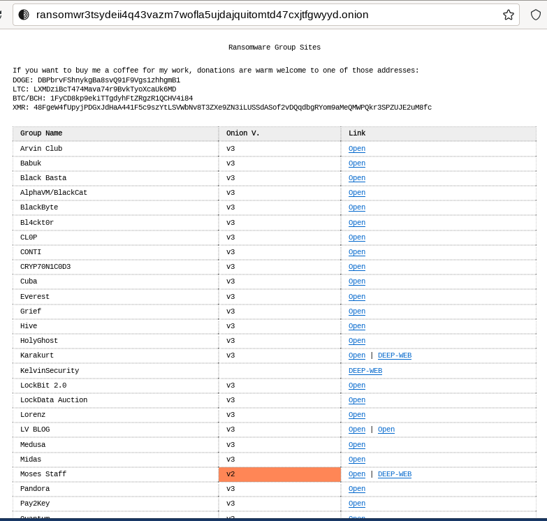
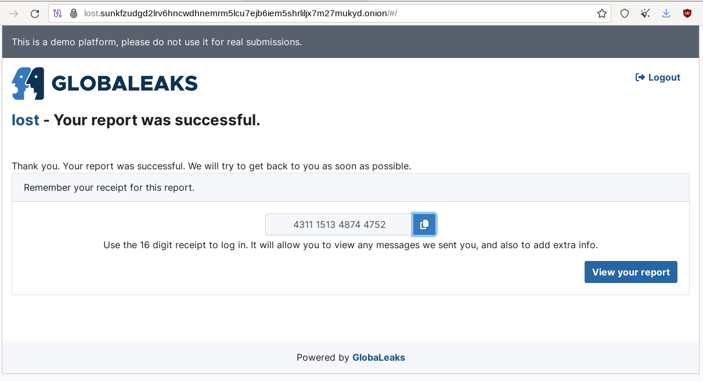

Chapter 2: Tor
##############

What Is Tor and How Does It Work?
*********************************
First and Foremost, What Is Tor?
================================
Tor (also known as The Onion Router) is a free and open-source software intended to improve anonymity and privacy on the Internet. It directs Internet traffic through an accessible worldwide overlay network, consisting of thousands of relays (also called Tor nodes) hosted by volunteers (including individuals, police enforcement organizations, and government agencies) to build encrypted circuits that aim at concealing user’s location and usage from anyone conducting network surveillance or traffic analysis.

Origin of Tor
=============
In the 90s, in a context of increasing digitalization and mass surveillance, three researchers (David Goldschlag, Mike Reed, and Paul Syverson) from the U.S. Naval Research Lab (NRL) began to work on a project that would allow anonymous communications and started to develop a way to route encrypted data through a network of computers placed all around the world [#]_.

Later, in 2000, Roger Dingledine, a recent Massachusetts Institute of Technology (MIT) graduate, began working on an onion routing project with Paul Syverson, which he named the “Tor project” (The Onion Routing). Nick Mathewson, a classmate of Roger’s at MIT, joined the project soon after.

In 2004, the Electronic Frontier Foundation (EFF) began funding the project, and in 2006, the Tor project [#]_ became a nonprofit organization.

The Tor Browser
===============
The Tor Browser anonymizes your web traffic using the Tor network, making it easy to protect your identity online. It is shipped with the Tor service, so you don’t need to install it separately.

.. note::

   You can access the Tor darknet without using the Tor Browser. Indeed, you can install the Tor service and use any browser you want. If you do so, you’ll need to manage the Tor service and configure the browser's proxy settings to use Tor.

Arti
====
Arti [#]_ is a project to implement the Tor anonymity protocols in the Rust programming language.
At the time of writing, the latest Arti release is 1.4.2 [#]_, which provides a working Tor client. However, more work is needed to make Arti equivalent to the C Tor implementation regarding security. Until Arti is more mature, it should only be used for experimental purposes.

The Tor Network
===============
Tor is a network of virtual tunnels that allows you to improve your anonymity and privacy on the Internet. It encrypts and sends your traffic through an encrypted circuit (also called a path). To create this connection, the client obtains a list of Tor nodes from the directory. Three random servers (entry guard [#]_, middle relay, and exit relay) are chosen from this list to build the circuit. Requests from the Tor client are forwarded through these relays using encryption. The last relay in the circuit then sends the traffic out onto the public Internet (in the case of Tor being used to browse the Surface Web).

   Circuit on the Tor network when browsing the Surface Web.

The list of Tor exit nodes is publicly available [#]_, which makes it relatively trivial to detect the usage of Tor in a network (Tor is generally blocked in corporate environments or some countries). As explained later in this chapter, Tor bridges can make this detection more complex.

Because Tor will hide your IP address, using the Tor network, it is possible to browse the Surface Web anonymously, but Tor also features a darknet via the `Onion Services <#id9>`_ [#]_ (formerly known as “Hidden Services”), which are like websites that are only accessible through the Tor network.

Tor Encryption (Onion Encryption Layers)
========================================
The traffic between the user and the entry guard node is encrypted three times using Advanced Encryption Standard (AES).

When a new circuit is built, Tor generates three shared symmetric secret keys (one for each node) and shares them with the nodes using Diffie-Hellman Key Exchange. Each node receives the key necessary to decrypt the appropriate encryption layer, and only the sender has the three keys to encrypt the initial data.

The sender reaches out to the guard node, which will use its secret key to decrypt the first layer and discover where to forward the resulting data to the relay node. This latest node uses its secret key to pull off one more encryption layer and relays the resulting data to the exit node, which will do the same. The resulting data is the full Tor unencrypted content (plain text data) that will be sent to the final destination.

   Tor encryption layers.

As a result, the guard node knows who the user is (the user's IP address is known) but doesn’t know what the user is doing (the entry guard node can only decrypt the first layer of Tor encryption). The exit node sees the traffic (plain text data) without knowing who the user is (only the IP address of the middle relay node is known). The same circuit is used for inbound and outbound traffic until a new circuit is built.

.. note::

	Tor does not encrypt the traffic between the exit node and the final destination. Unless the destination serves the page through HTTPS, the exit node can see the traffic in clear.

OSDirs, Introduction Point, and Rendezvous Point
================================================
For a user to communicate with `Onion Services <#id9>`_ (OS), formerly known as Hidden Services (HS), the circuit is a bit more complex, and twice as many nodes are required for a circuit built to visit a site hosted in the Surface Web. To preserve anonymity (so that the user is not aware of the location of the OS on the one hand and the OS is not aware of the user's location on the other hand), two circuits are built: one between the user and a Rendezvous Point (RP) and another from the OS to the RP. The resulting circuit consists of six onion relays. However, before this communication, there are several steps, which are depicted below.

.. figure:: images/image25.svg
   :width: 800
   :alt: Tor circuit for a client accessing an Onion Service

   Tor circuit for a client accessing an Onion Service.

The `Onion Service <#id9>`_ builds three long-term circuits to the Introduction Points (IP) and publishes this information to a Tor Onion database, which is a Distributed Hash Table (DHT) made up of a group of stable relay machines called OSDirs (formerly known as HSDirs).

When a user enters an onion URL in the browser, the Tor client first contacts an OSDir to get the list of Introduction Points for the requested OS and chooses one of them.

The client then establishes a Tor circuit to a standard relay called the Rendezvous Point (RP) and shares a secret string that will be part of the rendezvous procedure. It also shares the secret with the OS using a circuit to the selected IP.

After several verifications, the OS connects to the RP and shares the secret. Future communications will transit through this circuit, which consists of six nodes.

By this method, OSs are unaware of who is visiting the service, and the other way around, their location remains secret to users. When you host an OS, your Tor application will announce itself to an OSDir so that users can find it. It will tell the OSDir where to find its IPs.

Onion Services
**************
What Are Onion Services?
========================
*Onion Services* (formerly known as “Hidden Services”) are websites or services that can only be accessed via the Tor network. Because they rely on Tor, they offer privacy, anonymity, end-to-end encryption, and location hiding.

Version
=======
In September 2020, Tor started warning *Onion Services* operators and clients that version 2 would be deprecated and obsolete, and in October 2021, Tor disabled version 2. Consequently, the number of Tor v2 nodes kept decreasing, but it took more than 6 months to migrate most of the nodes to version 3, as depicted in the figures below.
 

   Decreasing number of unique version 2 onion addresses since Oct 2021, according to Tor Metrics (metrics.torproject.org).
 

   Amount of onion-service traffic from version 2 onion services relayed by rendezvous points since Oct 2021, according to the Tor Metrics (metrics.torproject.org).

The table below depicts the main differences between Onion Services' versions 2 (outdated) and 3 (the current version at the time of writing).

.. list-table::
   :header-rows: 1

   * - Criteria
     - Version 2
     - Version 3
   * - **Address format / Cryptographic strength**
     - Shorter names that are 16 characters long, a hash of the RSA public key of the onion service.
     - Longer names (56 characters) that encode the actual ed25519 key of the onion service into the name.
   * - **Security**
     - For V2 onion services, the data published in the hidden service directory is uploaded in plain text, meaning that the Tor relays with the HSDir flag can learn much information about a small fraction of running V2 onion services [#]_.
     - Malicious HSDirs cannot snoop. No one will ever find out your onion service exists unless you tell them.
   * - **Performance**
     - The older v2 addresses were somewhat inefficient in terms of connection establishment and overall network latency.
     - Version 3 has better performance characteristics due to more efficient address resolution and better use of cryptographic operations. This contributes to a faster, more reliable experience.
   * - **Deprecation**
     - Phased out since 2021.
     - Recommended for use.	 

Vanguards
=========
Vanguards for `Onion Services <#id9>`_ (i.e., Full Vanguards) is a feature to protect against guard discovery and related traffic analysis attacks. It was introduced as a beta add-on in 2018 [#]_. Since Tor version 0.4.7, Vanguards are enabled by default, and you no longer need to install the add-on.

Accessing Onion Services Without Tor
====================================
Browsing `Onion Services <#id9>`_ from your standard web browser without using Tor is possible. There are services on the Surface Web [#]_ (e.g. onion.re, onion.foundation, tor2web.io) that will proxy the traffic to you, as shown in the example below.

   Onion.ws is a service that allows browsing Onion Services via a standard browser without installing Tor (add “.ws” at the end of the onion address).

.. note::
   
   The use of such services is highly discouraged. Indeed, it will jeopardize your anonymity, as your IP address will be exposed to the service itself, and activities will likely be logged. Besides, there is no guarantee that traffic proxied through this service will not be tampered with (e.g., injection of malicious content).

Installation and Configuration
******************************
Installation Options
====================
Live Distributions
------------------
Tails
^^^^^
Tails [#]_ is a free portable Linux distribution that protects against surveillance and censorship. It features many tools, and the entire distribution is pre-configured to pipe network traffic through the Tor network.

For maximum security, make sure to run Tails from a USB stick rather than from a virtual machine.

It is the recommended setup to connect to the Tor darknet.

Whonix
^^^^^^
While Tails is meant to be used on a USB stick (it can still be used through a virtual machine, though it is not recommended), Whonix is designed for virtual machines.

Whonix [#]_ is a set of two virtual machines (a workstation and a Tor gateway) that allow users to browse the Tor network. As for Tails, all communications are forced through the Tor network.

Tor Browser
-----------
Alternatively, the Tor browser [#]_ is an all-in-one package with Tor and a pre-configured browser. Note that this won’t be suitable if you need to use the `ControlPort <#tor-controlport>`_.

Packages
--------
You can install the Tor service from the packages for advanced operations (e.g., if you need to use the Tor `ControlPort <#tor-controlport>`_ and have control over the Tor service). For Debian-based distributions, it should be as straightforward as entering the below command:

.. code-block::

   $ sudo apt update && sudo apt install tor

.. note::

   Once the service is running, configure the SOCKS proxy settings of your browser to use the Tor network (see the “Proxy Settings in Firefox” section).

Tor ControlPort
===============
The *ControlPort* connects with the Tor process and sends commands. You can use it to change the configuration and get information about the network, Tor circuits, etc. As explained in the last chapter of this book, OnionIngestor requires it.

To enable Tor *ControlPort*, edit the ``/etc/tor/torrc`` configuration file and uncomment the ``ControlPort`` and ``HashedControlPassword`` lines as highlighted below:

.. code-block::
   :emphasize-lines: 3, 6
   :caption: /etc/tor/torrc (extract)
   
   ## The port on which Tor will listen for local connections from Tor
   ## controller applications, as documented in control-spec.txt.
   ControlPort 9051
   ## If you enable the ControlPort, be sure to enable one of these
   ## authentication methods to prevent attackers from accessing it.
   HashedControlPassword 16:872860B76453A77D60CA2BB8C1A7042072093276A3D701AD684053EC4C
   #CookieAuthentication 1

To generate a new password hash, do as follows:

.. code-block::

   $ tor --hash-password "AweS0m3_pasSw0RD"
   
The above command will produce a result similar to this:

   16:72C351A6A2B3346260F62EACE3FF5C2D3FC283726E805141D1977B0C88

As shown above, the resulting string must be pasted into the ``/etc/tor/torrc`` file as the new value of the ``HashedControlPassword`` variable.

.. note::

   Notice that the ports used for the Tor SOCKS proxy and `ControlPort <#tor-controlport>`_ are different depending on how you have started the Tor service.

   .. list-table::
      :header-rows: 1
   
      * - 
        - Tor SOCKS proxy
        - Tor ControlPort
      * - Tor Service (package)
        - 9050/tcp
        - 9051/tcp
      * - Tor Browser
        - 9150/tcp
        - 9151/tcp

Proxy Settings in Firefox
=========================
If you have manually installed the Tor service, you’ll need to configure the SOCKS proxy settings in your browser to access the Tor network.

In Firefox, go to **Settings > Network Settings** and configure the proxy as shown below:

   Proxy settings in Firefox for Tor.

Security And Circumventing Censorship
*************************************
Tor and VPNs
============
You can use Tor with a VPN (Tor over VPN or VPN over Tor) if needed. However, as discussed in the `previous chapter <chapter1_overview_of_the_darkweb.html#virtual-private-network-vpn>`_, this will not add any additional value in terms of privacy and is generally not recommended.

Running Tor over a VPN means connecting to a VPN provider before using Tor. It is only helpful if you want to hide that you’re running Tor to your ISP provider or can’t access some sites blocking Tor.

On the other hand, running a VPN over Tor means you’re first connecting to Tor and then to a VPN provider. Notice that you won’t be able to access `Onion Services <#id9>`_ this way. It won’t bring an additional anonymity layer either, and the only reason you should use a VPN over Tor is to gain access to services that block Tor users.

Tor Bridges
===========
What Are Tor Bridges and How to Obtain Them?
--------------------------------------------
Tor bridges are Tor relays that are not published to the directory. They may be helpful when Tor is blocked by the government or in corporate networks. The downside of using them is that they are often less reliable and slower than public relays.

There are several options to get bridges:

- From Tor Browser, click the **Request bridges...** button.
- Email **bridges@torproject.org** from a Gmail or Riseup email address. Leave the email subject empty and write “get transport obfs4” in the email’s message body.
- Connect to https://bridges.torproject.org/bridges?transport=obfs4.
- Send a message to **@GetBridgesBot** on Telegram. Tap on **Start** or write ``/start`` or ``/bridges`` in the chat.

Using the Tor website, you will get something similar to this:
 

   Obtaining bridges via the Tor website (https://bridges.torproject.org/bridges/?transport=obfs4).

Configure Bridges in Tails
--------------------------
In Tails, bridges can be configured directly from the Tor Connection window:
 

   Bridges configuration in Tails.

Configure Bridges in Tor Browser
--------------------------------
If you’re using Tor Browser, you can find the option under **Settings > Preferences > Tor > Bridges** as shown below:
 

   Bridges configuration in Tor Browser.

Configure Bridges in Torrc
--------------------------
If you are running the Tor service, you can configure it to use bridges. To do so, install the ``obfs4proxy`` package (on Debian-based distributions, run ``sudo apt update && sudo apt install obfs4proxy``) and add the following lines to ``/etc/tor/torrc``:

.. code-block::
   :caption: /etc/tor/torrc (extract)
   :emphasize-lines: 3

   UseBridges 1 
   ClientTransportPlugin obfs4 exec /usr/bin/obfs4proxy 
   Bridge obfs4 <bridgeIP>:<bridgePort> <bridgeFingerprint> cert=<certString> iat-mode=0

Replace ``<bridgeIP>``, ``<bridgePort>``, ``<bridgeFingerprint>``, and ``<certString>`` with the values from your bridge lines. 

Other Pluggable Transports
==========================
In addition to obfs4 bridges, other pluggable transports could help circumvent Tor restrictions:

- **meek**: Meek bridges use domain fronting to make it look like you connect to services like Microsoft (meek-azure) or Amazon.
- **Snowflake**: Snowflake sends your traffic through WebRTC, a peer-to-peer protocol made up of volunteer-operated proxies to make it look like you're placing a video call instead of using Tor.
- **WebTunnel**: Introduced in March 2024 [#]_, WebTunnel masks your Tor connection, making it appear like you're accessing a website via HTTPS.

In Tor Browser, this can be easily configured via the built-in dropdown list as depicted below:
 

   Built-in bridges in Tor Browser.

Directories and Search Engines
******************************
The Tor browser allows you to browse any website hosted on the Surface Web anonymously, but Tor also features a darknet (i.e., “`Onion Services <#id9>`_,” formerly known as “Hidden Services”). Below are some valuable resources, especially if you are new to Tor. Directories available on the Dark Web and the Surface Web contain links to onion addresses. Search engines may help you find pages if you don’t find what you want in directories. However, don’t expect too much from the search engines, as they work differently than what you may be familiar with on the Surface Web (i.e., google.com, bing.com, etc.).

If you’re starting with Tor, you may find it convenient to import some prepared bookmarks from OS Int Combined. [#]_
 

   Bookmarks from OS Int Combined for the Tor Browser.

Directories
===========
The Hidden Wiki
---------------
The “hidden wiki” refers to a MediaWiki hosted on the Tor darknet with many links to `Onion Services <#id9>`_ including, but not limited to, money laundering, financial services, contract killing, cyber-attacks, bomb-making, child pornography, and abuse images.

The first “hidden wiki” was hosted on Tor in 2007. Still, it has been mirrored multiple times, and today, there are many iterations of “the hidden wiki,” referencing different `Onion Services <#id9>`_, some of which are curated versions. You may find some at the following addresses:

- http://5wvugn3zqfbianszhldcqz2u7ulj3xex6i3ha3c5znpgdcnqzn24nnid.onion
- http://zqktlwiuavvvqqt4ybvgvi7tyo4hjl5xgfuvpdf6otjiycgwqbym2qad.onion
- http://paavlaytlfsqyvkg3yqj7hflfg5jw2jdg2fgkza5ruf6lplwseeqtvyd.onion
- http://hkpcz3x3ovsogkqq7q3g3ymxpoksvypl5hwgly4omaoi5ujbhmtt4fyd.onion
- http://xsglq2kdl72b2wmtn5b2b7lodjmemnmcct37owlz5inrhzvyfdnryqid.onion
- http://6nhmgdpnyoljh5uzr5kwlatx2u3diou4ldeommfxjz3wkhalzgjqxzqd.onion
- http://hidden6p6x7iszgnrqhf2g7ajcpm3opxnekto3tzy4cnp7m7d7ynvgyd.onion

There are even instances of it on the Surface Web:

- https://thehiddenwiki.com
- https://thehidden.wiki
- https://thehiddenwiki.org
- https://thehiddenwiki.cc

Ransomware Group Sites
----------------------
Most ransomware groups have their home website hosted on Tor. The “Ransomware Group Sites” [#]_ is a directory that lists the addresses of these websites found on Tor. 
 

   The “Ransomware Group Sites” references addresses of most of the ransomware groups on Tor.

Signpost.directory
------------------
Signpost.directory [#]_ is a directory of more than 100 well-updated `Onion Services <#id9>`_ that contains many links ordered with categories and tags. It also references some ransomware portals known to leak data, but for a more complete list, refer to the “Ransomware Group Sites” page (see `previous section <#ransomware-group-sites>`_).
 

   The signpost.directory website on Tor.

Other directories
-----------------
- **The Tor Times** [#]_: Breaking Darknet Market news and links about DNMs, forums, crypto currency services, and `Onion Services <#id9>`_.
- **Dark.fail** [#]_ : this website is accessible from the Surface Web or Tor [#]_ and contains links to more than 50 hidden services, including darknet marketplaces.
- **Tor.taxi** [#]_ : a portal accessible from the Surface Web and Tor [#]_ listing links for search engines, email services, darknet markets, forums, etc.
- **OnionPages** [#]_ : a collection of Tor Darknet Markets, vendor shops, and forums
- **Onion link list**: list of 140 hidden services maintained by Daniel Winzen, available on the Tor darknet [#]_.
- **Underdir**: a collection of 34,246 known onion links, 2,367 of which were online at the time of writing. Available on Tor [#]_.
- **Onion.live** [#]_: a collection of Darknet Market links, with evaluations

Search Engines
==============
Ahmia
-----
Ahmia [#]_ is an open-source project available on GitHub. It searches for hidden services on the Tor network. It is available from the Surface Web [#]_ and Tor [#]_.
 

   Ahmia search engine on Tor.

Torch
-----
Torch [#]_ is a long-standing darknet search engine with reliable but unfiltered results. Valid Torch mirrors are constantly updated.
 

   The Torch search engine on Tor.

Haystak
-------
Haystak [#]_ is a search engine on Tor that claims to index 1.5 billion pages among 260,000 onions. However, many links still use the old onion addresses and are no longer reachable with the last Tor browser.
 

   The Haystak search engine on Tor.

Onionland Search
----------------
OnionLand Search [#]_ is another search engine on Tor. Malicious sellers and vendors advertise heavily on OnionLand Search. 
 

   OnionSearch Land search engine on Tor.

TOR66
-----
TOR66 [#]_ is another indexer/crawler resource that can provide additional links and sites that sometimes don’t appear in the results of other engines.
  

   TOR66 search engine on Tor.

VormWeb
-------
VormWeb is a German Darknet search engine that started in November 2020 as a simple search alternative for the open Internet (Clearnet). However, it later failed, so it switched to Darknet services and implemented them successfully.

VormWeb focuses on indexing truly genuine news, E-mail, chat, markets, forums, communities, and software services.

VormWeb is accessible from the Surface Web [#]_ and Tor [#]_.

DarkHunt
--------
DarkHunt is a powerful dark net search engine launched in April 2024. It is designed to provide users with a safer, more efficient, and accurate way to explore hidden networks, focusing on filtering harmful content. It is accessible from the Surface Web [#]_ and Tor [#]_.

DarkNet Market (DNM) search engines
-----------------------------------
Kilos [#]_ and Recon [#]_ are often listed under the search engine directories but are only used to search for items sold on `Dark Net Markets (DNM) <chapter1_overview_of_the_darkweb.html#darknet-markets-dnm>`_.
 

   The Kilos DNM search engine on Tor.

Email Service Providers
***********************
The following is a list of free email services hosted in hidden services that allow you to send and receive anonymous emails through Tor.

.. note::

   Some email providers below may require an invitation link or an invitation key. Also, note that some are automatically disabling email accounts that have not been used for some time.

ProtonMail
==========
ProtonMail is a privacy-respecting provider based in Switzerland and is available both from the Surface Web [#]_ and Tor [#]_.

Onion Mail
==========
Onion Mail is an email service provider accessible both from the Surface Web [#]_ and Tor [#]_.
 

   The Onion Mail interface on Tor.

Mail2Tor
========
Mail2tor is accessible both from the Surface Web [#]_ and from Tor [#]_. It is a free anonymous email service that includes webmail (SquirrelMail), POP3, IMAP, and SMTP. It can send emails to addresses outside of the Tor network using relays.

DanWin1210
==========
DanWin1210 is a personal website that provides free anonymous Jabber and email accounts that can be accessed on the Surface Web [#]_ or Tor [#]_. It provides 50MB of email storage, but you can contact the administrator if you need more space.

TorBox
======
TorBox is an email service only accessible from Tor [#]_. This email provider differs from others because you cannot send or receive messages outside the Tor network. It only works if you communicate with other people using an onion email provider.
 

   TorBox mailbox on Tor.

Tools
*****
Several tools not developed by the Tor project are taking advantage of the anonymity granted by the Tor network. Below are some of the significant contributions.

OnionShare
==========
OnionShare [#]_ is an open-source tool that lets you securely and anonymously share files, host an `Onion Service <#id9>`_, and chat with friends using the Tor network. OnionShare is pre-installed in Tails.

Using OnionShare means hosting services directly on your computer. When files are shared with OnionShare, they are not uploaded to any server. If you create an OnionShare chat room, your computer also acts as a server.

Information encryption relies on a private key, which should only be shared with the people you want to share the content with.

Share Files
-----------
Sharing a file is straightforward: click the **Share Files** tab and then the **Add** button to add files and directories to the list. Once you’re done with the selection, click the **Start sharing** button. It will generate an onion URL that you can share.
 

   OnionShare v2.6.2 (Tails version), the file sharing view.

The right panel shows real-time connection information, allowing you to see when your server is accessed and check that the file is successfully transferred.
 

   OnionShare v2.6.2 (Tails version), the file sharing view, file transferred.

On the other side, the user who is provided with the download link has access to the below interface:
 

   OnionShare, the downloader’s view.

Receive Files
-------------
To receive a file, click on the **Receive Files** tab and then on the **Start Receive Mode** button. You’ll be given an onion URL to share with anyone who should send files to you.
 

   OnionShare v2.6.2 (Tails version), the receive files window.

People connecting to the URL will be provided with a web form where they can upload files.
 

   OnionShare v2.6.2 (Tails version), the send files web interface.

Host a Website
--------------
Hosting a website (`Onion Service <#id9>`_) works precisely the same way as sharing files. All you need to do is select the files you want to publish on the website and start sharing the content by clicking the button.
 

   OnionShare v2.6.2 (Tails version), Publish website.

.. note::

   This method works fine for hosting a web service quickly and temporarily. However, as explained `later <#host-your-onion-service>`_ in this chapter, if you plan to host a long-term website on Tor, with dynamic content, the recommendation is to run it over Apache2 or Nginx.

Host a Chat
-----------
To host a chat, click **Start Chatting** from the welcome screen, and then click the **Start chat server** button.
 

   OnionShare v2.6.2 (Tails version), start a chat server.

Users provided with the link and the private key will have a web chat window, as shown below.
 

   OnionShare, the web chat window.

SecureDrop
==========
SecureDrop [#]_ is an open-source whistleblower submission system news organizations can install to safely and anonymously receive documents and tips from sources. It is used at over 50 news organizations worldwide, including The New York Times, The Washington Post, ProPublica, The Globe and Mail, and The Intercept.

The news organizations directly own the servers, and no third party could jeopardize the anonymization of the transfer. Also, metadata (source IP, browser, computer, etc.) information is not logged on the servers.
 

   SecureDrop access to The Guardian on Tor.

GlobaLeaks
==========
GlobaLeaks [#]_ is an open-source software enabling anyone to set up and maintain a secure whistleblowing platform quickly.
 

   GlobaLeaks submission example. The whistleblower can log in to the portal to modify his report.
 

   GlobalLeaks example of a report.

Ricochet Refresh
================
Ricochet Refresh [#]_ is an instant messenger that relies on Tor and ensures anonymity (no one knows your identity) and confidentiality (nobody knows your location or your messages).

Ricochet Refresh doesn’t rely on a server (you talk directly to your contact) and includes additional protections like Vanguard-lite, specifically designed to counter timing attacks on Tor.
 

   Example of conversation in Ricochet Refresh.

Host Your Onion Service
***********************
OnionShare was described earlier in this chapter as a way to host a website on Tor. However, it is not intended for dynamic content and persistent hosting. This section explains how to host your `Onion Service <#id9>`_ using the standard Tor and Apache2 packages.

.. note::

   Apache is only given as a server example here; you could use Nginx or any other web server as an alternative.

To host your `Onion Service <#id9>`_, first install the Apache2 and Tor packages (commands are given for a Debian-based distribution):

.. code-block::

   $ sudo apt update && sudo apt install apache2 tor

Ensure the server only allows ``localhost`` (critical to guarantee anonymity). Add ``127.0.0.1`` in the ``/etc/apache2/ports.conf`` file as shown below:

.. code-block::
   :emphasize-lines: 1,3,6
   :caption: /etc/apache2/ports.conf
   
   Listen 127.0.0.1:80
   <IfModule ssl_module>
     Listen 127.0.0.1:443
   </IfModule>
   <IfModule mod_gnutls.c>
     Listen 127.0.0.1:443
   </IfModule>

Host an ``index.html`` or ``index.php`` file in ``/var/www/html`` with the following content:

.. code-block::
   :caption: /var/www/html/index.html

   <html>
     <head>
       <title>My secret page</title>
     </head>
     <body>
       <h1>Welcome to my secret page</h1>
     </body>
   </html>

Now, restart apache2:
 
.. code-block::
   
   $ sudo systemctl restart apache2

To add the website to Tor, edit ``/etc/tor/torrc`` as follows:

.. code-block::
   :caption: /etc/tor/torrc (extract)
   :emphasize-lines: 10,11

   ############### This section is just for location-hidden services ###
   
   ## Once you have configured a hidden service, you can look at the
   ## contents of the file ".../hidden_service/hostname" for the address
   ## to tell people.
   ##
   ## HiddenServicePort x y:z says to redirect requests on port x to the
   ## address y:z.
   
   HiddenServiceDir /var/lib/tor/hidden_service/
   HiddenServicePort 80 127.0.0.1:80
   
   #HiddenServiceDir /var/lib/tor/other_hidden_service/
   #HiddenServicePort 80 127.0.0.1:80
   #HiddenServicePort 22 127.0.0.1:22

Restart tor (``sudo systemctl restart tor``) and go to ``/var/lib/tor/hidden_service`` to reveal the URL:

.. code-block::

   # cat /var/lib/tor/hidden_service/hostname 
   parke5zwsfqcmqhj632q3v453m7qsvnuq7ss6ivjervxtsgrbgu37wqd.onion

Connect to this URL in your Tor Browser to check that it is working:
 

   An example of a custom Onion Service hosted on my computer.

.. note::

   The example above explains how to quickly host an Onion Service on the Tor darknet. However, several additional steps exist before this service can be ready for a production environment (security and anonymization steps). I recommend that you read more on the Tor’s website [#]_.

Thoughts on Tor
***************
Tor is straightforward to use and offers anonymity and privacy if the browser is configured correctly. You do not need to wait several hours before you can browse `Onion Services <#id9>`_, as they are immediately available from their Onion URL.

Tor is the most widespread darknet, so some websites will confuse readers by only referring to Tor to discuss the Dark Web. This success probably comes from the Tor Browser or the integration of Tor in the Brave browser [#]_, making Tor very easy to use. It’s not a coincidence if ransomware authors publish ransom links to `Onion Services <#id9>`_. Some of the largest and most prominent darknet markets have used Tor for their operations, including Silk Road, Agora, and AlphaBay.

That said, Tor is overfilled with spam and scam content and numerous clones of legitimate services, making it difficult to check their genuineness. Finding a website may take a while without relevant directories or specific search engines.

One downside of Tor is that Tor relays are run by volunteers. Because of this model, there is a risk that the number of relays becomes insufficient to guarantee anonymity, and there is always a risk that a single actor owns a significant amount of Tor nodes in an attempt to deanonymize Tor partially [#]_.

By design, Tor might be prone to deanonymization attacks, and recent events [#]_ have shown that this is not just a proof of concept. Still, Tor developers keep improving the project, attracting more users with time.

-----

.. [#] https://www.onion-router.net/History.html
.. [#] https://www.torproject.org/
.. [#] https://tpo.pages.torproject.net/core/arti/
.. [#] https://crates.io/crates/arti/versions
.. [#] The entry guard can also be a bridge, which is a relay not publicly listed in the directory.
.. [#] https://check.torproject.org/torbulkexitlist
.. [#] https://tb-manual.torproject.org/onion-services/
.. [#] Note that collecting and probing V2 onion addresses via HSDir relays is considered malicious behavior and sanctioned by Tor’s bad-relays team.
.. [#] https://www.whonix.org/wiki/Vanguards
.. [#] More examples are given here: https://gist.github.com/adulau/5caf188bb1f63263bf7ac00c4a19f710
.. [#] https://tails.boum.org/install/index.en.html
.. [#] https://www.whonix.org/wiki/Download
.. [#] https://www.torproject.org/download/
.. [#] https://blog.torproject.org/introducing-webtunnel-evading-censorship-by-hiding-in-plain-sight/
.. [#] https://www.osintcombine.com/free-osint-tools/darkweb-bookmark-stack
.. [#] http://ransomwr3tsydeii4q43vazm7wofla5ujdajquitomtd47cxjtfgwyyd.onion
.. [#] http://signpostcjbbviqdhfbtocj6dthbd7cpvo3tpwrrfhkkk4fafjd53nyd.onion/
.. [#] https://tortimes.com
.. [#] https://dark.fail/
.. [#] http://darkfailenbsdla5mal2mxn2uz66od5vtzd5qozslagrfzachha3f3id.onion
.. [#] https://tor.taxi/
.. [#] http://tortaxi2dev6xjwbaydqzla77rrnth7yn2oqzjfmiuwn5h6vsk2a4syd.onion
.. [#] https://www.onionpages.com/
.. [#] http://donionsixbjtiohce24abfgsffo2l4tk26qx464zylumgejukfq2vead.onion/onions.php
.. [#] http://underdiriled6lvdfgiw4e5urfofuslnz7ewictzf76h4qb73fxbsxad.onion
.. [#] https://onion.live
.. [#] https://github.com/ahmia
.. [#] https://ahmia.fi/
.. [#] http://juhanurmihxlp77nkq76byazcldy2hlmovfu2epvl5ankdibsot4csyd.onion
.. [#] http://torchdeedp3i2jigzjdmfpn5ttjhthh5wbmda2rr3jvqjg5p77c54dqd.onion
.. [#] http://haystak5njsmn2hqkewecpaxetahtwhsbsa64jom2k22z5afxhnpxfid.onion
.. [#] http://3bbad7fauom4d6sgppalyqddsqbf5u5p56b5k5uk2zxsy3d6ey2jobad.onion
.. [#] http://tor66sewebgixwhcqfnp5inzp5x5uohhdy3kvtnyfxc2e5mxiuh34iid.onion
.. [#] https://vormweb.de/
.. [#] http://volkancfgpi4c7ghph6id2t7vcntenuly66qjt6oedwtjmyj4tkk5oqd.onion/en
.. [#] https://darkhunt.net/
.. [#] http://darkhuntxyxutk3cda4eogyvbcdcmsijv4i2dwtkfoeb6ggwzz7ke3qd.onion/
.. [#] http://mlyusr6htlxsyc7t2f4z53wdxh3win7q3qpxcrbam6jf3dmua7tnzuyd.onion
.. [#] http://recon222tttn4ob7ujdhbn3s4gjre7netvzybuvbq2bcqwltkiqinhad.onion
.. [#] https://proton.me/mail
.. [#] https://protonmailrmez3lotccipshtkleegetolb73fuirgj7r4o4vfu7ozyd.onion/mail
.. [#] https://onionmail.org/
.. [#] http://pflujznptk5lmuf6xwadfqy6nffykdvahfbljh7liljailjbxrgvhfid.onion/
.. [#] http://mail2tor.com/
.. [#] http://mail2torjgmxgexntbrmhvgluavhj7ouul5yar6ylbvjkxwqf6ixkwyd.onion/
.. [#] https://danwin1210.de/
.. [#] http://danielas3rtn54uwmofdo3x2bsdifr47huasnmbgqzfrec5ubupvtpid.onion/
.. [#] http://torbox36ijlcevujx7mjb4oiusvwgvmue7jfn2cvutwa6kl6to3uyqad.onion/
.. [#] https://onionshare.org/
.. [#] https://securedrop.org/
.. [#] https://www.globaleaks.org/
.. [#] https://www.ricochetrefresh.net/
.. [#] https://community.torproject.org/onion-services/setup/
.. [#] https://brave.com/blog/tor-tabs-beta/
.. [#] https://www.schneier.com/blog/archives/2021/12/someone-is-running-lots-of-tor-relays.html
.. [#] https://www.reddit.com/r/TOR/comments/1fjmon5/german_authorities_successfully_deanonymized_tor/
