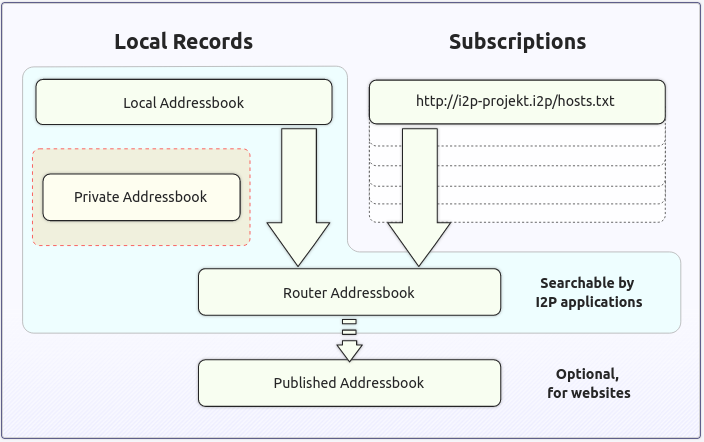

Chapter 3: I2P
##############

What Is I2P and How Does It Work?
*********************************
The Invisible Internet Project (I2P)
====================================
The “Invisible Internet Project” (I2P) is an encrypted and anonymous overlay network that relies on peer-to-peer (P2P), where each connected user is a node. One of I2P’s cornerstones is its innovative Garlic routing protocol, which speeds up traffic and makes it more challenging to analyze traffic. Unlike Tor, which natively allows users to anonymously browse the Surface Web in addition to featuring a darknet, I2P was not designed to create a proxy to access the Surface Web [#]_.

History of I2P
==============
In October 2001, a developer named “Lance James” (aka “0x90”) created the Invisible IRC Project (IIP), an initiative to anonymously and privately talk using Internet Relay Chat (IRC). However, this project alone was not a big enough target to face the competition (at this time, Freenet, GNUnet, and Tor), and a more extensive project was created: the InvisibleNet [#]_.

In 2003, a developer named “jrandom” took over the project and decided to rewrite the code in Java. He redesigned the IIP protocol (i.e., the “garlic routing”) and renamed the project “the Invisible Internet Project” or “I2P”.

Router development continued through 2004 and 2005, and several applications (i2ptunnel, SusiMail, and SusiDNS) were added to the I2P package with the help of a few contributors.

In 2005, “jrandom” introduced Secure Semi-reliable UDP (SSU). This innovative new UDP transport protocol contained IP discovery and firewall traversal features. He ported Snark, a Java BitTorrent client, to become an I2P application and bundled it with the I2P package.

In 2006, “jrandom” seemed to abandon the I2P project until a developer named “zzz,” with a few other developers, decided to take over the project in 2009.

I2P seemed to eventually reach the expected credibility in 2013 thanks to several integrations, like the built-in support of Anoncoin [#]_ in I2P or the introduction of outproxies by the Privacy Solutions organization.

Between 2014 and 2016, developers mainly focused on enhancing I2P cryptography and organizing conferences. I2P was introduced to Defcon for the first time in 2019.

In 2020 and 2021, a new end-to-end encryption protocol and faster crypto were implemented to make I2P faster and more secure.

In 2022, a new UDP transport (SSU2) was released and confirmed to be a solid, well-designed, and secure protocol.

How Does I2P Work?
==================
A Peer-to-Peer Network
----------------------
I2P is designed as a peer-to-peer network where every user is a node of the global I2P network, which can be either a server that hosts a darknet service (called eepsites) or a client who accesses the servers and services hosted by other nodes. This is a significant difference from Tor, where only volunteers host a Tor node (see `previous chapter <chapter2_tor.html#the-tor-network>`_).

Tunnels and the Network Database
--------------------------------
I2P builds and maintains temporary and virtual paths through a sequence of three nodes (gateway, participant, and endpoint), making one-way tunnels. Tunnel information is stored in a Distributed Hash Table (DHT) called “NetDb.” Tunnels expire every 10 minutes and thus need to be refreshed frequently. If a tunnel in the pool is about to expire or is no longer usable, the router creates a new tunnel and adds it to the pool. This is one of I2P’s security measures to prevent long-lived tunnels from becoming a threat to anonymity.

When an I2P router wants to send a message to a destination (e.g., a request to browse an eepsite), it first does a lookup in the NetDb to find the destination’s “leaseSet,” a necessary information to connect the outbound tunnel to the destination’s inbound tunnel. If this endpoint replies to the initial I2P router that made the request, data will travel through its outbound tunnel and the client’s inbound tunnel.
 

   Inbound and outbound tunnels in I2P.

Garlic Routing
--------------
I2P relies on an extension of onion routing called “garlic routing,” in which multiple messages can be bundled together, resulting in a “garlic clove.” If Alice wants to browse an eepsite hosted by Bob, Alice’s I2P router may forge a Garlic message composed of several cloves as follows:

- Clove 1 contains the initial HTTP request to Bob’s web server (eepsite).
- Clove 2 contains a Delivery Status Message that has instructions to send a delivery confirmation back to the message's originator.
- Clove 3 contains a Database Store Message that contains a leaseSet for the message's originator's destination.
 

   A Garlic message in the example of an HTTP request, can contain several cloves.

Bundling several cloves into a single message allows I2P to optimize message routing and reduce overall bandwidth usage. It also makes it more difficult for an attacker to do traffic analysis because the attacker cannot quickly determine how many cloves are contained in a garlic message or the destination of each message.

Encryption
----------
Content sent over I2P is encrypted through three layers:

- Garlic encryption (used to verify the delivery of the message to the recipient)
- Tunnel encryption (all messages passing through a tunnel are encrypted by the tunnel gateway to the tunnel endpoint)
- Inter-router transport layer encryption (e.g., the TCP transport uses AES256 with ephemeral keys).

   I2P layered encryption.

Layered encryption ensures end-to-end encryption, so each router can only decrypt a single layer. The decrypted information contains the IP of the next router, along with the encrypted data to be forwarded. Once the outbound tunnel's endpoint decrypts the message, it will have instructions on forwarding it to the correct inbound gateway.

Eepsites and the Address Book
-----------------------------
Since there is no Internet in I2P, the network comprises its own anonymous and hidden sites called “eepsites.” These exist within the network and are only accessible to people using I2P. So that I2P users can reach out to these eepsites, they need to be listed in an Address Book, which works like a DNS server.

Installation
************
I2P Router
==========
The I2P Router installer relies on Java and is the default setup on the official I2P website [#]_. It can be downloaded from the official website or installed from the packages of most Linux distributions. It is shipped with several applications (address book, email, hidden services manager, torrent, etc.) and supports plugins, making it the de facto installer for beginners.

From the Packages (Debian and Ubuntu)
-------------------------------------
Packages for Debian and Ubuntu are available. Refer to the documentation [#]_ to install the latest packages available for your distribution.

Manual Installation
-------------------
For other Linux distributions where the I2P package is unavailable, or if you prefer to install I2P yourself, you can use the Java installer [#]_.

Run the installer as follows:

.. code-block::

   $ wget https://files.i2p-projekt.de/2.8.2/i2pinstall_2.8.2.jar
   $ java -jar i2pinstall_2.8.2.jar

It will install I2P in the chosen location. Once the installation is complete, continue with the setup, as explained in the next section.

I2P Setup
---------
Run I2P with the below command:

.. code-block::

   $ ./i2prouter start
   Starting I2P Service...
   Waiting for I2P Service.....
   running: PID:3414

It will automatically open your default browser to the welcome page [#]_. If you run I2P for the first time, you’ll be required to set it up and will be presented with the below screen:
 

   Language selection in the I2P Java installer.

Click **Next** until you reach the bandwidth test. This step shouldn’t be ignored, as the installer will test your Internet connection to determine how much bandwidth should be allocated automatically. Notice that you can manually modify the values at any time, even after the installation is complete.

   Bandwidth configuration in the I2P Java installer.

Click **Next** until you eventually reach the end of the installation process.
 

   Main screen of the I2P Router Console.

Plugins
-------
You can optionally add plugins to extend the I2P’s features, but it is recommended that you first familiarize yourself with the basics.
 

   I2P plugins screen in the I2P Router Console.

You can find examples of plugins here: http://stats.i2p/i2p/plugins/. For a more complete list of available plugins, go to http://wiki.i2p-projekt.i2p/wiki/index.php/Plugins.
 

   Extract of the I2P plugins available on http://wiki.i2p-projekt.i2p/wiki/index.php/Plugins.

I2pd
====
I2P can alternatively be run by i2pd [#]_ (I2P Daemon), a full-featured C++ implementation of the I2P client. Notice that this setup doesn’t include any applications like I2P Router does (e.g., i2psnark), and they’ll need to be installed manually if you want to use them. It has no support for plugins, either.

Installation from the Packages
------------------------------
The easiest way to install i2pd is by using the precompiled packages [#]_.

For example, on a Debian 12 (Bookworm) distribution, run the following commands:

.. code-block::

   $ wget https://github.com/PurpleI2P/i2pd/releases/download/2.56.0/i2pd_2.56.0-1bookworm1_amd64.deb
   $ sudo dpkg -i i2pd_2.56.0-1bookworm1_amd64.deb
   $ sudo apt -f install

Two new ports should now be opened: 4444 (proxy) and 7070 (console).

Start and Stop I2pd
-------------------
The i2pd service should automatically start. If you need to start the service manually, run the below command:

.. code-block::

   $ sudo systemctl start i2pd.service

To stop the i2pd service, run the below command:

.. code-block::

   $ sudo systemctl stop i2pd.service --no-block

Proxy Configuration and Webconsole
----------------------------------
In Firefox, go to **Preferences > Advanced > Network tab > Connection Settings**. Select **Manual proxy configuration** and enter ``127.0.0.1`` and ``4444``, respectively, for the host and the port.

Now, connect to http://127.0.0.1:7070 and make sure that you can access the console:
 

   Access to the i2pd console over port 7070.

Depending on your connection speed (refer to the tunnel creation success rate), after a minute or so, browse http://identiguy.i2p/ or http://reg.i2p/ to make sure I2P is working.

SSH Port Forwarding
-------------------
As explained previously, mounting the tunnels needed to browse I2P eepsites can take several hours. For this reason, it is recommended to run i2pd on a Raspberry Pi or a VPS, where you’ll pipe your traffic through using SSH with port forwarding as follows:

.. code-block::

   $ ssh -NL 4444:127.0.0.1:4444 user@server

Live Distribution
=================
Prestium [#]_ is a privacy-focused, secure, and easy-to-use live OS for the I2P overlay network. The I2P setup relies on i2pd rather than I2P Router.

.. note::

   The project seems to have been abandoned. Indeed, the website on the Surface Web is down, and according to Wayback Machine, the latest release (Prestium-1.6.0) was from October 2023. The website on I2P has been down since January 2024.

I2P+
====
I2P+ [#]_ is an enhanced version of the Java I2P anonymizing network platform that aims to deliver a superior user experience and improved network performance while retaining full compatibility with upstream I2P.

I2P+, which has existed since 2003 and is maintained by a group of volunteers from the I2P community, implements improvements to the router's network performance and, for firewalled routers, significantly increases participating traffic and network responsiveness. In some contexts, the performance of the resident BitTorrent client I2PSnark is also improved.

   The main I2P+ interface.

I2P in Docker
=============
I2P can also run in Docker. If you are interested in this type of setup, please find some links below.

- https://geti2p.net/en/download/docker
- https://hub.docker.com/r/geti2p/i2p/
- https://hub.docker.com/r/divax/i2p

Outproxies
==========
I2P was not initially designed to create proxies for the Internet. Instead, it is meant to be used as an internal network (darknet). However, if you want to use I2P to access the Surface Web, you must configure an outproxy.

There are several outproxies (``stormycloud.i2p``, ``false.i2p``, ``outproxy-tor.meeh.i2p``, ``bandura.i2p``, ``purokishi.i2p``), but some of them are no longer available (e.g., ``false.i2p``) or quite unreliable. When writing, ``purokishi.i2p`` and ``exit.stormycloud.i2p`` [#]_ worked.

Outproxies in I2P Router
------------------------
In I2P Router, go to the “Hidden Services Manager” menu [#]_, and under the “I2P Client Tunnels” section, edit the “I2P HTTP Proxy” entry. Add ``exit.stormycloud.i2p`` for both “Outproxies” and “SSL Outproxies” as shown below:
 

   Configuration of the outproxy in the I2P HTTP Proxy settings.

.. note::

   It is possible to specify multiple outproxies by separating the names with a comma like this: “exit.stormycloud.i2p,purokishi.i2p.”

Outproxies in i2pd
------------------
To configure an outproxy in i2pd, edit the ``[httpproxy]`` section of the ``/etc/i2pd/i2pd.conf`` file as shown below.

.. code-block::
   
   [httpproxy]
   port = 4444
   outproxy = http://purokishi.i2p

Restart the i2pd service to apply the changes.

.. code-block::
   
   $ sudo systemctl restart i2pd.service

Directories and Search Engines
******************************
Some search engines exist on I2P (e.g., ``legwork.i2p``, ``ransack.i2p``), but there are also directories of eepsites, which are good resources to contents you can find on I2P if you don’t know where to start:

Directories
===========
Reg.i2p
-------
``Reg.i2p`` [#]_ is a directory that maintains a list of eepsites and constantly updates (every 4 hours) a list of new sites and sites that are alive.
 

   The reg.i2p site on I2P.

Identiguy.i2p
-------------
Identiyguy.i2p [#]_ is another non-curated list of eepsites highlighting new and live sites.
 

   The identiguy.i2p site on I2P.

Other Directories
-----------------
There are other directories available on I2P. Some examples are given below:

- http://hopjoy.i2p
- http://notbob.i2p
- http://stats.i2p/cgi-bin/newhosts.txt

Search Engines
==============
There are search engines available on the I2P darknet that list results for the Surface Web (e.g., ``duckduckgo.i2p``) or Tor (e.g., ``ahmia.i2p``, ``raklet.i2p`` or ``torch.i2p``).

It is also worth mentioning I2P Search [#]_, an eepsites search engine accessible from the Surface Web and Tor [#]_.

Hopefully, you’ll also find search engines on I2P that list eepsites, as detailed below.

I2PSearch
---------
I2PSearch [#]_ is a basic but effective search engine on I2P.
 

   I2PSearch on I2P.

Legwork
-------
Legwork [#]_ is a search engine specialized in the I2P network. It only indexes eepsites.
 

   The Legwork search engine on I2P.

Applications
************
This section details the built-in applications shipped with I2P Router.

.. note::

   The applications listed below are not shipped with the i2pd service, but some have their equivalent features in i2pd (e.g., the address book also exists in i2pd), and you may also host your eepsite, as explained later.

In I2P Router, applications are available from the “Applications” tab of the main screen. A complete list of I2P applications is available on GitHub [#]_.
 

   Access to the built-in applications in I2P Router.

Address Book
============
In I2P, there is no central naming authority, and instead, all hostnames are local. Each node maintains its address book, a ``hosts.txt`` file that lists key-value pairs composed of human-readable names (e.g., ``zzz.i2p``), and a long bas64 encoded string that is the actual address of the eepsite. This can be seen in the I2P Address Book, as shown below.
 

   The Address Book application in I2P Router.

In I2P Router, SusiDNS is the frontend application that allows the management and configuration of the address book.

The address book application regularly polls your subscriptions and merges their content into your “router” address book. Your “local” address book has also been incorporated into the router address book. If configured [#]_, the router address book can be “published,” meaning it will be publicly available. This can be useful if you want to host your ``host.txt`` file so others can add it to their subscriptions or if you are hosting an eepsite.

The router also uses a private address book, which has not been merged or published. You can access hosts in the private address book, but their addresses are never distributed to others. The private address book can also be used for aliases of hosts in your other address books. 

   The Address Book logic in I2P Router.
   
In i2pd, address books are managed through the ``/etc/i2pd/i2pd.conf`` configuration file.
 

   Address book management in i2pd.

Email (Susimail)
================
Susimail is a Java web-based email client installed by default with I2P Router and was created to address privacy concerns. Susimail is intended primarily for use with Postman's mail servers. To send and receive emails, you’ll first need to create an account by clicking the “Create Account” button as shown below.
 

   The Susimail authentication page in I2P, and the “Create Account” button.

You will be redirected to ``hq.postman.i2p``, where you will be able to create and manage your account.
 

   The mailbox creation confirmation page (I2P).

Once your account has been created in Postman, you can authenticate in Susimail to read and send emails.
 

   The Susimail interface in I2P.

Susimail is shipped with I2P Router. If you are using i2pd and would like to use emails, you’ll first need to enable SMTP and POP3 in  ``/etc/i2pd/tunnels.conf`` and configure a mail client like Claws or Thunderbird. 
 

   SMTP and POP3 tunnels in i2pd.

Hidden Services Manager
=======================
The Hidden Services Manager is the interface for managing your I2P tunnels. The page is broken down into the following sections:

- **Global Tunnel Control**: Used to create a new tunnel, and start or stop existing tunnels.
- **I2P Hidden Services**: Manages your hidden services (create a new hidden service, delete an existing hidden service, modify your hidden services, start or stop your hidden services). Clicking on a service's name will redirect to the configuration window.
- **I2P Client Tunnels**: Manages all the client tunnels (e.g., I2P HTTP Proxy for the outproxy configuration, POP3 and SMTP tunnels for the email application, etc.). Clicking on the name of a service will redirect to the configuration window.
 

   The Hidden Services Manager interface in I2P Router.

.. note::

   In i2pd, tunnels are managed through the ``/etc/i2pd/tunnels.conf`` file. Unlike I2P Router, starting or stopping tunnels independently is impossible.
   
Torrents (I2PSnark)
===================
I2PSnark is a BitTorrent client that comes with the I2P Router installer. It has the necessary BitTorrent client features, such as multi-torrent, magnet, PEX, and DHT.

I2PSnark is based on the open-source software Snark [#]_ written by Mark Wielaard in 2003.

Of course, I2PSnark is exclusively based on the I2P network, which means that you’ll need to download torrent files from I2P trackers (see an example below), and torrent files you may find on the Surface Web won’t work in I2PSnark.
 
.. figure:: images/image86.png
   :width: 800
   :alt: An example of a P2P tracker in I2P
   :class: with-border

   An example of a P2P tracker in I2P.

   I2PSnark running.

I2PSnark is shipped with I2P Router by default. If you are running i2pd and want to do file sharing, you’ll need to download I2PSnark [#]_ or any BitTorrent client with I2P support [#]_.

You’ll also need to enable the I2P Client Protocol (I2CP) in ``/etc/i2pd/i2pd.conf``:

.. code-block::
   
   [i2cp]
   ## Enable the I2CP protocol (default: false)
   enabled = true
   ## Address and port service will listen on (default: 127.0.0.1:7654)
   address = 127.0.0.1
   port = 7654

Web Server
==========
The Web Server is not an application but a helper for hosting eepsites. It is a web page [#]_ with detailed instructions to host an eepsite. The following section explains how to host your eepsite on I2P.

Host your Own Eepsite
*********************
With I2P Router
===============
Configure the Web Server
------------------------
I2P Router is shipped with Eclipse Jetty Webserver [#]_, a highly scalable and memory-efficient web server and servlet container, supporting many protocols such as HTTP/3,2,1 and WebSocket. 

Depending on the installer, the root of the web server should be one of the following paths:

- ``~/.i2p/eepsite/docroot``
- ``/var/lib/i2p/i2p-config/eepsite/docroot``

Once you have uploaded your sources to the appropriate ``docroot`` folder, go to the “Hidden Services Manager” and find the “I2P Hidden Services” section, as shown in the figure below.
 

   The Hidden Services Manager in I2P Router.

Click on the “I2P webserver” link to edit its configuration. Once on the configuration page, edit the website hostname (URL) and description of your eepsite, and click the “Save” button at the bottom of the form.
 

   I2P webserver settings.

.. note::

   The “Local destination” field contains a string you’ll need to use to publish your eepsite in the address book later. Clicking on the “Add to local addressbook” button will only add your hostname to the private address book.

Check your Eepsite
------------------
Now, click the “Start” button to share your eepsite on I2P. Test the I2P link in your browser to make sure it works.
 

   Example of eepsite hosted by Jetty on I2P.
   
Add your Hostname to the Published Address Book
-----------------------------------------------
In I2P Router, the published Address Book can add your eepsite to a ``hosts.txt`` file that others can add to their subscriptions. To do that, manually add an entry to the published address book, as shown in the below example.
 

   Adding your eepsite hostname to the published address book.

.. note::

   To register your domain, most I2P Name Registry services will require your Authentication Registration key, which you can get by clicking on your I2P webserver (under the “I2P Hidden Services” section) from the I2P Hidden Services console and then on the “Registration Authentication” button.

With i2pd
=========
Unlike I2P Router, which ships Jetty webserver by default and has a GUI to manage it, you’ll need to install the server manually with i2pd. The example below shows how to do it with Nginx, but you can use another web server (e.g., Apache2).

Host your Web Server
--------------------
On Ubuntu or Debian, installing Nginx is straightforward:

.. code-block::

   $ sudo apt update && sudo apt install nginx

If not already there, create the following ``default`` file in ``/etc/nginx/sites-available``:

.. code-block::

   server {
       listen 80 default_server;
       listen [::]:80 default_server;
       root /var/www/html;
       index index.html index.htm index.php;
       server_name _;
       location / {
           try_files $uri $uri/ =404;
       }
   }

Also, create a symbolic link in ``/etc/nginx/sites-enabled`` as follows:

.. code-block::
   
   $ sudo ln -s /etc/nginx/sites-available/default /etc/nginx/sites-enabled/default

Now, place your website in ``/var/www/html`` and restart Nginx as follows:

.. code-block::
   
   $ sudo systemctl restart nginx

Create the Tunnel
-----------------
We need to create a tunnel in i2pd to make our website available in I2P. Add the following content to ``/etc/i2pd/tunnels.conf``:

.. code-block::
   
   [anon-website]
   type = http
   host = 127.0.0.1
   port = 80
   keys = anon-website.dat

And restart i2pd

.. code-block::
   
   $ sudo systemctl restart i2pd

Check your Eepsite
------------------
Now, we need to find the URL of our hidden service, which is available from the console [#]_ by clicking on the “I2P tunnels” link. If i2pd detects your web server, the address should appear under the “Server tunnels” section, as shown below.

   The address of our eepsite in i2pd.

Getting the Authentication Registration
---------------------------------------
When registering your domain (see next section), you may be asked to provide your authentication registration. To get it from the i2pd web console, go to ``I2P tunnels > anon-website``. Below the base64 field, you’ll find an “Address registration line” link that will allow you to get the authentication string and publish your eepsite to ``reg.i2p``.
 

   Getting the address registration line in i2pd.

Register the Domain
===================
Once you have hosted your eepsite, you must register your I2P domain so others can access it. For that, you’ll need to manually add your host using an I2P Name Registry service such as:

- http://stats.i2p/i2p/addkey.html
- http://identiguy.i2p/cgi-bin/submit
- http://reg.i2p/add
- http://inr.i2p/postkey/

Thoughts about I2P
******************
By design, I2P is less prone to deanonymization attacks than Tor, for example. Tunnels in I2P are short-lived, decreasing the number of samples an attacker can use to mount an active attack, unlike circuits in Tor, which are typically long-lived.

The I2PRouter interface may not seem very user-friendly and quite complex, especially for the advanced configuration settings. For a lightweight installation, i2pd may be a good alternative.

I2P might be slow sometimes, though it got faster with the last updates.

I2P suffers from a lack of sustainable sites. Only 12% of the eepsites indexed by ``reg.i2p`` are alive.
 

   Only 12% of the eepsites indexed byreg.i2p are alive.

Unlike Tor where access to Onion Services is immediate, I2P requires that you maintain a server up and running for it to be fully integrated into the network. Otherwise, you’ll have to wait a long time to browse eepsites.
 

   Tunnel creation success rate in i2pd.

I2P has not been designed for exit traffic, and if outproxies exist, it is recommended not to use them. Since the outproxy acts as a gateway to the clearnet, there is a higher risk that the exit point (the outproxy server) could monitor or log user activity. On the other hand, Tor has been designed explicitly for anonymous browsing of the clearnet, and its entire network is optimized for this purpose. Tor is a better option to browse the Surface Web anonymously. 

-----

.. [#] You can still browse the Surface Web, if you use an outproxy, as explained later in this chapter.
.. [#] http://invisibleip.sourceforge.net/
.. [#] https://anoncoin.net/
.. [#] https://geti2p.net/en/download
.. [#] https://geti2p.net/en/download/debian
.. [#] https://geti2p.net/en/download
.. [#] http://127.0.0.1:7657/welcome
.. [#] https://github.com/PurpleI2P/i2pd
.. [#] https://github.com/PurpleI2P/i2pd/releases/latest
.. [#] https://prestium.org/release/ (Surface Web), or http://prestium.i2p (I2P darknet)
.. [#] https://i2pplus.github.io/ (Surface Web), or skank.i2p (I2P darknet)
.. [#] Since August 2022, exit.stormycloud.i2p is the new officially recommended outproxy, according to I2P developers.
.. [#] http://127.0.0.1:7657/i2ptunnelmgr
.. [#] http://reg.i2p
.. [#] http://identiyguy.i2p
.. [#] https://i2psearch.com
.. [#] http://i2poulge3qyo33q4uazlda367okpkczn4rno2vjfetawoghciae6ygad.onion/
.. [#] http://i2psearch.i2p/
.. [#] http://legwork.i2p/
.. [#] https://github.com/i2p/i2p.i2p/tree/master/apps
.. [#] To configure SusiDNS to push your router address book to your published address book, set “should_publish=true” on the configuration page.
.. [#] http://klomp.org/snark/
.. [#] https://gitlab.com/i2pplus/I2P.Plus/-/jobs/artifacts/master/raw/i2psnark-standalone.zip?job=Java8
.. [#] https://i2pd.readthedocs.io/en/latest/tutorials/filesharing/
.. [#] http://127.0.0.1:7658/help/
.. [#] https://www.eclipse.org/jetty/
.. [#] http://127.0.0.1:7070/
