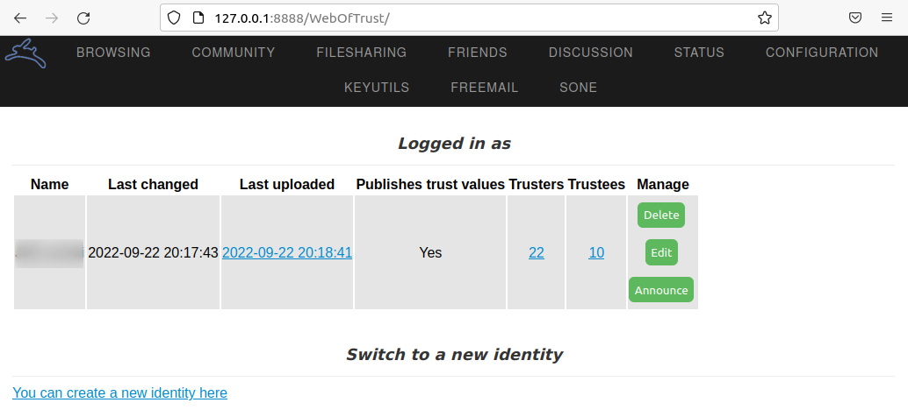

Chapter 4: Hyphanet (formerly Freenet)
######################################

What is Hyphanet and How Does It Work?
**************************************
First and Foremost, What Is Hyphanet?
=====================================
Hyphanet, formerly known as “Freenet,” is free software that lets you anonymously share files, browse and publish “freesites” (websites accessible only through Hyphanet), and chat on forums without fear of censorship. Hyphanet is decentralized to make it less vulnerable to attack, and if used in “darknet” mode, where users only connect to their friends, it is tough to detect.

Communications between nodes are encrypted and routed through other nodes to hide the origin and content of the request.

Each Hyphanet user shares bandwidth and disk space to store files (data store), which makes Hyphanet very resistant to censorship.

Hyphanet is based solely on distributed storage with crypto keys and is for static content only. All dynamic features are emulated with different keys, so the content updates can be pretty slow, for example, if you use the forum system.

Hyphanet, Freenet, and Locutus
==============================
It may be confusing for people used to the former “Freenet” project to understand what Hyphanet, Freenet, and Locutus are, as projects have recently been renamed. The former “Locutus” project (which was a development project) has been renamed “Freenet,” forcing the former “Freenet” project to be renamed (now known as “Hyphanet”).

Freenet (formerly known as Locutus) is currently under development. Unlike Hyphanet, which is developed in Java, Freenet’s programming language is Rust, which brings some benefits in terms of portability and efficiency.

Freenet focuses on faster communication and scalability, but unlike Hyphanet, it doesn’t offer built-in anonymity. The Freenet’s website [#]_ suggests that it will support a variety of applications, including:

- Decentralized email and microblogging services, along with message boards and forums.
- Instant messaging services.
- Online stores and marketplaces.
- Video and media discovery.
- Search engines.

The peer-to-peer network is not established yet and will not be until the initial prototype is ready. In other words, you can only use the local mode (in opposition to the network mode) to develop and test local applications.

History of Hyphanet
===================
In 1999, Ian Clarke, a young computer scientist concerned that the Internet kept becoming more centralized and prone to attacks, created a decentralized network called “Freenet” (now known as “Hyphanet”).

Hyphanet has been under continuous development since 2000. Significant milestones are listed below:

- In 2008, the darknet mode is introduced, and the TCP protocol switched to UDP for better performances.
- In 2009, the memory usage is reduced for faster insert, and retrieval of content, and significant improvements are brought to the FProxy web interface used for browsing freesites. The code benefits from considerable security improvements.
- In 2015, the Freenet core stopped using the db4o database and laid the foundation for an efficient interface to the Web of Trust plugin, which provides spam resistance.
- In 2019, work began on a successor to the original Freenet, internally known as “Locutus.” This project is a redesign from the ground up, incorporating lessons learned from the original Freenet’s development and operation and adapting them to today’s challenges.
- In March 2023, the former “Freenet” project became “Hyphanet [#]_”, and what was known as “Locutus” was officially branded as “Freenet [#]_”. 

How Does Hyphanet Work?
=======================
Distributed Storage and Data Store
----------------------------------
When a file is shared or updated on Hyphanet, it is “inserted” into the network. Once the “insertion” is complete, the document will be available to others, even if the publishing node shuts down, because the file has been replicated as encrypted blocks to several other nodes. That way, each node maintains a data store containing documents associated with keys and a routing table associating nodes with records of their performance in retrieving different keys.

There is no manual way to remove a file once inserted, but it will be removed with time if not requested for a long time.

The Hyphanet Routing Protocol
-----------------------------
The Hyphanet protocol uses a key-based routing protocol similar to Distributed Hash Tables (DHT). Each node is only aware of some other nodes, called neighbors. When a node requests a file, the message is routed through the network by traveling from neighbor to neighbor until it reaches the destination, as depicted by the example below.

1.	The host labeled “A” requests a file hosted on “E”. Host “A” first sends a data request to “B”, which is in the neighborhood.
2.	As “B” doesn’t have the requested resource, it forwards the request to “C.”
3.	If “C” doesn’t have the file and cannot forward the request to another node, it will send a “request failed” message to “B.” It’s a dead end.
4.	As a result, “B” sends the request back to “D,” another neighbor.
5.	Unfortunately, “D” doesn’t have the file either and forwards the request to “F.”
6.	“F” doesn’t have the file and, by chance, forwards the request to “B” as it was listed in his neighbors. “F” had no way of knowing that the request had already been submitted from “D” by “B” (this is the principle of anonymity).
7.	“B” identifies that the request forwarded to “D” is looping. It informs “F” with a “request failed” message.
8.	As a result, “F” forwards this failure message to “D.”
9.	“D” forwards the data request to “E.”
10.	Fortunately, “E” has the requested resource and shares it with “D.”
11.	“D” makes a copy of the resource and sends it back to “B,” who was known to have requested it.
12.	“B” also copies the resource in its data store and sends it to “A,” the initial requester. The file will also be copied on “A.”
 

   The Hyphanet routing protocol.

Opennet and Darknet Modes
-------------------------
By design, Hyphanet fulfills the requirements to be a darknet. However, to ensure true anonymity and minimize the risk of being blocked, Hyphanet recommends connecting to a minimum of 3 (ideally 5 to 10) trusted nodes or friends (“darknet” mode). Without these trusted nodes, Hyphanet can still be used with the open mode called “opennet.”

Installation
************
Installing Hyphanet
===================
This section explains how to install Hyphanet on a Debian workstation.

First, download the Java installer [#]_. Make sure you have Java installed. If you are manually installing it, I recommend JDK [#]_ over JRE because there are some problems running Hyphanet with JRE.

Run the installer as follows:

.. code-block::

   $ java -jar new_installer_offline_1497.jar

The installer is a graphical user interface that guides you through the installation steps easily. Once the installation is complete, you’ll be redirected to the configuration page [#]_. If the URL doesn’t respond, you may need to manually start the server using the ``run.sh start`` command from the directory where Hyphanet is installed.

.. note::

   You will notice many references to “Freenet” during the installation and configuration processes. These old references to “Freenet” before it was renamed “Hyphanet” have not been updated yet, but it won’t prevent the application from working correctly. However, it may add a bit of confusion.

The setup page lets you specify if you want to enforce anonymity (only check this box if you know people of trust with whom you would like to connect), select your bandwidth, and specify the data store size.

   Hyphanet setup screen.

Once the installation is complete, you should see a screen similar to the one in the capture below. This page [#]_ is the home of your Hyphanet node and is called “Fproxy.”

   Fproxy, your Hyphanet node’s main screen.

Start and Stop Hyphanet
=======================
The ``./Freenet/run.sh`` script (installed by default in your ``home`` directory) is used to start, stop and check the status of the Hyphanet service.

To start Hyphanet and confirm the status, run the following commands:

.. code-block::

   $ cd ~/Freenet/
   $ ./run.sh start
   Your java executable at /bin/java seems suitable
   Starting Freenet 0.7...
   $ ./run.sh status
   Your java executable at /bin/java seems suitable
   Freenet 0.7 is running (2884).

To stop Hyphanet and confirm the status, run the following commands:

.. code-block::

   $ ./run.sh stop
   Your java executable at /bin/java seems suitable
   Stopping Freenet 0.7...
   Stopped Freenet 0.7.
   $ ./run.sh status
   Your java executable at /bin/java seems suitable
   Freenet 0.7 is not running.

.. note::

   - To prevent Hyphanet from auto starting when your machine boots up, edit the crontab (``crontab -e``) and remove the line that looks like this: ``@reboot "/home/user/Freenet/run.sh" start 2>&1 >/dev/null #FREENET AUTOSTART – 8888``.
   - When Hyphanet is freshly started, it connects to the network, which may take a few minutes. Performance will continue to improve during the next few hours, which will happen each time you shut down Hyphanet for more than a few minutes.

Browsing Hyphanet
*****************
Indexes
=======
Many indexes (including Enzo’s index, The Filtered Index, Nerdageddon, and AFI) were removed from FProxy bookmarks in the last release of Hyphanet because they had been abandoned for several years. Now, Clean Spider is the only index that appears on the home page.
 

   The “Clean Spider” index on Hyphanet.

Search Engine
=============
Native Search Engine
--------------------
Hyphanet's native search engine relies on several indexes. Enter your search terms, select the indexes you want to use and click “Find.”

Searches can take several minutes, as all selected indexes will be requested. As shown below, progress bars show the progress of the search.
 

   Hyphanet search in progress.

Once the search process is complete, the results of the search will appear as follows:
 

   Search results for the term "classified" in Hyphanet.

.. note::

   It is possible to manage the indexes (add more or delete existing ones) for the search. However, the more indexes there are, the longer the search will take.

Freesites Connectivity Graph
----------------------------
The Network Engineering & Security Group (NESG) has published an online connectivity graph with a search feature [#]_. It can help find resources on Hyphanet.
 

   Freenet Freesites Connectivity Graph tool from the Network Engineering & Security Group (NESG).

Freesites
=========
The first time you visit a page, it needs to be downloaded in your local cache before being available.

.. figure:: images/image104.png
   :width: 800
   :alt: A page being downloaded in the local cache
   :class: with-border

   A page being downloaded in the local cache.

Once the page is downloaded, it is automatically refreshed with the requested content. The content is stored in your local cache, so you won’t need to download it again the next time you visit.
 

   The page is downloaded and now available in the local cache.

Plugins and Applications
************************
Web of Trust (WoT)
==================
What is WoT?
------------
The Web of Trust (WoT) plugin tries to solve the problem of spam being a critical threat to address in an anonymous, censorship-resistant network.

This plugin is required for some applications, including Sone, Freemail, and Freenet Messaging System (FMS).

Installation
------------
From the Hyphanet main page, go to the plugins page [#]_ and select “WebOfTrust.” Then click on the “Load” button.
 

   Selection of the WebOfTrust plugin in the Hyphanet plugins page.

The plugin will download:
 

   The WebOfTrust plugin download is in progress.

Create a New Identity
---------------------
Once the “WebOfTrust” plugin has been downloaded, a new entry is available in the “Community” menu. Click on “Log in”. Then, select the “Generate a new, random secret key” option and click the “Continue” button.
 

   Creation of a new identity in WebOfTrust (generate a new key).

Choose a name and click on the “Continue” button.
 

   Creation of a new identity in WebOfTrust (choosing a name).

You'll need to solve captchas at the end of the registration process. Go to ``Community > My Identity > Announce``.
 

   Creation of a new identity in WebOfTrust (announce).

After you've solved about ten puzzles, it's just waiting for the other identities to recognize you. Your identity is successfully introduced when the number of Trusters changes to something greater than zero. You should try getting at least five Trusters, so repeat the introduction if necessary.
 

   The number of Trusters (WebOfTrust) will increase after some time.

Back-Up and Restore your Identity
---------------------------------
Once you have an identity, it is essential to save it to restore it later if something goes wrong with your installation or if you need to reinstall Hyphanet. To back up your identity, go to ``Community > My identity`` and click on the “Edit” button. Copy both your public and secret keys in your favorite password manager.
 

   WOT public and secret keys in Hyphanet.

To restore your identity, do as if you would create a new identity, as described in the previous section, and choose the “Re-use an old secret key” option instead of “Generate a new, random secret key.” When asked to provide your secret key, copy it from your password manager and paste the entire string (starting with ``USK@``) into the form. On the next screen, you will be asked to specify whether your private key has been used with Web of Trust in the past. If you have used this identity to authenticate on services like Freemail or Sone, you should use the first option.
 

   Restoring a WoT identity in Hyphanet.

.. note::

   Restoring an identity can take several hours, and your Hyphanet node must be online until the end of the restoration process.

Freenet Messaging System (FMS)
==============================
What is FMS?
------------
FMS was designed to address problems with Frost, such as Denial of Service attacks (DoS) and spam. Users publish trust lists, and each user downloads messages only from identities they trust. FMS has been developed anonymously and can be downloaded from the FMS freesite within Hyphanet. It does not have an official site on the Surface Web. It features random post delay, support for multiple identities, and distinguishing between trusting a user’s posts and their trust list. It is written in C++ and is a separate application from Hyphanet, which uses the Freenet Client Protocol (FCP) to interface with Hyphanet.

Installation
------------
To install FMS, click on the “Freenet Message System” widget under the “Freenet related software” section of Hyphanet’s main page (127.0.0.1:8888). You will be redirected to the FMS web page, where you can download the FMS client for your operating system, as depicted below.
 

   Freenet Message System download page.

Hyphanet will claim that downloading the file is unsafe, but as we get it from the official website, we will ignore the message and click the download button. It will save the file locally in the download folder of your Hyphanet’s installation directory.
 

   Freenet Message System (FMS) currently downloading.

Once FMS has been downloaded, a new file (e.g., ``fms-linux-amd64-bin-0.3.85.tar.gz``) is added to your Hyphanet’s ``downloads`` folder. Move it wherever it makes sense on your disk, uncompress the application, and remove the archive.

.. code-block::

   $ tar xzvf fms-linux-amd64-bin-0.3.85.tar.gz
   $ rm -f fms-linux-amd64-bin-0.3.85.tar.gz

The last thing you need to do before launching FMS is to install the libfreeimage libraries:

.. code-block::

   $ sudo apt install libfreeimage-dev

Now, start the FMS server as follows:

.. code-block::

   $ ./fms &

.. note::

   The FMS server does not start automatically with Hyphanet. If you want to start the service automatically, you can write a custom startup service with systemctl.

Configuration
-------------
You should be able to access FMS in the browser directly by browsing http://127.0.0.1:8080, as depicted below.
 

   The FMS main page.

The next step is to convert our Web of Trust (WoT) identity to FMS. To do that, you’ll need to use the below XML template from the Freenet Social Networking Guide (FSNG) available from the Hyphanet home page.

.. code-block:: XML
   :emphasize-lines: 4,5,6
   
   <?xml version="1.0" encoding="UTF-8"?>
   <IdentityExport>
     <Identity>
       <Name><![CDATA[NAME]]></Name>
       <PublicKey>SSK@TRANSLATED_REQUEST_URI/</PublicKey>
       <PrivateKey>SSK@TRANSLATED_INSERT_URI/</PrivateKey>
       <SingleUse>false</SingleUse>
       <PublishTrustList>false</PublishTrustList>
       <PublishBoardList>false</PublishBoardList>
       <PublishFreesite>false</PublishFreesite>
     </Identity>
   </IdentityExport>

Go to the WoT plugin to edit your identity [#]_ and collect the information you need to replace the correct values in the template. Notice that you’ll only need to get part of the content for the keys, as WoT identities have a slightly different format than the keys in FMS. You only need to report the content between the ``@`` character and the ``/WebOfTrust/0`` string. The below key is an example of a public key taken from WoT:

   USK\@BwjQ6myK6gU9ZLUEDaFHaIRV7n6rkNDEvP8W6WB5wQ4,8laZ0ECv-beFkDttKgRXq8HCBdTdaLULDIcuw-lkV2c,AQACAAE/WebOfTrust/0

The interesting part is:

   BwjQ6myK6gU9ZLUEDaFHaIRV7n6rkNDEvP8W6WB5wQ4,8laZ0ECv-beFkDttKgRXq8HCBdTdaLULDIcuw-lkV2c,AQACAAE

Save the resulting XML file somewhere on your disk (e.g., ``fms_id.xml``). Click on the “Local Identities” link in FMS from the menu. Click on the “Browse” button to pick the XML file, and then on the “Import Identities” button.
 

   Import your WoT identity in FMS (1/2).
   
Now, optionally provide the form with the URI of an avatar you may have inserted on Hyphanet and a signature. Ensure “Image Captcha with Letters” is selected in the “Introduction Puzzle Type” dropdown. Click on the “Update” button.
 

   Import your WoT identity in FMS (2/2).

After you click the “Update” button, click the “Insert” link to confirm that you want to publish your identity.

Now, click “Announce Identity” from the menu, fill in the captcha puzzles, and click the “Announce” button. Notice that you will need to do it several times, as new captchas will be presented until you complete all captchas. Beware that they are case-sensitive. Getting announced will take some time, and you must assign trust to other identities to see yourself announced. Do not continuously solve captchas. Solve 30 at most, wait a day, and if your identity has not been announced, repeat until it is.
 

   Announcing identity in FMS.

Using FMS
---------
From the FMS home page [#]_, click “Browse Forums” from the left menu to show the existing forums list. Notice the dropdown on the left of the “Sign In” button, which contains a list of identities you have previously imported. Be sure to be signed in to post messages.
 

   Browse forums in FMS.
   
Forums with a yellow star are the ones you haven’t opened yet. Clicking on a forum's name will redirect to its posts, and clicking on each post will show its comments.
 

   Posts in the “Test” forum in FMS.

The “test” forum can be used to test that everything is working fine for you, and I recommend that you use it to familiarize yourself with FMS.

Only some forums are shown in this list by default, but more are available. To see more forums, go to the “Board Maintenance” section available from the main menu, and in the list, check the boxes of corresponding forums you want to see in your list.
 

   Board maintenance in FMS.

If you know the names of hidden forums (you may ask via FMS), you can add them to this list.

Freemail
========
Install the Freemail plugin as you did for the WoT plugin (see previous section).

Once successfully installed, the application should appear as a new menu in Hyphanet, as shown below.
 

   The Freemail application in Hyphanet.

The Freemail application allows users to send, read, and delete emails to people within the Hyphanet darknet, meaning that you won’t be able to send emails to providers in the Clearnet (e.g., Gmail, Yahoo, Microsoft, …). The “About” page will show your email address as well as IMAP and SMTP settings that you can use to configure a mail client (e.g., Claws, Thunderbird, etc.) in case you need more advanced control over your emails (e.g., PGP, archive, etc.).

Sone
====
What is Sone?
-------------
Sone is a plugin that offers communication possibilities like X or Facebook. It’s fully decentralized and uncensorable.

.. note::

   Sone is still under development and has yet to reach the maturity level to be an official plugin. At the time of writing (version 82), Sone is still suffering from a scaling issue because all messages from all users from the beginning of time are stored in RAM each time you restart your Hyphanet node.

Installation
------------
To install Sone, go to ``Configuration > Plugins`` and enter the following URI [#]_ in the plugin key field at the bottom of the screen: 

   USK\@nwa8lHa271k2QvJ8aa0Ov7IHAV-DFOCFgmDt3X6BpCI,DuQSUZiI~agF8c-6tjsFFGuZ8eICrzWCILB60nT8KKo,AQACAAE/sone/82/sone-current.jar

The plugin will be downloaded:
 

   Plugin manager showing Sone being downloaded.

Once the plugin has been successfully downloaded, you should have a Sone menu in Hyphanet:
 

   The Sone menu in Hyphanet.

Log In, Log Out, and Using Multiple Identities
----------------------------------------------
Like several other Hyphanet applications, Sone uses the WebOfTrust plugin to identify you. To log in, select “Login” from the “Sone” menu, select an identity from the dropdown list, and click on the “Create Sone” button.
 

   Login to Sone in Hyphanet.

If you have multiple identities, a logout entry will be added to the menu, allowing you to easily log out from one profile and use the other identity.
 

   A logout entry in Sone allows you to switch identity.

Using Sone
----------
Sone allows you to follow other Sone users who you can find from the “Known Sones” entry in the “Sone” menu or by searching a given name in the search field. Click on a profile's “follow” link to subscribe to the user’s Sones.
 

   Known Sones in the Sone Hyphanet application.

In Sone, you can publish posts, reply to other users’ posts, like posts, add comments to their posts, publish albums, and save bookmarks. To create a new post, go to “Sone > Your Sone” and add content under the “Post Feed” section.
 

   Posting in Sone.
   
To create or edit an album and add pictures, go to “Sone > Images.” Click “Create album” from here to create a new album. Once the album is created, click “Upload image” to add new images.
 

   Album in Sone.

Freenet Lightweight IRC Program (FLIP)
======================================
Internet Relay Chat (IRC) has been a popular communication protocol since 1988. Although its popularity has declined recently with the rise of newer chat and messaging platforms, it is still in use. Thanks to the Freenet Lightweight IRC Program (FLIP), using IRC over Hyphanet is possible.

To install the server, copy the URL on the FLIP download page (the FLIP link is on the home page of your Hyphanet setup).
 

   Copy the plugin link of the FLIP installation.

Now go to “Configuration > Plugins” and scroll to the very bottom of the page. Paste the part of the URL starting with “CHK@” in the field and click on the “Load” button.
 

   Paste the plugin URL to install FLIP.

It won’t create any new menu items in the web interface, but you should now have port **6667/tcp** listening on your machine. Configure your preferred IRC client to connect to **127.0.0.1:6667** to use IRC on Hyphanet, as shown below.
 

   HexChat on Hyphanet using FLIP.

JSite
=====
What is JSite?
--------------
JSite is a tool for uploading websites. It handles keys and manages uploading files.

To install jSite, click on the “jSite” widget from the Hyphanet’s main page [#]_ under the “Freenet related software” section. You will be redirected to the jSite freesite, where you can get the download link to the standalone application (select the binary file, not the sources). In the Hyphanet file downloader page, click on the “Download” button at the bottom to download the file in the download folder of the Hyphanet installation directory. Hyphanet will warn you that it may be insecure to download the file, but we will ignore the message as we are getting the file from the official website.

Using JSite
-----------
Once jSite is downloaded, move the jar file to where it makes sense on your disk and start jSite as follows:

.. code-block::

   $ java -jar jSite-17-jSite-0.14-jar-with-dependencies.jar

It will start the jSite project wizard. Let’s begin by adding a new project. Press the “Add project” button. It will automatically generate keys and a URI that you should not change. All you need to do is give your project a name and a description and tell jSite where your project is located on the disk.
 

   Project creation in jSite (1/2).

Click on “Next”. The next screen will show a list of files contained in the path you mentioned in the previous screen. Select your ``index.html`` file and check the box “Default file.” Then, click on the “Insert now” button.
 
.. figure:: images/image135.png
   :width: 800
   :alt: Project creation in jSite (2/2)
   :class: with-border

   Project creation in jSite (2/2).

After you have pressed “Insert now,” your freesite will be inserted on Hyphanet. Depending on the number of files and their size, it can take a while, so be patient and wait until a confirmation popup appears.
 

   Project being published in jSite.

When the site is successfully inserted, you can access the “Copy URI to Clipboard” button. To browse your new freesite, prepend the URI previously copied with “http://127.0.0.1:8888/” and enjoy your new freesite.

.. note::

   Remember to copy and save this URI somewhere safe, as there is no trivial way of recovering it from jSite. You can also bookmark your URI on the Hyphanet main page by editing the “My bookmarks” section.

Other Applications and Plugins
==============================

- **FlogHelper** [#]_ is an easy-to-use tool for creating a blog on Hyphanet. It automatically uses WebOfTrust to announce your new flog, so it should appear on the freesite indexes.
- **Freereader** [#]_ is a tool to insert RSS and ATOM feeds as Freesites.
- **Frimgur** [#]_ is a plugin that allows you to upload a bunch of images.
- **Frost** includes support for convenient file sharing, but its design is inherently vulnerable to spam and denial of service attacks. Frost can be downloaded from the Frost home page on SourceForge [#]_, or from the Frost freesite within Hyphanet. The Hyphanet developers do not endorse it. Frost is written in Java and is a separate application from Hyphanet. FMS is considered a better option.
- **Infocalypse** [#]_ is an extension of the distributed revision control system Mercurial. It uses an optimized structure to minimize the number of requests to retrieve new data. It allows supporting a repository by securely reuploading most of the data without requiring the owner’s private keys.
- **KeepAlive** [#]_: Because the disk space in Hyphanet/Freenet is finite, only popular sites and files stay available long-term. Files that are seldom requested get lost quite soon after insertion. To keep these files alive, it is necessary to reinsert them frequently, which is what the KeepAlive plugin does.
- **Sharesite** [#]_ is a tool to publish and update single-page sites. Based on the ShareWiki plugin.
- **Shoeshop** [#]_ is a plugin that exports files and sites such as fblob and imports fblob files.
- **ThawIndexBrowser** [#]_ lets you browse Thaw file indexes and download files from them from within the Freenet web interface without having to install Thaw.

.. note::

   For a more complete list of applications and plugins, check the repositories available on the Hyphanet GitHub page [#]_.

Build a Freesite
****************
Files
=====
It is recommended to add a picture called an “activelink”, to identify your freesite. It is used, for example, in the Fproxy’s bookmarks as depicted below.
 

   Fproxy’s bookmarks showing the activelink pictures.

This picture should be named ``activelink.png``, reside in your freesite’s root folder, and have a size of 108x36 pixels.

Ensure you have an ``index.html`` file located at the root of your folder and that you identify this file as the default for your site in jSite.

Insert Your Freesite
====================
The publication is called “Insertion” on Hyphanet. There are several options to insert a freesite on the Hyphanet darknet:

- **jSite**: Standalone Java application. Detailed earlier in this chapter.
- **FlogHelper**: Installs as a plugin. It is an easy-to-use tool for creating a blog on Hyphanet. Use WebOfTrust to announce your new flog automatically, so it should appear on the freesite indexes.
- **Sharesite**: Installs as a plugin. It is a tool for publishing and updating single-page sites based on the ShareWiki plugin.

Announce Your Freesite
======================
Now that your freesite has been inserted, it's time to promote it in different places.

A good idea is to post on FMS in the “site.announce” forum using the format below. Index spiders will index your post.

.. code-block::
   
   Name: MySite
   Location: USK@...RvM~s,AQACAAE/my-test-project/0/
   Activelink: USK@...RvM~s,AQACAAE/my-test-project/0/activelink.png
   Description: This is my test freesite.
   Categories: freenet,testing

.. note::

   The “site.announce” forum is not visible by default. To add it to your forums in FMS, go to “Board Maintenance” and check the box “forum” for the “site.announce” forum, as shown below.
 
   .. figure:: images/image138.png
      :width: 800
      :alt: Adding the "site.announce" forum to FMS
      :class: with-border
   
      Adding the "site.announce" forum to FMS.

Thoughts About Hyphanet
***********************
From my own experience, I found Hyphanet relatively slow, which is probably the price to pay for good anonymity. Plugins and pages are slow to download, but this may depend on your connection and the bandwidth allocated to Hyphanet.

Besides, I was not a big fan of the extensive captcha process required to create a WoT identity, which took me a day to complete. It’s quite a confusing process where you keep having captchas and don’t know when you must stop until you eventually see that the number of trusters increases, which is the sign that your identity is being announced on Hyphanet. The same applied to FMS, where I spent 2 days trying to make my posts visible on the “test” forum. I feel that this process could be improved.

There seems to be no way to queue pages to download; a page stops downloading when the tab is closed. This may be a bit confusing for beginners.

The notion of “darknet” is a bit confusing because Hyphanet claims anonymity can only be granted if you connect to at least five trusted sources (ten are even recommended) that are connected 24/7. Honestly, I don’t think many people know ten friends who are connected all the time to connect to a darknet.

Like I2P, Hyphanet works best if you leave your node connected 24/7 on the Hyphanet network. Otherwise, it will take several minutes before you are integrated. The best solution is to leave a Raspberry Pi connected and use it as a proxy using SSH when you want to use Hyphanet.

Hyphanet lacks content, and many outdated or abandoned resources are still listed in the indexes. Of course, there are many individual contributions, some of which are good, but it still gives the feeling that this darknet is relatively tiny.

According to a study performed by “Freenet data stats” since 2024, based on data collected from the “Freefiles” index, Hyphanet loses around 3 GiB of file data every day.
 

   Hyphanet loses 3GiB of data files every day.

The future of this darknet seems quite uncertain, and the recent rebranding (“Hyphanet” to replace “Freenet”) has generated a lot of confusion [#]_. 

-----

.. [#] https://freenet.org/ and https://github.com/freenet/freenet-core
.. [#] https://www.hyphanet.org/
.. [#] https://freenet.org/
.. [#] https://www.draketo.de/dateien/freenet/build01497/new_installer_offline_1497.jar
.. [#] https://download.oracle.com/java/21/latest/jdk-21_linux-x64_bin.deb
.. [#] http://127.0.0.1:8888/wiz/
.. [#] http://127.0.0.1:8888
.. [#] https://nesg.ugr.es/freenet/#
.. [#] http://127.0.0.1/plugins/
.. [#] http://127.0.0.1:8888/WebOfTrust/EditOwnIdentity
.. [#] http://127.0.0.1:8080
.. [#] You can get this URI from the Sone page, available from the Hyphanet’s home page.
.. [#] http://127.0.0.1:8888
.. [#] https://github.com/hyphanet/plugin-FlogHelper
.. [#] https://github.com/hyphanet/plugin-Freereader
.. [#] https://github.com/Bombe/frimgur
.. [#] https://jtcfrost.sourceforge.net/
.. [#] https://github.com/ArneBab/infocalypse
.. [#] https://github.com/hyphanet/plugin-KeepAlive
.. [#] https://github.com/hyphanet/plugin-sharesite
.. [#] https://github.com/hyphanet/Shoeshop
.. [#] https://github.com/hyphanet/plugin-ThawIndexBrowser
.. [#] https://github.com/orgs/hyphanet/repositories
.. [#] https://news.ycombinator.com/item?id=36561663