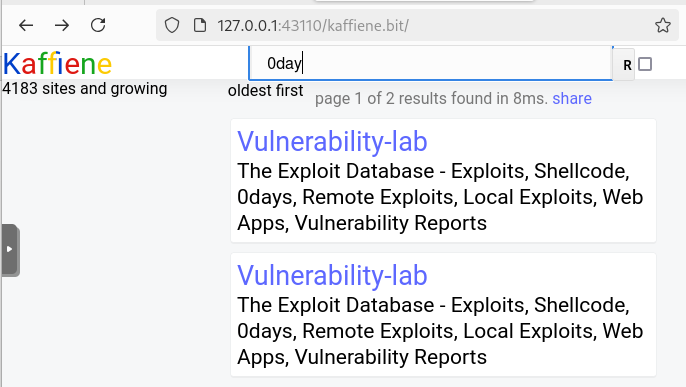
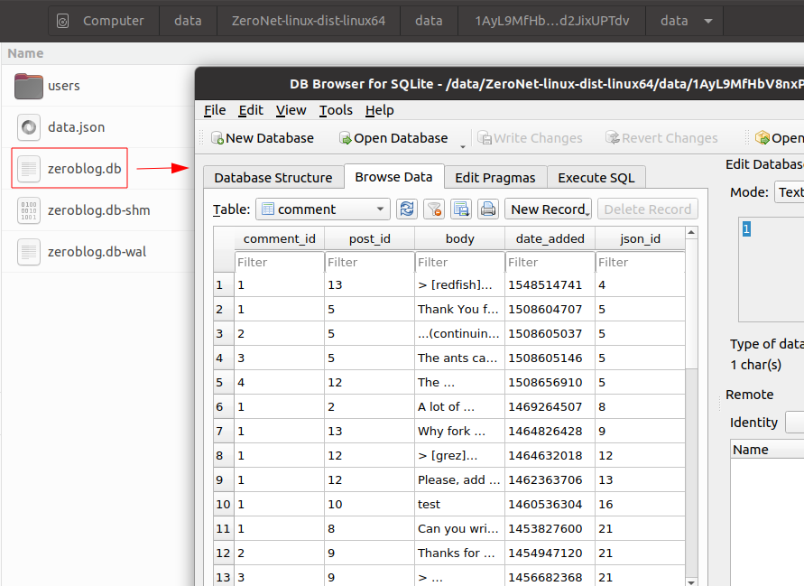

Chapter 5: ZeroNet
##################

What Is ZeroNet and How Does It Work?
*************************************
What Is ZeroNet?
================
ZeroNet uses Bitcoin cryptography and BitTorrent technology to build a decentralized censorship-resistant network. Like Hyphanet, it’s a P2P network, but it works differently.

Users can publish static or dynamic websites to ZeroNet, and visitors can also choose to host websites themselves. Websites will remain online as long as one peer is still online. 

ZeroNet has a variety of “zites,” the so-called Zeronet sites (ZeroName, ZeroHello, ZeroMail, etc.) for messaging, email, chat, blogging, and social platforms. Since ZeroNet is based on the BitTorrent network, it is also ideal for file sharing.

ZeroNet doesn’t have anything to ensure anonymity, but the project has been designed to work with Tor, and on Windows, ZerosNet is even bundled with Tor.

History of ZeroNet
==================
ZeroNet was started in 2014 as a project by Tamas Kocsis, a Hungarian developer, who made the first release of ZeroNet in 2015. Until 2019, the project was regularly updated, but when Tor migrated to `version 3 <chapter2_tor.html#version>`_, ZeroNet stopped working with Tor. In November of 2021, a developer named “geekless” ported the code to be compatible with the Onion v3 protocol. Still, unfortunately, this patch has never been implemented in the official repository of ZeroNet, and the author has since deleted his repository from GitHub, removing access to the patch.

Since 2019, the development of ZeroNet has almost stopped (see release dates in the figure below), and the project has been forked several times (ZeroNetX [#]_, ZeroNet-enhanced, zeronet-conservancy [#]_, ZeroNet by TwinLizzie). Most of these forked projects have been abandoned, and the only one that remains active seems to be ZeroNetX, maintained by a developer named “Pramukesh (canewsin) [#]_,” who is willing to rewrite ZeroNet using the Rust programming language instead of Python.
 

   List of releases for ZeroNet on Github shows that the latest release (0.7.1) is from Sept 2019.

How Does ZeroNet Work?
======================

.. figure:: images/image141.png
   :width: 600
   :alt: File transfer on ZeroNet

   File transfer on ZeroNet.

1.	Host **A** asks the BitTorrent Tracker to provide some IP addresses (“peers”) that are known to host a requested resource (this group of hosts is called a “swarm”). In ZeroNet, connecting to http://127.0.0.1:43110/Stats will reveal the list of trackers.
2.	The BitTorrent Tracker answers with a list of IP addresses (**B**, **C**, **D**, and **E**) and adds host **A** as potential provider for the requested resource.
3.	Host **A** simultaneously asks **B**, **C**, **D**, and **E** to deliver the ``content.json`` file for the given resource.
4.	All requested hosts have the file (not necessarily complete, but parts of it) and simultaneously send parts of ``content.json``, which holds all other file names, hashes, and the site owner’s cryptographic signature. These parallel downloads of parts of the requested file speed up the transfer.
5.	The downloaded ``content.json`` file is verified using the site’s address and the site owner’s signature from the file. Host **A** now goes through the ``content.json`` file and recursively asks the same “seeders” to provide the files (HTML, CSS, JS, etc.).
6.	Requested files are sent to **A**, which, in turn, becomes a provider for the files. Files are verified using the SHA512 hash from the ``content.json`` file.

If the site owner (who has the private key for the site address) modifies the site, they sign the new ``content.json`` and publish it to their peers. Afterward, the peers verify the ``content.json`` integrity (using the signature), download the modified files, and publish the new content to other peers.

Installation
************
Installing ZeroNet
==================
ZeroNet can be installed on Windows, Mac, and Linux. What follows applies to Linux.

ZeroNet can be easily installed with a few command lines on a Linux box.

.. code-block::

   $ wget https://github.com/HelloZeroNet/ZeroNet-linux/archive/dist-linux64/ZeroNet-py3-linux64.tar.gz
   $ tar xvpfz ZeroNet-py3-linux64.tar.gz
   $ cd ZeroNet-linux-dist-linux64/
   $ ./ZeroNet.sh

It should automatically open your default browser to http://127.0.0.1:43110/.
It may happen that ZeroNet is not able to install, and you’ll end up with the following error message:
 

   ZeroNet initialization error during installation.

If this happens, wait a few minutes and try again.

ZeroNet Forks
=============
ZeroNetX
--------
Alternatively, you can install ZeroNetX, a fork of ZeroNet developed and maintained by “Pramukesh (canewsin)”. It natively supports Tor v3 and several identity providers in addition to `ZeroID <#id20>`_. The increasing number of users migrating from ZeroNet to ZeroNetX makes it an interesting alternative to ZeroNet.

To install ZeroNetX, issue the below commands:

.. code-block::

	$ wget https://github.com/ZeroNetX/ZeroNet/releases/latest/download/ZeroNet-linux.zip
	$ unzip ZeroNet-linux.zip
	$ cd ZeroNet-linux/
	$ chmod +x ZeroNet.sh runtime/bin/*

Start with:

.. code-block::

	$ ./ZeroNet.sh
 

   The ZeroNetX dashboard, a perfect clone of ZeroNet.

If this method fails, you can also use the ZeroNetX Updater. To do that, make sure you have a working ZeroNet installation. Run the following command:

.. code-block::

	$ ./ZeroNet.sh --updatesite 1Update8crprmciJHwp2WXqkx2c4iYp18

Once ZeroNet is started, browse the following URL: http://127.0.0.1:43110/1Update8crprmciJHwp2WXqkx2c4iYp18/

It will inform you that an update is available, as shown in the below screenshot.
 

   ZeroNetX Updater.

Click the **Update to latest version** button and restart ZeroNet when requested. If the upgrade worked, your applications should now update automatically, and you should have new entries in your menu (e.g., **Name.YO**, **ZeroSitesX**, and **ZeroMailX**).
 

   ZeroNetX Updater updating ZeroNet.

One significant advantage is that applications shipped with ZeroNetX support several identity providers. For example, clicking the **Select Username** button in ZeroMailX shows a list of five identity providers. On the other hand, `ZeroMail <#id24>`_ (shipped with ZeroNet) only natively supports “zeroid.bit.”
 

   ZeroNetX gives access to alternate applications, like ZeroMailX, which rely on several identity providers instead of just ZeroID.

.. note::

	While the official ZeroNetX website [#]_ proposes to install a clone of ZeroNet [#]_ (developed in Python), there is a parallel project by the same developer, also called ZeroNetX, that is a complete redevelopment in Rust [#]_. This latest is the ultimate objective of the ZeroNetX project, but it is not ready yet for production.

Other Forks
-----------
Other forks exist but they are not detailed in this book:

- ZeroNet-conservancy [#]_
- 0NetDWF (ZeroNet Decentralized Webhosting and Fileshare project): this project seems to be abandoned, as depicted in the below screenshot.
 

   Comment posted on ZeroTalk by the developer of the 0NetDWF project, informing that the project is stopped.

How to Use ZeroNet with Tor?
============================
If you want to hide your IP address (recommended), use ZeroNet with Tor and enable the **Tor always mode** in ZeroNet.

.. note::

	The original release of ZeroNet doesn’t support Tor v3. If you want to use ZeroNet with Tor, consider using ZeroNetX.

Tor as a Service
----------------
If you plan to use Tor over ZeroNet without the Tor Browser, first `install Tor <chapter2_tor.html#packages>`_ as a service, as explained in the chapter about Tor.

Then, edit the ``/etc/tor/torrc`` configuration file and uncomment the following lines:

.. code-block::
	:caption: ``/etc/tor/torrc`` (extract)
	
	ControlPort 9051
	CookieAuthentication 1

Restart Tor:

.. code-block::

	$ sudo systemctl restart tor.service

Grant your user permission to read the ``/var/run/tor/control.authcookie`` file. Replace ``[yourlinuxuser]`` with your username in the command below.

.. code-block::

	$ sudo usermod -a -G `stat -c "%U" /var/run/tor/control.authcookie` [yourlinuxuser]

Log out and log in with your user to apply group changes and start ZeroNet. Remember to enable the **Always Tor mode**.
 

	ZeroNetX banner confirming that Tor always mode is enabled.

Tor Browser
-----------
To be able to browse ZeroNet sites within the Tor Browser, you’ll need to do a couple of things.
First, download the Tor browser and start it. You’ll need to tune it so that it ignores our ZeroNet proxy address. To do that, enter ``about:config`` in the URL bar and ignore the warning by clicking the **I accept the risk** button. Now, search for the ``network.proxy.no_proxies_on`` parameter and set the value to ``127.0.0.1:43110``.
 

	Proxy exception in the Tor Browser for ZeroNet.

Append these two lines in the global section of the ``zeronet.conf`` file. This will instruct ZeroNet to use the Tor Browser’s Tor ports instead of the ones used by the Tor service (default values).

.. code-block::
	:caption: ``zeronet.conf`` (extract)
	
	tor_controller = 127.0.0.1:9151
	tor_proxy = 127.0.0.1:9150
	open_browser = ""

Now, start ZeroNet and point your Tor browser to http://127.0.0.1:43110. Enable the **Always Tor mode** option in ZeroNet.

Open Proxies
============
It is possible to test ZeroNetX without installing anything by connecting to one of these proxies:

- https://proxy.zeronet.dev/
- https://0net-preview.com/

.. note::

	Open proxies should only be considered a temporary way of testing ZeroNet, as they will be slower, have limited features, and have privacy concerns.

Using ZeroNet
*************
This section introduces some basic concepts of ZeroNet and examples of sites called “zites.”

ZeroHello
=========
When you start ZeroNet, it will open “ZeroHello”, the homepage and site manager for ZeroNet.
 

	ZeroHello, the home page and visited site manager for ZeroNet.

.. note::

	On ZeroNetX, the home page is called “Dashboard” instead of “ZeroHello,” but it has a similar look, as shown in the screenshot below.
 
	.. figure:: images/image152.png
		:width: 800
		:alt: the home page in ZeroNetX
		:class: with-border

		"Dashboard," the home page in ZeroNetX.

You can access configuration options by clicking on the three dots on the right side of the ZeroNet logo (update all sites, configure ZeroNet, change the theme, mute users or sites, create a new site, etc.).

	ZeroNet options menu in ZeroHello.

The default view (the “sites” tab) shows a list of sites you have visited and are now sharing with others. Moving your mouse over a site title will reveal a three-dot icon on the right side of the title. The figure below shows the options available from the menu.
 

	Contextual menu for visited sites in ZeroHello.

Each time you visit a new site, it will be added to your ZeroHello list of sites, which you will share with other visitors. ZeroHello will also update sites you have already visited. The bell icon at the right of the site name indicates that some files must be updated.
 

	ZeroHello is automatically updating sites that have been updated since you last visited them.

Directories
===========
To familiarize yourself with ZeroNet, the best approach is to pick some sites from directories, some of which are listed below.

- **Awesome-ZeroNet** [#]_: This is a GitHub repository containing many addresses available on ZeroNet in several categories (search engines, indexes, chat rooms, forums, mail providers, etc.).
- **ZeroSites** [#]_ proposes a list of pages sorted by categories (blogs, services, forums, news, politics, etc.). On ZeroNetX, the site is called “ZeroSitesX [#]_.”
- **ZeroName** [#]_ is an alphabetic list of zites.
- **ZeroWiki** [#]_ proposes a list of pages sorted by categories (blogs, chat, discussion, file sharing, games, etc.).
 

	ZeroSites on ZeroNet.

	ZeroWiki on ZeroNet.

Search Engines
==============
Below is a list of some search engines in alphabetic order:

- **Bwoi/RVRE** [#]_ is a search engine written by LetsRaceBwoi at bwoi.bit. At the time of this writing, the search engine claimed to index 1,769 sites.
- **Dream Search** [#]_ is the most data-scanning search engine yet still fast and light. You can search for thousands of the most popular links.
- **Kaffiene** [#]_ indexes more than 4,183 sites at the time of writing. Kaffiene seems to be a reference, as several other search engines are based on It (e.g., KidSearch, ZeroSearch).
- **KidSearch** [#]_ is a search engine with curated content based on Kaffiene.
- **Snifferdog** [#]_ is a search engine that integrates many other search engines to combine more search results.
- **ZeroSearch** [#]_ is a search engine based on Kaffiene.
- **Zoogle Zearch** [#]_. 
 

	DreamSearch search engine on ZeroNet.

	Kaffiene search engine on ZeroNet.

ZeroID
======
ZeroID is a key application since it is the leading identity provider in ZeroNet, and many applications rely on it. For this reason, it is essential that you first create an identity. Register a new identity by clicking on the “Register” button from any application requiring identification or directly with this address:  http://127.0.0.1:43110/zeroid.bit.
 

	The ZeroID site in ZeroNet.

When prompted, click the “Get auth cert” button and enter a username. An automatic control will let you know if this username has already been taken. Your request will be approved soon, so stay on the page until you receive a confirmation after you send it.

The service is often overwhelmed, so it may be a bit of a struggle to get an identity. You will likely get an error message (“Error while during request: Forbidden. Please try again later”). If this happens, wait a few hours and try again until it eventually works.

Once you have a new identity, make a backup of it (it’s in the ``./data/users.json`` file) so that you can restore it if needed.

.. note::

	Unlike ZeroNet, which only relies on ZeroID by default [#]_, ZeroNetX natively supports more identity providers, including CryptoID, KaffieID, KxoID, and ZeroVerse.

ZeroBlog
========
ZeroBlog [#]_ is a self-publishing demo blog that allows you to build and publish your blog on ZeroNet by simply cloning the application. To create your blog, install ZeroBlog, click the three dots icon on the right side of the application name, and click the “Clone” option.
 

	To create a blog in ZeroNet, clone the ZeroBlog application.

	Example of a ZeroBlog.

Once done, ZeroNet will assign a new random address (Identity Address) and create a directory in its ``data`` directory using this identifier. You can modify these files to customize your blog.
 

	The address of a newly created ZeroBlog and the blog’s file structure.

The main files and directories are described below:

- The ``content.json`` file contains the blog’s metadata and lists all files with their respective hashes.
- The ``dbschema.json`` file gives the structure of the SQLite database saved in ``data/zeroblog.db``.
- You can remove the ``data-default`` directory, as it only serves as a template for the ``data`` directory.
- All posts and comments are saved to the ``data/data.json`` file and in the ``zeroblog.db`` SQLite database. The ``data/users/content.json`` file contains the list of identity providers and user permissions.

When the blog’s content changes, it needs to be signed and published, which can be done by clicking the “Sign and publish” button, as shown below.
 

	The “Sign and publish” button in ZeroBlog.

.. note::

	On ZeroNetX, the application is called Scribe [#]_.

ZeroTalk
========
ZeroTalk is a decentralized P2P demo forum you can easily clone to make your forum.
 

	The ZeroTalk site in ZeroNet.

.. note::

	In ZeroNetX, the equivalent application is named ThreadIt

ZeroMail
========
ZeroMail is an end-to-end encrypted, distributed P2P messaging site.

When you first visit the site, it adds your public key to your data file. At that point, anyone can send you a message. ZeroMail downloads messages from all users, but you can only decrypt your messages.
 

	The ZeroMail site in ZeroNet.

.. note::

	In ZeroNetX, you can use ZeroMailX, which supports several identity providers.

ZeroMe
======
ZeroMe is a decentralized, X-like P2P social network. All posts and comments are broken down into separate hubs (KaffieHub, Moon Hub, etc.). ZeroMe relies on the MergerSite plugin [#]_ to aggregate all subscribed feeds into a single page, within the ZeroMe application.
 

	The ZeroMe site in ZeroNet.
	
When you first connect, you must identify yourself using one of the supported identity providers and then create a profile. You’ll be asked to choose a hub where your profile will be stored. A hub is the place where your profile and posts will be stored. No matter which one you choose, the content will be the same, and you’ll be able to join any user, including those not on the same hub. The difference is mainly in the storage space.
 

	Available default hubs in ZeroMe.

.. note::

	ZeroMe already has a list of hubs by default [#]_, but you can add more by clicking on the addresses referenced on ZeroWiki (ZeroMe Hubs section).

How to Create a Zite?
*********************
Build Your Site
===============
In ZeroNet, sites are called “zites”. Zites can be static or dynamic, but because ZeroNet has no client/server architecture, dynamic sites work differently from what you use on the clearnet.

Build a Static Zite
-------------------
You should start by creating a static site, as it requires less knowledge than creating a dynamic one.

To create a new site from scratch, click on the three dots at the right of the ZeroNet icon and select "Create new, empty site" from the menu.
 
.. figure:: images/image169.png
	:width: 350
	:alt: Create a new empty site from ZeroHello in ZeroNet
	:class: with-border

	Create a new empty site from ZeroHello in ZeroNet.

ZeroNet will redirect you to an address that it has created, as shown below.
 

	The empty site created in ZeroNet.

You can find and modify your site’s content in the data/[yourpageaddress] directory, automatically created by ZeroNet, where you will find the following structure:

.. code-block::

	./data/1MDewwyt6QDnhgePgq6PjS9QBs1M1iH29X
	├── content.json
	├── index.html
	└── js
	    └── ZeroFrame.js

It’s up to you to add folders to organize your website, but leave the ``content.json`` file.

Building a Dynamic Zite
-----------------------
There are no servers on ZeroNet, so sites don’t rely on languages like PHP, Python, or Ruby. Instead, one can create dynamic content using ZeroNet’s API (called “ZeroFrame”), JavaScript (or “CoffeeScript”), and an SQLite database.

You can either clone an existing site (e.g., ZeroBlog) or create an empty site.

Building a dynamic zite is complex, but helpful resources and examples are available on ZeroNet. For example, you could start by reading the following documentation.

- http://127.0.0.1:43110/1DocsYf2tZVVMEMJFHiDsppmFicZCWkVv1/site_development/getting_started/
- http://127.0.0.1:43110/Blog.ZeroNetwork.bit/?Post:99:ZeroChat+tutorial

Publish Your Zite
=================
Before you publish your zite, make sure you have a port open [#]_. To be sure what port number should be open, connect to http://127.0.0.1:43110/Config and use or modify the port associated to the “File server port” parameter.
 

	Port status in ZeroNetX.

Once you are ready to publish your zite, open it in ZeroNet, drag the top right “0” button to the left, modify the site title and description, and press the “Sign and publish” button.
 

	Sign and publish your new site in ZeroNet.

Register a “.bit” Domain
========================
To make it easier for users to find your zite, you can optionally register a “.bit” domain by buying it with namecoins with the namecoin software [#]_. You will be your registrar using the namecoin software. The fee consists of two parts: the registration fee plus the transaction fee (as for every transaction).

There are also alternatives to namecoin: domaincoin.net, peername.com, and dotbit.me.

Adding Your Zite to Directories
===============================
The best way to make your zite visible to other users is to announce it to directories (e.g., ZeroName, ZeroSites, etc.).
 

	Submitting a newly created zite on ZeroSites.

Thoughts about ZeroNet
**********************
Because of its design, ZeroNet can quickly require a significant amount of disk space, as the sites you’re visiting are cached locally to be served for others who are also visiting the sites. Unlike Hyphanet, where only blocks of data are copied, ZeroNet makes an entire copy of the sites you’re visiting, which may involve complete databases or files owned by other users.
 

	The SQLite database of ZeroBlog can be read from the cache.

ZeroNet heavily relies on ZeroID as an identity provider. Still, the site is often overwhelmed and refuses to provide any new identity, pretending the username already exists, or because of too many requests from the same IP address in a short period. Several other identity providers (e.g., CryptoID, KaffieID) exist, but only a few services on ZeroNet support them, and you will need to add them as trusted providers manually. ZeroNetX, on the other hand, addresses this issue and proposes several forked copies of the services (ZeroSiteX, ZeroMailX, ZeroTalk++, etc.) that natively support these alternate identity providers. Because it’s almost impossible to create a new identity on the legacy ZeroNet identity provider (ZeroID), most users will likely migrate to forked versions of ZeroNet (e.g., ZeroNetX).

Anonymity is only supported when ZeroNet is used in conjunction with the Tor network, but the latest release of ZeroNet doesn’t support Tor v3. On the other hand, ZeroNet forks (including ZeroNetX) natively support Tor v3 and appear to be a much easier alternative.

ZeroNet seems to have fewer peers than Hyphanet, making it less reliable.

The existence of proxies [#]_ (e.g. https://0net-preview.com, https://0net-proxy.pl) to access ZeroNet from the clearnet is a mistake because this is against what defines a darknet.
 
.. figure:: images/image175.png
	:width: 800
	:alt: Example of Zeronet proxy to access ZeroNet from the clearnet
	:class: with-border

	Example of Zeronet proxy to access ZeroNet from the clearnet.

The ZeroNet project has not been updated for a while and is even considered by some long-time users as a proof-of-concept (the author of the Horizon search engine himself has abandoned his project for the reasons mentioned above).

That said, from a personal experience, I found that ZeroNet pages downloaded way faster (because it relies on BitTorrent) than on Hyphanet, and the interface is very user-friendly. 

-----

.. [#] https://zeronet.dev
.. [#] https://github.com/zeronet-conservancy/zeronet-conservancy
.. [#] https://github.com/canewsin
.. [#] https://zeronet.dev/
.. [#] https://github.com/ZeroNetX/ZeroNet
.. [#] https://github.com/ZeroNetX/zeronet-rs
.. [#] https://github.com/zeronet-conservancy/zeronet-conservancy
.. [#] https://github.com/zolagonano/awesome-zeronet
.. [#] http://127.0.0.1:43110/Sites.ZeroNetwork.bit/
.. [#] http://127.0.0.1:43110/ Sites.ZeroNetX.bit
.. [#] http://127.0.0.1:43110/1Name2NXVi1RDPDgf5617UoW7xA6YrhM9F/
.. [#] http://127.0.0.1:43110/138R53t3ZW7KDfSfxVpWUsMXgwUnsDNXLP/
.. [#] http://127.0.0.1:43110/bwoi.bit/
.. [#] http://127.0.0.1:43110/1JBFNPrAGp1nQX6RsAN6oRqCfvtoeWoion
.. [#] http://127.0.0.1:43110/kaffiene.bit/
.. [#] http://127.0.0.1:43110/kidsearch.bit/
.. [#] http://127.0.0.1:43110/19X5gH4DnWFGhjYCxHzun9BYmCJvBsHjgc
.. [#] http://127.0.0.1:43110/zerosearch.bit
.. [#] http://127.0.0.1:43110/13EYKqmPpwzBU4iaQq9Y4vfVMgj8dHeLkc
.. [#] It is possible to install other identity providers on ZeroNet, but it has to be done manually.
.. [#] http://127.0.0.1:43110/Blog.ZeroNetwork.bit/
.. [#] http://127.0.0.1:43110/Blog.ZeroNetX.bit
.. [#] https://github.com/HelloZeroNet/ZeroNet/tree/py3/plugins/MergerSite
.. [#] http://127.0.0.1/me.zeronetwork.bit/?Create+profile
.. [#] Create a firewall rule or use uPnP.
.. [#] https://www.namecoin.org/download/
.. [#] An updated list is available from the ZeroNet network at this URI: http://127.0.0.1:43110/138R53t3ZW7KDfSfxVpWUsMXgwUnsDNXLP/?Page:proxies