.. meta::
	:description lang=en:
		“Navigating the Dark Web: A Comprehensive Guide to Darknets, Tools, and Intelligence” is an online book written by Sébastien Damaye. Chapter 6: What cn be found on the Dark Web?

Chapter 6: What can be found on the Dark Web?
#############################################

In the four previous chapters, we have described four popular darknets in detail, how they work, and what they have been designed for (anonymity, censorship-resistance, resilience, etc.). These characteristics influence the nature of the contents found on these darknets. For example, because ZeroNet is not anonymous by default, and dynamic websites rely on SQLite databases replicated in the clear, you won’t find darknet markets selling guns or stolen credit card numbers. These markets will instead find their home on Tor. A whistleblower who aims to reveal information anonymously may use SecureDrop on Tor. On the other hand, a user who wants to publish information without being censored may prefer distributed content on Flogs (Hyphanet blogs) or on ZeroBlogs (ZeroNet blogs), which are more resistant to censorship because it’s almost impossible to remove the published information. 

Of course, it would be way too ambitious, if not impossible, to list all the information available on the different darknets, so this chapter shows examples of what can be found on the Dark Web from all previously mentioned darknets. Many screenshots are extracted from Tor, which remains the biggest darknet in terms of volume and number of visitors.

Disclaimers
***********
Content and People
==================
The Dark Web is home to many illegal goods and services sold on darknet markets (DNM) and dedicated sites, ranging from weapons to drugs, stolen credit card information, fake identities, hacking, and (child) pornography. These contents may also be found on the Surface or Deep Web, but probably less obviously.

Because it is well known that this kind of content can be found on the Dark Web, this latest suffers from a bad reputation. However, the Dark Web also has exciting things that can’t be found on the Surface Web, which makes darknets unique places.

As far as people, the Dark Web is, of course, attracting specific categories of people caring for their anonymity and privacy, including, but not limited to, cyber criminals, whistleblowers, activists, drug dealers, and buyers, but also journalists, researchers, students, and geeks.

Examples Given in This Chapter
==============================
The examples in this chapter do not represent the darknets from which they are taken. Many contents (legal or illegal, ethical or not) can be found on any darknet, so no conclusion should be made exclusively from these examples to associate a content category to a given darknet. Besides, it would be impossible to be exhaustive about what can be found on darknets, and the examples shown in this chapter are just an attempt to structure content that I’ve been able to see while browsing darknets.

Search Engines, Directories, and Web Archives
*********************************************
Search Engines and Directories
==============================
Search engines are mandatory for almost everything we do on the Internet daily. Unless we know exactly the address of a website (e.g., gmail.com, facebook.com, etc.) or access it from a bookmark, it’s very likely that we will use a search engine to access a website or content we’re after. Most of the pages available on darknets have complex addresses that are impossible to remember, making directories and search engines even more relevant.

Depending on darknets, searching for specific content may not be as trivial as searching on the Surface Web because search engines may not exist, may not have results for your search, or may not be relevant enough. This is because the content is not always indexable, and search engines may use information found on existing indexes to populate their databases. For most darknets, some indexes are well-organized and maintained by volunteers. Some of these indexes are also hosted directly on the Surface Web [#]_.

The previous chapters have given examples of search engines and directories related to the darknets. The table below summarizes Tor and I2P.

.. list-table::
	:header-rows: 1

	* - 
	  - Tor
	  - I2P
	* - Examples of search engines
	  - Ahmia, Haystak, VormWeb, NotEvil, Torch, Deep Search, TorDex
	  - legwork.i2p, ransack.i2p
	* - Examples of directories
	  - The Tor Times, darkweblinks.com, TORDir, TorLinks, OnionBookmark, The Hidden Wiki, TorMarks, core.onion, onion.live
	  - stats.i2p, reg.i2p, identityguy.i2p, hopjoy.i2p, notbob.i2p

There are directories on Tor referencing eepsites (I2P sites) and vice-versa. For example, a version of “The Hidden Wiki” referencing Onion Services is also available on I2P [#]_.

	A version of “The Hidden Wiki” on I2P, referencing onion addresses.

You can also find pages with Onion Service links on Hyphanet.

Wayback Machine Like
====================
If you are familiar with Wayback Machine [#]_ on the Surface Web, you will be happy to learn that a similar service [#]_ also exists on Tor, as shown in the screenshot below. This snapshot service shows copies of a given site at different dates whenever snapshots are available.
 

	Webpage archive service on Tor, similar to Wayback Machine (Surface Web).

Communication
*************
Emails
======
Emails are commonly used on the Dark Web to anonymously communicate with other users of the same darknet or validate access to forums and markets. Only a few email providers will allow emails to be sent to the Surface Web, as this is not intended to work this way. For most darknet, emails will only circulate within the darknets they are issued from, and it won’t be possible to send an email from a Tor email provider to I2P, for example.

Encrypting emails with PGP is strongly advised. This latest is also required to encrypt sensitive information exchanged on markets or forums and can be used as multi-factor authentication (2FA).

For a list of email providers, refer to the previous chapters, respectively, on each darknet.

On Tor, you can use email services like Elude or Torbox.

On I2P, you can create a new account on Postman [#]_ and use Susimail or any email client to receive and send emails. The example below shows the Claws lightweight email client on I2P:
 

	The Claws lightweight email client used on I2P.
	
This service even allows to send emails to the clearnet, as depicted on the below header [#]_:

.. code-block::

	Delivered-To: testmail@gmail.com
	Received: by 2002:a05:6500:261:b0:14b:aa56:b7c2 with SMTP id c1csp672633lqq;
			Fri, 15 Jul 2022 21:32:41 -0700 (PDT)
	X-Google-Smtp-Source: AGRyM1v6XL5aYR+muZkJs3bwilNrSZPXZ3OQWYMNdJm1pTLF2jRBd+0RC/FsHOF+2bNXysZghJ/p
	X-Received: by 2002:a17:907:2d90:b0:72f:5bb:1f32 with SMTP id gt16-20020a1709072d9000b0072f05bb1f32mr4495760ejc.758.1657945961136;
			Fri, 15 Jul 2022 21:32:41 -0700 (PDT)
	ARC-Seal: i=1; a=rsa-sha256; t=1657945961; cv=none;
			d=google.com; s=arc-20160816;
			b=m9QkqEYFimSWEUeuF65xhxIlHnCoqOfPA+6jhg47ntDC8KCFHaimV3OmdEHvZKPQAk
			 IO887FwBYYBN0LMj5XXrTYVjiiPzkN/6dlZ99bjDUsYZS2QR4uC+A7anJ0HAyZmrTxur
			 UP01ZgVy700sdPzhnc3Bh6/vSOIKPtfu1TTfe0lW5Zk2v2XDGs60aiYTc5Q3Ky+D3o+v
			 hiHeL/sSNSqg//Yp/OVqhxpdMMvcGBMQBCSvGw2GtVqMgnxetIEM8zXTOy60+chQJj8L
			 AmPYUHxILJuaddru6gB4j5VRQdi6ZUVq/pmFMdWwsNhahSHkPYb0UgbMBYFphbOOIyaZ
			 TfOg==
	ARC-Message-Signature: i=1; a=rsa-sha256; c=relaxed/relaxed; d=google.com; s=arc-20160816;
			h=date:message-id:content-transfer-encoding:mime-version:subject:to
			 :from;
			bh=BW1jHG3l7/rtANQAo5+XVe3hf43nw/WL6ijtc3e/N0Q=;
			b=yIBjbwZVt6NqudIUHNJtyZygyNtTEGAQnfyUYdgicYwqR2T7SU+CCjE97k7zx9xN9W
			 oU+kwttX7fp8onkC2darlxfA2z0J60L2SjKwboOmSnQgFNb7ZISvjB0joO8jj2ftU8Y2
			 PiCOHiUgYMO803LmpG82I1PBK8wRiEOgzIIhG7oJTT+xSVgzFEKQNyPtZYEa69B/eEMD
			 6rHzlf8T7dUb199t2vbefhhdjaEWaFzckJ8IzTNStJpuZsuQfm7/bSrLbInnzMMX/UHO
			 9x2KCdw9m89IhQlIL9vjaTGP8GN0L9AwJJXv8vndrq7Jc+sijMzP1qkDl7WoyptQvSs9
			 8riw==
	ARC-Authentication-Results: i=1; mx.google.com;
		   spf=pass (google.com: domain of moustik@i2pmail.org designates 91.143.83.7 as permitted sender) smtp.mailfrom=moustik@i2pmail.org
	Return-Path: <moustik@i2pmail.org>
	Received: from mail.i2pproject.net (mail.i2pproject.net. [91.143.83.7])
			by mx.google.com with ESMTPS id m11-20020a056402510b00b0043ade60a15bsi9404359edd.380.2022.07.15.21.32.40
			for <testmail@gmail.com>
			(version=TLS1_3 cipher=TLS_AES_256_GCM_SHA384 bits=256/256);
			Fri, 15 Jul 2022 21:32:41 -0700 (PDT)
	Received-SPF: pass (google.com: domain of moustik@i2pmail.org designates 91.143.83.7 as permitted sender) client-ip=91.143.83.7;
	Authentication-Results: mx.google.com;
		   spf=pass (google.com: domain of moustik@i2pmail.org designates 91.143.83.7 as permitted sender) smtp.mailfrom=moustik@i2pmail.org
	Received: from i2prouter.i2p.net ([81.7.8.99] helo=smtp.postman.i2p) by mail.i2pproject.net with esmtp (Exim 4.92) (envelope-from <moustik@i2pmail.org>) id 1oCZTq-000701-T8 for testmail@gmail.com; Sat, 16 Jul 2022 06:32:39 +0200
	X-Mailer: smtp.postman.i2p - Official I2P Mailer
	From: moustik <moustik@i2pmail.org>
	To: testmail@gmail.com
	Subject: test mail from i2p
	MIME-Version: 1.0
	Content-Type: text/plain; charset=US-ASCII
	Content-Transfer-Encoding: 7bit
	X-Virus-Scanned: clamav-milter 0.103.X on milter.postman.i2p
	Message-Id: <20220715183745.22DAC5C7CB3@smtp.postman.i2p>
	Date: Fri, 15 Jul 2022 18:37:45 +0000 (UTC)
	X-Spam-Score: -5.3 (-----)

	test email from i2P

Instant Messaging (IRC, XMPP, Web Chat)
=======================================
Chat services, including IRC, XMPP, and web chats, are not only available on the Surface Web. You’ll find several free instant messaging providers on the Dark Web, some of which are listed below.

On I2P, you must create an IRC tunnel before connecting to an IRC server. Such a tunnel is already configured in I2PRouter, as shown below:
 

	I2PRouter runs an IRC service natively.

By clicking on the **gear** icon on the left of **Irc2P**, it is possible to change the local port, as well as the list of servers and remote ports, as shown below:
 
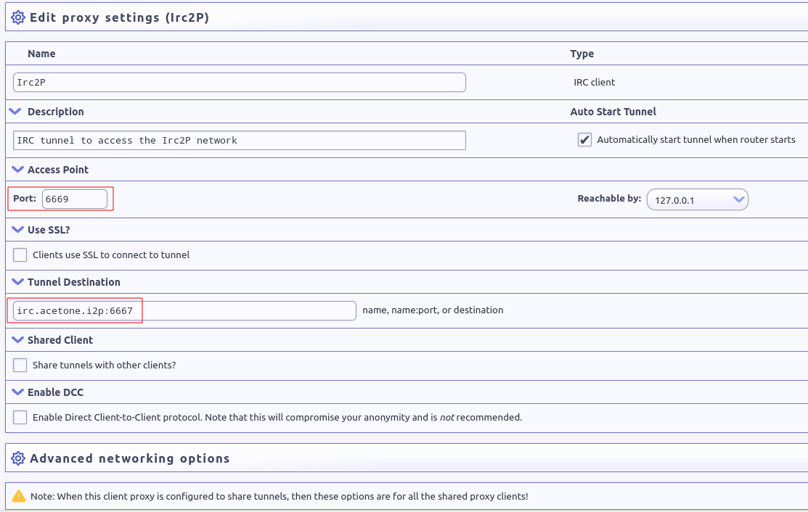

	Changing default port and servers in Irc2P.
	
To connect to a server from the list, you only need to connect your IRC client to the local tunnel (i.e., ``127.0.0.1``) on the access point port (i.e., port ``6668`` by default). The capture below shows HexChat connecting to the ``irc.echelon.i2p`` server using this tunnel.
 
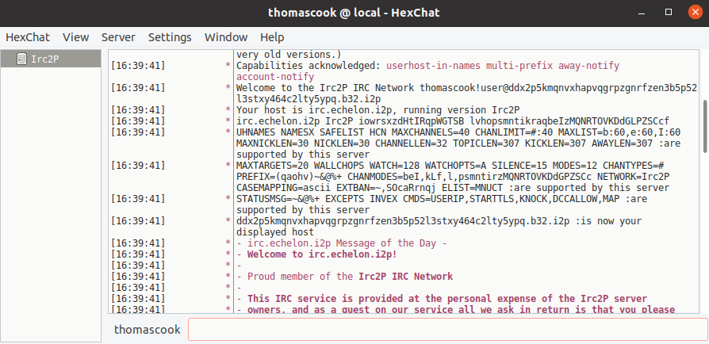

	The HexChat client successfully connected to irc.echelon.i2p via the local Irc2P tunnel.

There are other IRC servers available on I2P, as shown below.
 

	Ilita network on I2P is an IRC service.

On i2pd, it is also possible to create an IRC tunnel, as demonstrated below:
 

	Configuration of XChat on Ubuntu to use the Ilita IRC server on I2P via i2pd.

Web clients also exist, like the one below:
 

	Ilita network online IRC web client on I2P.

Of course, these chat services are also available on other darknets. Below is an example of a free web chat available on Tor.
 

	Free chat service hosted on BlackHost (Tor).

XMPP services are also available, as shown below:
 

	Snopyta on Tor proposes various services, including an XMPP service.

Free File Sharing and Streaming Services
****************************************
A wide variety of content can be downloaded from the Dark Web via direct downloads or torrents, legally or illegally, including, but not limited to, TV episodes, movies, music, podcasts, comics, books, pictures, games, and software (both legal and cracked versions).

Torrent Files
=============
Torrent is a peer-to-peer file-sharing protocol that allows anyone to download and share files easily. This is a very convenient way to download large files, like Linux distributions. On the Surface Web, because many torrent trackers offer pirated software, TV shows, movies, music, comics, and books, law enforcement seized several of them (“The Pirate Bay” is a famous example) because of copyright infringement. Torrent trackers are also available on the Dark Web, with less surveillance.

Below are some examples of torrent trackers available on some darknets.
 

	i2ptorrents.i2p on the I2P darknet is a portal to download torrents about movies, software, series.
 
.. figure:: images/image188.png
	:width: 800
	:alt: List of some TV shows available for download on Hyphanet
	:class: with-border

	List of some TV shows available for download on Hyphanet.
 

	Forbidden History [#]_ on I2P hosts torrents of documentaries.
 

	The Pirate Bay torrent tracker [#]_ on Tor.

TV Shows and Music (Direct Downloads)
=====================================
While some TV shows or music can be downloaded via torrent trackers, direct downloads are also available, as shown below.

	TV Series Activelinks proposes links to download some TV shows on Hyphanet.

	Direct download of music and books on the “Freenet Warez portal” (Hyphanet).

Online Streaming and Radio
==========================
Video and audio streaming, including online radio, are also available, as shown in the examples below.
 

	ZeroMusic on ZeroNet is a free music streaming service.
 

	Arav’s Dwell is an online radio on I2P.
 

	Invidious on Tor, an open-source alternative front-end to YouTube.
 

	Deep Web Radio [#]_ on Tor.

Comics and Books
================
Some darknets also have online libraries with comics, manga, and books that can be downloaded.

Z-Library is one of the biggest libraries. It was available on the Surface Web [#]_ until the domain was seized in November 2022 due to copyright infringements. However, the library is still available on Tor, as shown below.
 

	Z–Library was seized on the Surface Web (z-lib.org) but is still available on Tor.
 

	The Comic Book Library on Tor, hosting almost 3,000 comics for free.
 

	The Free Book Library on I2P.
 

	Just Another Library on Tor hosts hundreds of books in various categories.

Online Tools and Software
=========================
Many software (including cracked ones) can be found online or downloaded on the Dark Web. Some rely on specific darknets (e.g., FMS for Hyphanet, OnionShare for Tor), and some are free tools or pirated copies of software.
 
.. figure:: images/image201.png
	:width: 800
	:alt: Nyx, a tool to monitor Tor
	:class: with-border

	Nyx, a tool to monitor Tor.
 

	Some programs available for download on BlackHost (Tor).
 

	A public repository on Tor to download utilities for Sun.
 

	Pirated copies of IDA Pro, a powerful disassembler (Tor darknet).

You’ll also find online software, like a cloned version of CyberChef:
 

	Cloned version of CyberChef [#]_ on I2P [#]_

	
	Etherpad tool available on Tor.
	
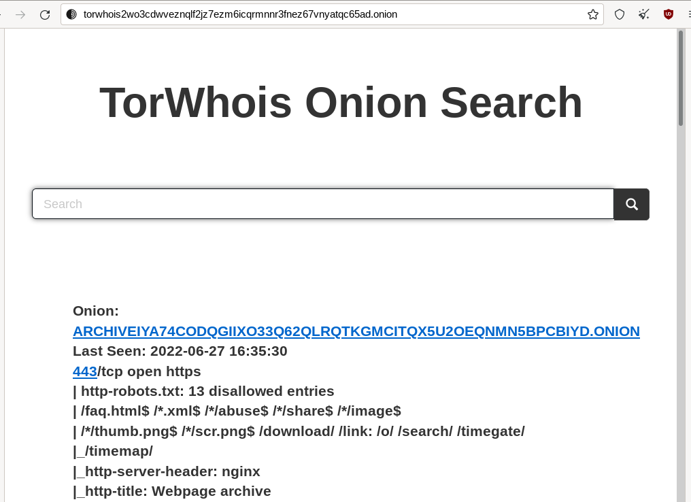

	An online version of Nmap (a powerful port scanner) hosted on the Tor darknet.

Development Repositories
========================
Some developers prefer to share their developments on the Dark Web, where you can clone their Git repositories as you would on GitHub (Surface Web). Below are some examples of Git repositories available on the Dark Web.
 
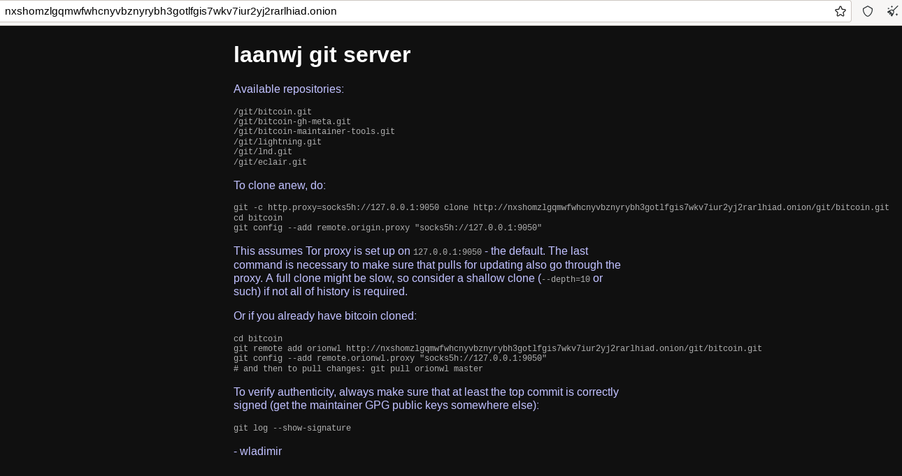

	A git repository on Tor.
 

	Coarse Enigma on Tor, hosting some programs that contribute to better anonymization (notice that the git repos are on I2P).
 
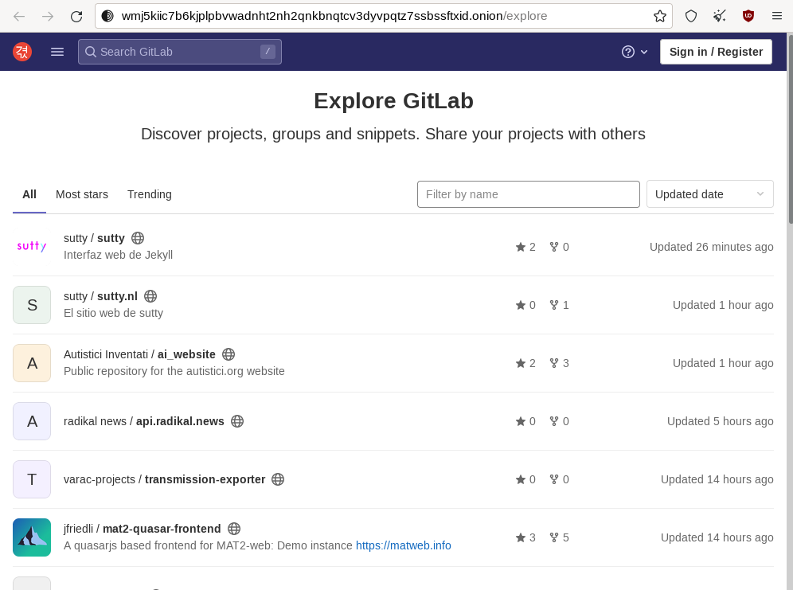

	0xacab, a git server hosting development projects for free on Tor.
 

	Cloning a git repository over I2P using the HTTP proxy tunnel.

Games
=====
Online and offline games, from old games to gambling websites, are available on almost all darknets. However, don’t expect advanced online games that rely on low latency. Anonymity networks are instead synonyms of high latency, which makes these online games incompatible.
 
.. figure:: images/image213.png
	:width: 800
	:alt: Deep Space Games on Hyphanet, a portal where you can download games
	:class: with-border

	Deep Space Games on Hyphanet, a portal where you can download games.
 
.. figure:: images/image214.png
	:width: 800
	:alt: GIHKAL, a freesite (Hyphanet) where you can download many computer games for Windows, Linux, or Mac
	:class: with-border

	GIHKAL, a freesite (Hyphanet) where you can download many computer games for Windows, Linux, or Mac.
 

	Play 2048 online on ZeroNet.
 

	Zero-8 is a Zite (ZeroNet) where you can play many games online.

Paste Services
**************
Services like Pastebin also exist on the Dark Web and may be interesting sources of information if you know what you are looking for and how to use them. Some pastes may contain dumps of stolen data, while others may be source code extracts or links to hidden services.
 

	NullPaste, a paste service on ZeroNet.
 

	Stronghold Paste, a paste service on Tor.
 

	0xpaste.i2p and privatebin.i2p (I2P) are paste services that allow you to share content (some posts are password protected).
	
News, Blogs, Discussion Boards, Whistleblowing, and Tutorials
*************************************************************
Blogs, news, discussion boards, and tutorials are on all darknets detailed in the previous chapters (i.e., Tor, I2P, Hyphanet, and ZeroNet). You can find many of them listed on directories or by using search engines on the respective darknets. Still, some of these resources may be less straightforward because they are not referenced or have private access. You’ll be able to find many topics addressed, including (but not limited to) news, politics, religion, hacking, scam, programming, science and technology, security, LGBT, whistle-blowing, humor, etc. Below are some examples found on different darknets.

News
====
Many news sites, including security news sites, available on the Surface Web, are also available on the Dark Web. Tor or I2P are used to circumvent censorship in some countries so that people living in those countries can access the information.

As examples of security resources available on the Surface Web and the Dark Web, we can quote Naked Security from Sophos [#]_, which is also available on I2P [#]_, Schneier On Security [#]_, which is also available on I2P [#]_, and Krebs On Security [#]_, which is also available on I2P [#]_.

There are also IT-related resources, like Ars Technica [#]_, also available on I2P [#]_ or Hackaday [#]_, also on I2P [#]_.

The example below shows the ProPublica [#]_ version available on Tor.

	ProPublica [#]_ also has its version on Tor to allow censored users to access the site.

Some news sites only relate darknet’s specific information, including recent arrests or seized marketplaces, like “Darknetlive”, as shown below.

	Darknetlive on Tor, a news site that talks about Dark Web-related events.

Some politically oriented news websites are hosted on the Dark Web, as depicted below.
 
.. figure:: images/image222.png
	:width: 800
	:alt: notochina.i2p is a politically oriented site on I2P
	:class: with-border

	notochina.i2p is a politically oriented site on I2P.

Blogs
=====
A wide variety of blogs on the Dark Web address almost any topic. Interestingly, many of these blogs don’t necessarily host illegal or unethical content but have their home on the Dark Web. It’s a way for their authors to remain anonymous and share content they don’t want to be linked to. On the other hand, some other blogs may host illegal or harmful content, and hosting such content on the Surface Web may lead to censorship or seizure.
 

	Digdeeper blog on Tor about software, privacy, society, video games, and reviews.
 

	A blog on Hyphanet explaining how to grow cannabis.
 

	Kaffie’s Blog (ZeroNet) from the developer of Kaffiene, a search engine on ZeroNet.
 

	Icfteam.i2p, a blog in Russian language on I2P that deals with network-related topics (related to exploiting Cisco vulnerabilities here).
	
Social Networks, Discussion Boards, and Forums
==============================================
Social networks on the Dark Web are an interesting topic. Hence, social networks usually found on the Surface Web (e.g., Facebook, X, Instagram, etc.) associate an identity with the published content because the primary objective is to build connections and communicate with others. However, the Dark Web population is mainly looking for anonymity and privacy, which seems to be in contradiction with social networks. As a result, most social networks on the Dark Web are more like the infamous Reddit website, where content and discussion matter much more than identity (i.e., who is posting).

That said, you’ll still find X and Facebook on the Dark Web, which allows censored people to access these social networks.
 

	Facebook on Tor.
	
Sone is an application that can be installed as a plugin on the Hyphanet darknet. It allows the posting of news and supports comments and votes.
 

	Sone on Hyphanet.
	
On the ZeroNet darknet, you can use ZeroTalk, a decentralized forum that supports comments and votes.
 

	A discussion on ZeroTalk (ZeroNet darknet) about Odysee.com, a video-sharing platform available on the Surface Web that runs on the LBRY decentralized blockchain.

The capture below shows Teddit on I2P, a Reddit-like site.
 

	Teddit on I2P, a reddit-like site.
	
Dread on Tor is probably one of the most active social networks on the Dark Web. The website was created in 2018 by HugBunter, a Reddit developer who was disappointed that discussions on darknet markets have been banned on Reddit and decided to clone Reddit on Tor. Since then, Dread has become a reference and has hosted thousands of discussions on many topics besides darknet markets.
 

	Dread on Tor.
	
The “Deep Answers” website on Tor is used to ask questions and receive answers from members.
 

	The “Deep Answers” website on Tor.
	
The official “Hidden Answers” was also another popular “questions and answers” forum-like website, but it has been closed, and it seems that clones have emerged, as shown below.
 

	Cloned version [#]_ of the “Hidden Answers” website on Tor.

Image Boards
============
An image board is a forum that focuses on posting images, often along with text and discussion. The first image boards were created in Japan to extend the concept of textboards. The most famous one is probably “4chan,” available on the Surface Web and developed initially as a response to “2chan,” a Japanese image board. It was initially used to discuss anime and is the original incubator for many memes. However, it quickly hosted less ethical content, some censored. Because some users found moderation too strict on “4chan,” they cloned the board to “8chan.” This explains why “8chan” is also available on Tor, meaning less censorship and more anonymity. 

	The 8chan image board on Tor, a 4chan-like website.

Tutorials
=========
Many tutorials can be found on the Dark Web, addressing many topics, ranging from teaching how to use Vim (a Linux text editor) to growing cannabis, techniques for killing someone, or developing undetectable malware. Some tutorials are freely accessible from personal web pages and forums, while others are sold on Dark Web markets.

Below is an example of a site that lists different ways to kill someone.
  

	Timetable of Death 2020 on Hyphanet, a site that details some techniques to kill someone.

Below is another example of a publication that deals with killing people.
 

	“Hit Man, A Technical Manual for Independent Contractors” on Hyphanet.

You may also find resources for coding-related content, like the one below. It explains how to use JavaScript while preserving anonymity on the I2P darknet.
 

	javascript.i2p (I2P) teaches how to use JavaScript without jeopardizing anonymity on I2P.

The screenshot below shows a tutorial on using PowerShell evasion techniques written by “Cadaver.” It is possibly linked to the “Hermit Kingdom,” a North Korean Advanced Persistent Threat (APT) group known for ransomware attacks.
 

	Hacking tutorial on Tor, explaining how to write undetectable PowerShell-based malware.

Another example of malware, backdoor, and ransomware-related resources is shown below, this time hosted on Hyphanet.
 

	Malware development tutorial on Hyphanet.

Classified, Restricted, Censored, and Leaked Content
****************************************************
Classified Documents
====================
Wikipedia defines classified documents as “material that a government body deems to be sensitive information that must be protected. Access is restricted by law or regulation to particular groups of people with the necessary security clearance and need to know, and mishandling of the material can incur criminal penalties.”

It is also important to note that previously classified documents that become public are deemed “declassified.” The screenshot below shows an extract from the Library of Congress website [#]_ (Surface Web), where declassified documents are available for download.
 

	Link to declassified documents available on the Library of Congress website.

Such declassified documents can be found on the Dark Web as well, as depicted in the below screenshot:

	Declassified documents available on a clone of VoltaireNet.org, on Hyphanet. [#]_

Julian Assange, who is one of the most famous whistleblowers, founded WikiLeaks, a website available on the Surface Web [#]_ and on various darknets, which he defines as “a giant library of the world’s most persecuted documents.”

Some of these disclosed documents (whose authenticity has not been verified) are available on Hyphanet and Tor, as shown in the following two screenshots.

	Documents available on a Wikileaks version hosted on Hyphanet.
 

	Leaked documents from Wikileaks were shared on SuprBay and are available via Tor.

A resource available on Tor, and often described as an alternative to WikiLeaks, is called “Distributed Denial of Secrets [#]_.” The site is best known for publishing an extensive collection of internal police documents known as “BlueLeaks.”

	Distributed Denial of Secrets is a whistleblower site founded in 2018 and is an alternative to WikiLeaks.

There are also discussions on Dread about potentially leaked classified documents, but you’ll rarely find links to these documents.
 

	Discussion on Dread (Tor) about a potential leak of classified documents.

With a lot of patience and specific tools, it is possible to find public directories that contain classified documents, as shown below.
 

	Classified documents on Tor.

Restricted/Confidential Documents
=================================
If classified information is for government-related data, this is not necessarily the case for restricted or confidential data, which applies to organizations or individuals. Restricted data is highly sensitive and can lead to a massive loss for the company if stolen (e.g., trade secrets, financial records). On the other hand, confidential data is generally restricted to limited and controlled teams within an organization (e.g., social security numbers). In both cases, it is never suitable for companies or individuals when such information is publicly disclosed.

Over the past few years, Greenpeace Netherlands released secret negotiation documents of various trade agreements on their website [#]_, which has its clone on Hyphanet. You can download copies of the restricted documents there.

	The clone of trade-leaks.org on Hyphanet lists restricted documents published by Greenpeace Netherlands.
 

	Leaked restricted documents on Hyphanet from the Greenpeace Netherlands TTIP leaks.

Some other sources involve emails or phone call extracts of politicians or presidents, as shown in the example below.
 

	Stolen files to French President Emmanuel Macron, available on Hyphanet.

By browsing darknets with specific search terms or tools, it is possible to find public repositories of documents stolen from companies. Some of these sources result from ransomware attacks, in which data becomes public if the ransom is not paid.
 

	Leaked stolen Camden City School District documents are available on Tor.
	
Law enforcement administrations may also be targets for stolen documents. The example below shows a list of documents related to law enforcement projects, tactics, and programs available on Hyphanet.
 
.. figure:: images/image252.png
	:width: 800
	:alt: Documents stolen from the police, related to projects, tactics, and programs of law enforcement
	:class: with-border

	Documents stolen from the police, related to projects, tactics, and programs of law enforcement, publicly disclosed on a repository [#]_ in Hyphanet.

We may also find documents stolen from Ministries, as shown in the below example.

	Documents about Ministries leaked on Tor.

Of course, all the leaked documents impact not only the school, the administration, or the organization concerned by the leakage but also the individuals quoted in some of the leaked documents or their personal information. It can disclose any valuable information, including, but not limited to, administrative, financial, legal, or medical information. Stolen documents are often the result of a ransomware attack. The example below shows the Lorenz.sz40 ransomware portal and examples of confidential documents publicly disclosed.
 

	The Lorenz.sZ40 portal on Tor, with the list of victims and associated stolen documents.
 

	An example of a confidential document on the Lorenz.sZ40 portal.

The screenshots below depict some examples of public repositories available on Tor, with stolen data from companies who likely refused to pay the ransom:
 

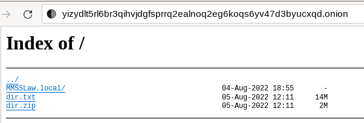

	Compressed archives containing documents stolen from companies.

Censored Books
==============
Some censored books are available on the Dark Web. You’ll notice that for this kind of resource, it’s not a coincidence that Hyphanet has been selected as the darknet of choice (remember that resistance to censorship is one of Hyphanet’s strengths).

Below is a screenshot of a page on Hyphanet with a link to download “Noir Canada,” a book banned from sale in Canada.
 

	Censored book in Canada, available for download on Hyphanet.

After the Nazis were defeated in 1945, the Allies gave the copyright in “Mein Kampf” to Bavaria. This latest banned reprinting of the book in Germany until the copyright expired in 2016. The book was also banned in Russia in 2010. The example below shows a scanned copy of “Mein Kampf,” available on Hyphanet.
 

	Scanned version of Mein Kampf by Adolf Hitler, available on Hyphanet.

Tor also has Onion Services that host thousands of books, some of which are still banned in some countries.
 

	Thousands of books (including banned ones) can be downloaded on Z-Library [#]_. The screenshot shows “The Great Replacement,” a book banned in New Zealand in 2019.

Leaked Source Code
==================
Applications (e.g., Microsoft Windows, Microsoft Word, Adobe Photoshop, Google Chrome, GitHub, etc.) result from code. Some applications are compiled, and others run on a server, but all depend on source code, which vendors try to keep secret unless deliberately shared (i.e., open source). It happens that source code is stolen (insider job, ransomware, misconfiguration, etc.), and the Dark Web is often the place where it will be shared (either by direct download or via torrent files), as shown in the screenshots below.

	A site on Tor hosting leaked source code.
 

	Example of leaked source code on Tor.
 

	Leaked source code on PaTracker, available on I2P.

On some forums, you’ll also find discussions about source code leaks, as shown in the following two screenshots.
 

	Discussions on source code leak on Suprbay (Tor).
 

	Source code leak related to LAPSUS$ hack, discussed on Nanochan (Tor).

Financial Services
******************
Escrow Services
===============
An escrow service is a financial third party that works like PayPal. However, unlike PayPal, funds are collected, held, and disbursed only when both the buyer and the seller approve the transaction, which is supposed to make the service more secure.

Some examples of external escrow services on the Dark Web are shown below.
 
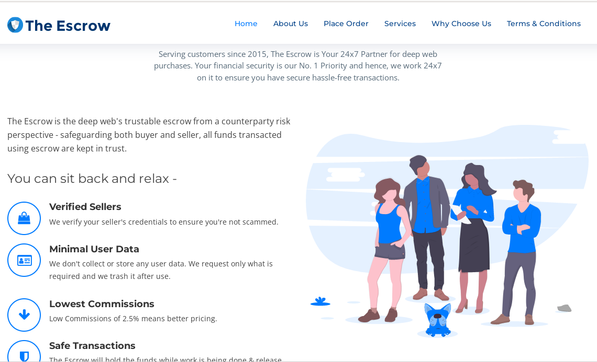

	“The Escrow” service, a typical escrow service available on Tor.
 

	FirstTrustEscrow, another escrow service available on Tor.

Money Laundering / Bitcoin Tumbler and Mixer
============================================
A cryptocurrency Tumbler, or Mixer, is a service that exchanges identifiable cryptocurrency funds with others via various operations to obscure the funds' origin. Due to its anonymity goal, tumblers have been used to launder cryptocurrency.

Such services can be found on the Surface Web and the Dark Web. The screenshot below shows an example from Tor.
 

	“Best BTC Cleaner” on Tor, a Bitcoin tumbler and mixer.

Hacked Crypto Wallets
=====================
Crypto stealers are a category of malware that focuses on stealing wallets’ private keys on compromised computers. The screenshot below shows an example of such a crypto stealer for sale on the Tor darknet.
 

	An example of a crypto stealer sold on Tor.

Once keys are gathered, crypto wallets can be stolen and sold on the Dark Web, as depicted in the screenshot below.
 
.. figure:: images/image274.png
	:width: 800
	:alt: Cryptonium on Tor, a service that sells hacked crypto wallets
	:class: with-border

	Cryptonium on Tor, a service that sells hacked crypto wallets.

Stolen or Fake Credit Cards and PayPal Accounts
===============================================
Many Darknet Markets have a “financial services” or “fraud” section where you can find stolen or fake credit cards and PayPal accounts.
 

	Stolen credit card information for sale on Abacus Market on Tor.

You can also find Markets dedicated to this kind of activity. Below are some examples of what you can find.
 

	AccMarket on Tor.
 

	Oscar Market on Tor sells credit cards with a given balance.

Digital Services
****************
Coupons Generators and Gift Cards
=================================
A gift card is a prepaid card used to purchase goods or services at a specific retailer or group. The card has a fixed monetary value (e.g., $25, $50) that can be spent until the balance is exhausted. Coupons, on the other hand, are vouchers that provide a discount or special offer on a product or service. They typically have a specific monetary discount (e.g., $5 off) or a percentage off (e.g., 20% off). Both gift cards and coupons are identified by a unique number or code (serial number, barcode, QR code, etc.) that shops can use to check the card’s validity. 

The generation of these numbers may have a weakness that can be exploited to generate new valid codes, or the algorithm may have been stolen. Generators use different techniques to generate these numbers, but some may be fake.

The screenshots below show examples of such generators sold on DNMs.
 

	Gift cards for sale on Royal Market, on Tor.
 

	IKEA gift card generator and checker for sale on the Ares DNM.

Pirated Accounts
================
Many DNM sell pirated accounts for video or music streaming services like Netflix, Spotify, and premium porn accounts.
 

	Pirated Netflix account sold on Kingdom Market on Tor.
 

	A Spotify Premium account for sale on Vice City, on Tor.

Social Media Subscribers, Views or Likes Boosters
=================================================
Because monetization of social media like YouTube, Instagram, or TikTok is based on the number of subscribers or visitors, it is not surprising that some content creators try to cheat. Buying a service to get more subscribers, views, or “likes” on Dark Web marketplaces is possible, as shown in the screenshots below.
 

	Tiktok likes booster for sales on Kingdom Market (Tor).
 

	Youtube likes booster for sale on Torzon (Tor).

Dumps
=====
Databases with usernames, passwords, email addresses, IP addresses, postal addresses, phone number, social security number, or other valuable personal information are sold on the Dark Web. This Personally Identified Information (PII) is most often stolen by stealers, a category of malware that collects various account and payment data, cookie files, authorization tokens, etc. This data is usually used for phishing, social engineering, or privilege escalation attacks.
 
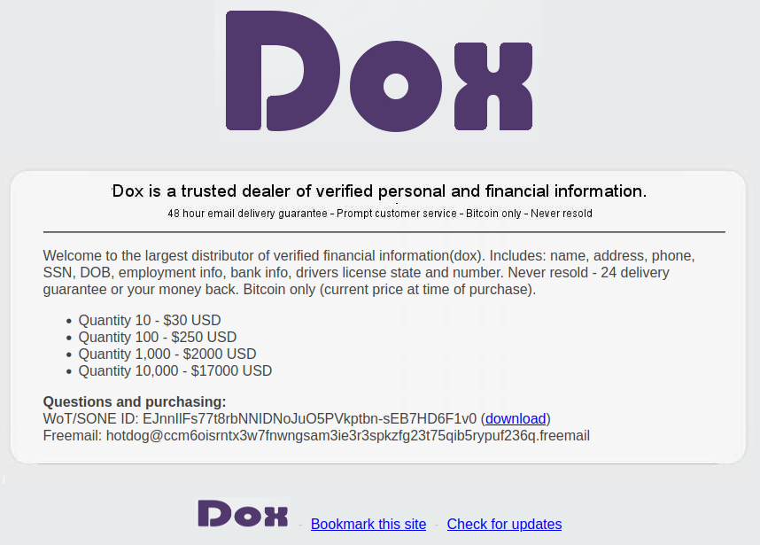

	Personally identifiable information (PII) for sale on Hyphanet.
 

	Databases for sale on Darkode (Tor).
 

	Leaked data from dating sites for free download on Hyphanet.
 

	A post from Changpeng “CZ” Zhaon, the CEO of Binance on X, informing that 1 billion resident records have been discovered for sale on the Dark Web.
 
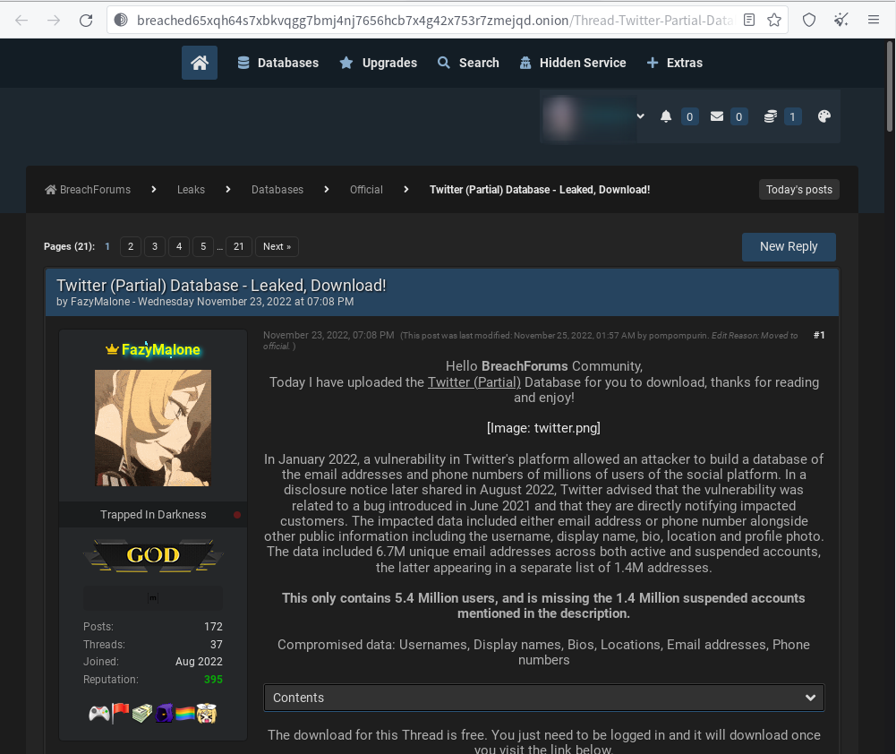

	Twitter (now called “X”) leaked data on BreachForums (Tor).

Commercial Services
*******************
Hacking Services
================
Many sites and advertisements (especially on Tor) sell hacking services, ranging from hacking a cell phone or social accounts to attacking websites. These services are often sold under the label “hire a hacker” or “rent or hacker,” and you can find such services on dedicated websites or via darknet markets. Payment is made in crypto-currency, and prices vary from an equivalent of $200 to $2000, depending on the service. However, these services are very likely all scams (there are a lot of discussions on the topic on Dread, the Reddit of the Dark Web).
 

	Dark Web Hackers for hire, on Tor.
 

	Rent a Hacker on Tor, with prices.

Hitman Services
===============
As crazy as it sounds, you’ll easily find sites offering services to perpetrate murder. This kind of service is generally found on dedicated pages outside of DNMs, and like for hacking services (the previous section), there is no assurance that the service is not a scam.  Indeed, a study conducted by Thomas J. Holt, a Director and Professor in the School of Criminal Justice at Michigan State University, tends to confirm that the majority of these services, if not all, are very likely fake [#]_. Some of these sites even share requests they receive with the police [#]_ once they have charged the potential customers.
 

	Hire a hitman website on Tor.

Some sites, like the one shown below, even review the reputations of different services in an attempt to give these sites more credit.
 
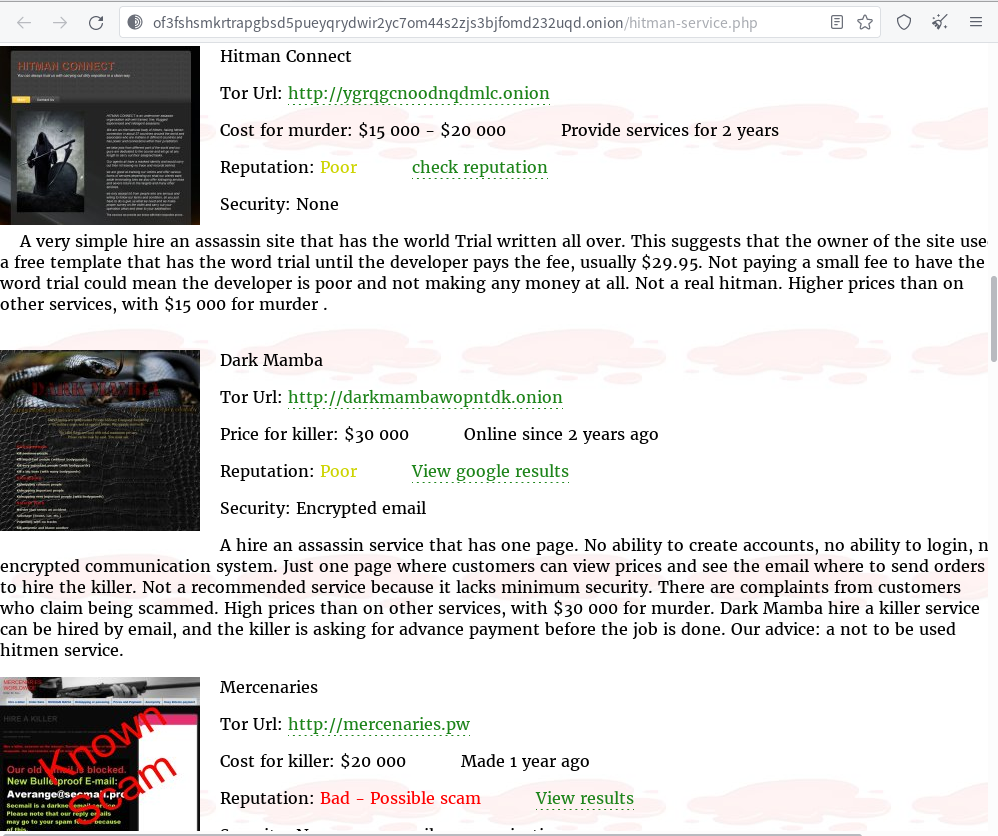

	A page on Tor that reviews some hitman services.

Postage Services
================
Postage services are not specific to the Dark Web, and most are also available on the Surface Web. Using Tor to access these services may add a level of anonymity. 
 

	Cryptostamps on Tor is a service to buy postage using popular cryptocurrencies.
 

	Cryptopostage, another service on Tor to buy and print from home using cryptocurrency.

Commercial Goods
****************
Weapons
=======
Weapons are often the first thing many people think of when asked what they think we can buy on the Dark Web. Yes, it’s real. You can buy weapons in specific markets or vendor stores. These include guns, rifles, but also heavy weapons such as rocket launchers.
 

	EuroGuns on Tor.
 

	Luckp 47 Shop.
 

	Black Market Guns on Tor sells new, unused weapons without serial numbers.

Pharmaceutical Products & Drugs
===============================
Many DNMs are selling prescriptions and drugs, and some of them are even exclusively selling this kind of product.
 

	Prescriptions for sale on the Royal Market on Tor.

Poison & Venom
==============
Poisonous substances and venom can be found on the Dark Web, as shown below.
 

	A website on Tor that sells poisons claimed to be undetectable.
 

	Apex market on Tor has a section called “Poisons.”
 

	Scorpion venom for sale on “The Dark Market,” on Tor.

Mobile Phones
=============
You can buy mobile phones (likely stolen items or scams) on the Dark Web, either from DNM or vendor’s pages. On the “Apple Shop” DNM, there is a disclaimer that says: “Our products are sold at competitive prices mainly because they are obtained using leaked credit cards & PayPal billing information. Data is first acquired; gift cards are bought using the data and then used to purchase goods on various clearnet stores in order to further anonymize the purchase.”
 

	Apple Shop on Tor.
 

	iPhone 13 Pro Max for sale on Kingdom Market, on Tor.
 

	Mobile Store available on Tor, where you can buy unlocked phones.
 

	The Galaxy Shop on Tor sells Samsung Galaxy phones.

Counterfeit Items
=================
Many DNM sell counterfeit items, ranging from clothing and electronics to fake documents (including IDs, passports, proof of address, and COVID certificates), jewelry and gold money, and tobacco. Some examples are shown below.

Counterfeit Money
-----------------
Counterfeit money in local currencies (USD, EUR, etc.) is available on many DNMs at different prices, depending on the quality grade. This latest ranges from A (high-quality counterfeit) to C (low-quality counterfeit):

- **Grade A (High Quality)**: Very close to genuine currency, using advanced technology and accurate replication of security features. Difficult to detect with casual inspection but can be identified with expert tools.
- **Grade B (Moderate Quality)**: Noticeable flaws in design and security features, but still relatively convincing. Can often pass in less scrutinized settings.
- **Grade C (Low Quality)**: Poor quality with visible flaws in appearance and security features. Easily detectable using basic counterfeit detection methods.
 

	Some offers for counterfeit currency on DarkFox Market (Tor).
 

	Counterfeit USD (Tor) is a site where you can buy counterfeit US dollars.

The same sites are available for euros as well, as depicted below.
 

	A site on Tor where you can buy counterfeit euros.

Stolen or Fake Identities
-------------------------
Darknet Markets almost always sell stolen or fake identities, including, but not limited to, counterfeit IDs or passports, driver's licenses, or identity cards.
 

	OnionIdentityServices on Tor allows the generation of fake passports, ID cards, or driver's licenses.
 

	USfakeIDs (Tor) proposes a range of fake driving licenses from different states in the US.

Counterfeit Certificates and Diplomas
-------------------------------------
This section is likely more for students looking for unethical excuses (e.g., fake death certificates) to justify an absence or looking for a first job when companies require evidence of studies and diplomas and cannot provide it. For those students, DNMs sell counterfeit certificates.
 

	Death Certificate template for sale on Kingdom Market, on Tor.
 

	Fake Baccalaureat diploma for sale on Cocorico Market, a French market on Tor.

Counterfeit Invoices and Bills
------------------------------
Fake invoices can be used for several purposes (assurance, proof of address, etc.). As shown in the examples below, finding fake invoices or templates to build your own on the Dark Web is easy.
 

	Fake invoices available for sale on Cocorico market.
 

	Template to build a fake bill, available for sale on Ares (Tor).

Malware, Ransomware, and Malicious Infrastructures
**************************************************
Malware
=======
You’ll find all kinds of possible malware shared for free on forums or sold on DNMs, ranging from data stealers to exploit kits, remote access tools (RAT), banking trojans, ransomware, or even ransomware builders.
 

	Discussions about malware on Helium, a discussion board hosted on Tor.
 
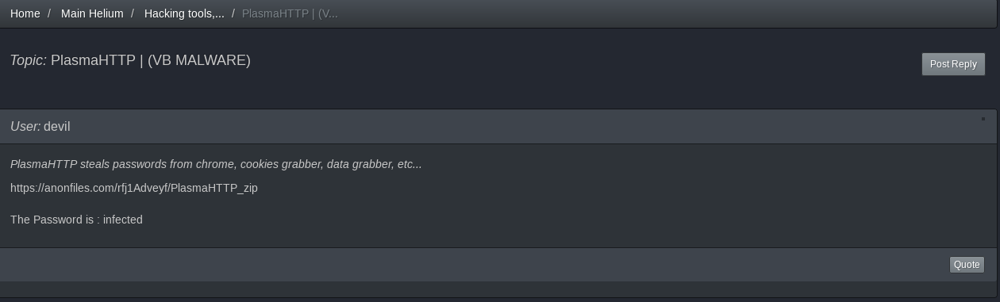

	Download link to PlasmaHTTP, a data stealer, on Helium.
 

	Source code of Dexter malware available for download on the “Best Carding World” forum on Tor.
 

	The DarkFox market available on Tor sells botnets, crypters, exploit kits, exploits, malware, remote access tools (RAT).
 

	The ARES market on Tor sells various products, including malware. For example, the infamous RedLine Stealer malware is for sale at less than $25.
 

	Hack Tools 2022 on Tor sells a pack of 500 hacking ebooks, crypters, RATs, keyloggers, virus makers, SMS and email bombers, phone and forensic tools for 30 euros.

Zero-day
========
A zero-day (commonly abbreviated 0-day) exploit is a cyber attack targeting a software vulnerability unknown to the software vendor or antivirus vendors and for which no official patch has yet been released.

Such attacks will likely succeed because defenses are not in place (no patch, no detection signature). Therefore, attackers often sell these exploits on the Dark Web for a price that depends on their exploitability (what benefit an attacker can have from the exploit).

Below is an example of a 0-day exploit against NodeBB, an open-source forum platform.
 

	0-day against NodeBB published on a blog available on Tor.

The below example shows a 0-day exploit against Facebook.
 

	0-day for sale on Tor.

Ransomware Portals
==================
Ransomware gangs have pages on the Dark Web where they publish documents stolen from compromised companies. Below are some examples of their sites.
 

	The page “Ransomware Group Sites” on Tor references active leak sites of ransomware groups.
 

	LockBit 3.0 ransomware official portal on Tor.
 

	Conti (ransomware) News page on Tor.
 

	Lorenz ransomware page on Tor, disclosing stolen documents from compromised companies.

Malicious Infrastructure
========================
Some attacks may involve complex infrastructure that only advanced attackers (sometimes sponsored by governments) can offer. This may include botnet networks to launch Distributed Denial of Services (DDoS). Such infrastructures are for sale on the Dark Web, as depicted in the screenshots below.
 

	Ransomware and Command And Control (C2) infrastructure for sale on Tor.

Network Services and Privacy Services
*************************************
Hosting
=======
Regarding the hosting service itself (not the configuration of the web server), hosting a web server on a darknet shouldn’t be that different from hosting web services on the Surface Web.

What these hosting providers do is pre-configuring a shared web space to be available on a darknet (e.g., Tor). There may be a few benefits to increased anonymity since these hosting providers are likely not registered companies. Still, it depends on the payment options, the type of data required to get an account, and how they handle the users’ data.

Of course, this hosting service comes with no guarantee, meaning that the web service can be shut down at any moment, there is no uptime service level agreement, no backup, no data recovery plan, etc. Besides, the hosting provider will also access your website’s data, including the source code and the database.

Below are examples of shared hosting services found on Tor.
 

	VPS Hosting options on TheHighTable, on Tor.
 

	Kaizushi’s Little Onion Server hosting prices (Tor).

SOCKS5 Proxies and VPN
======================
SOCKS5 proxies are commonly used for “carding” purposes, a form of fraud where stolen credit or debit card information is used to charge prepaid cards or purchase gift cards. To avoid raising some flags, the “carder” needs to perform the operations using an IP address in the same region as the cardholder, which can be achieved by proxying network traffic through a SOCKS5 proxy.

SOCKS5 proxies can also help circumvent Internet censorship, bypass firewall rules, and do safe torrenting.

	SOCKS5 proxy for sale on the DarkFox market, on Tor.

VPNs are also commonly used as they can hide your IP address and encrypt your network traffic. An example of a VPN provider is shown below (note that this provider is also available on the Surface Web).
 

	CryptoStorm, a VPN provider available on Tor (also available on the Surface Web).

Other Contents
**************
Of course, not everything could be covered in this chapter, but it should give a pretty good overview of what to expect when visiting Onion Services or eepsites. Some of the readers may wonder if it is true that the Dark Web hosts content related to red rooms, snuff films, torture, cannibalism, human trafficking, child pornography, suicide, or death fights. As far as child pornography, unfortunately, yes, there are many resources on the Dark Web, which even pollute many search engines. Regarding the other topics, most are scams (see screenshots below). There are many discussions on forums, both on the Surface Web and the Dark Web, with questions about the existence of such resources, but without obvious answers.
 

	Red Room on Tor (likely scam).

Disturbing videos showing scenes of rapes, torture, or beheading transit through the Internet via social media applications (X, Telegram, etc.) and are often shared by teenagers. This kind of content exists on the Dark Web, but is likely more straightforward to find on the Surface or Deep Web because of social media applications.

-----

.. [#] https://github.com/praveenjalasutram/Darkweb-Onion-Links, https://www.expressvpn.com/blog/best-onion-sites-on-dark-web/ or https://darkweblinks.com/ for example
.. [#] http://hiddenwiki.i2p/
.. [#] https://web.archive.org/
.. [#] http://archiveiya74codqgiixo33q62qlrqtkgmcitqx5u2oeqnmn5bpcbiyd.onion/
.. [#] http://hq.postman.i2p/?page_id=16
.. [#] Mail header for an email sent from I2P to the clearnet (Gmail address)
.. [#] http://forbiddenhistory.i2p/
.. [#] http://piratebayo3klnzokct3wt5yyxb2vpebbuyjl7m623iaxmqhsd52coid.onion
.. [#] http://anonyradixhkgh5myfrkarggfnmdzzhhcgoy2v66uf7sml27to5n2tid.onion/
.. [#] http://z-lib.org/
.. [#] https://gchq.github.io/CyberChef/
.. [#] http://cyberchef.i2p/
.. [#] https://nakedsecurity.sophos.com/
.. [#] http://nakedsecurity.i2p/
.. [#] https://www.schneier.com/
.. [#] http://schneieronsecurity.i2p/
.. [#] https://krebsonsecurity.com/
.. [#] http://krebsonsecurity.i2p/
.. [#] https://arstechnica.com/
.. [#] http://arstechnica.i2p/
.. [#] https://hackaday.com/
.. [#] http://hackaday.i2p
.. [#] https://www.propublica.org/
.. [#] https://www.propublica.org/ (Surface Web URL).
.. [#] http://q7fn5gvufkvqmg2p7hxdihbkfutgftv6pu5dors4t3r7sec6tcmewhid.onion
.. [#] https://guides.loc.gov/finding-government-documents/declassified-documents
.. [#] http://127.0.0.1:8888/freenet:SSK@UNOIGFBO~3x2yDMUvkoQj0RmXlh6l8jeBoYlg8ep~XI,xQDsLQwA3lSa8-kt1kIc-4wbDVdE3CpwK23XlJeAapA,AQACAAE/Voltairenet2014-12-15-0/
.. [#] https://wikileaks.org/
.. [#] http://ddosxlvzzow7scc7egy75gpke54hgbg2frahxzaw6qq5osnzm7wistid.onion/wiki/Distributed_Denial_of_Secrets
.. [#] https://trade-leaks.org/
.. [#] http://127.0.0.1:8888/USK@sDg8r7Cc9lqtPBsPgn2gRGi9rEstwrVDcutExyqVE3A,tz-fi3YwH~CVXjY8VyxgU~a4e2Loc0q6uS52WCaYGhM,AQACAAE/Cops/1/
.. [#] http://zlibrary24tuxziyiyfr7zd46ytefdqbqd2axkmxm4o5374ptpc52fad.onion/
.. [#] https://www.tandfonline.com/doi/abs/10.1080/01639625.2020.1787763?journalCode=udbh20
.. [#] https://www.vice.com/en/article/mg77bn/this-fake-hitman-site-is-the-most-elaborate-twisted-dark-web-scam-yet
