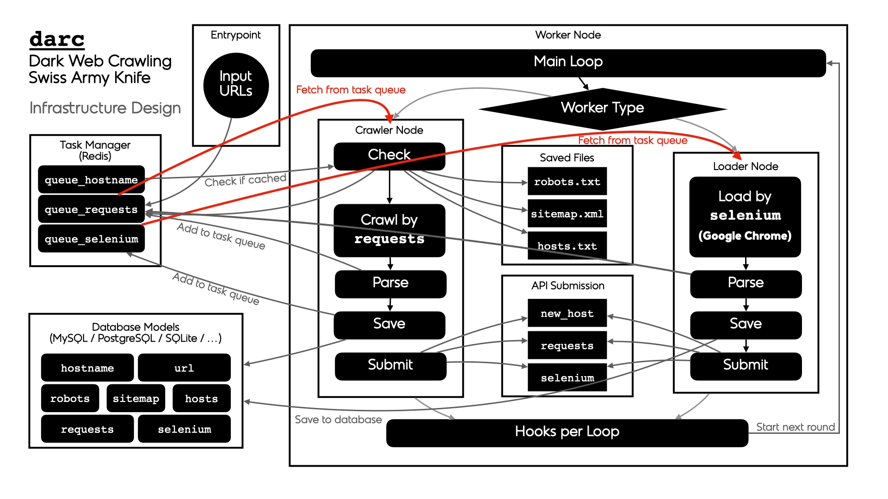

Chapter 7: Intelligence and Hunting on the Dark Web
###################################################

The previous chapters have covered four darknets in detail and their similarities and differences. The last chapter also gave a good overview of the contents to expect. Now that you have a much better understanding of what the Dark Web is and what information it contains, it is interesting to study how to extract and organize the information that is relevant to you, mainly if you are in the cybersecurity domain (e.g., Threat Intelligence Analyst, Threat Hunter) or in a law enforcement administration (e.g., Cybercrime Investigator, Cybercrime Intelligence Officer, etc.) as the Dark Web is an excellent source of threat intelligence and threat hunting.

Introduction
************
Why Does Monitoring the Dark Web Matter?
========================================
You may have different objectives:

- **Create your search engine**: This involves collecting as many links as possible and parsing all pages to index content and return relevant pages for the search criteria.
- **Threat intelligence**: Monitor a list of predefined pages, boards, forums, or markets against a list of keywords (e.g., your company name, your domain, and subdomains, IP addresses, hostnames, people’s names, vulnerabilities, etc.) to alert when keywords match.
- **Metadata collection**: Browse pages to collect metadata and make statistics or find interesting items (IP addresses, keys, email addresses, etc.), often based on specific regular expressions.
- **Investigation**: Investigators might want to monitor specific places (e.g., darknet markets, blockchain tracking). This investigation may also involve correlating information from other sources found on the Surface Web and Deep Web.

As far as threat intelligence is concerned, the reasons that generally motivate companies to monitor the Dark Web are pretty obvious:

- **Targeted attacks**: Threat actors sometimes discuss targeted attacks against specific individuals and organizations on Dark Web forums. These conversations can provide valuable insight into potential attack vectors and inform your risk management team.
- **Leaked data**: stolen and leaked credentials are available for sale on Dark Web forums and markets. Credentials are extremely valuable, allowing cybercriminals to use them to carry out brute force or identity theft attacks.
- **Vulnerability information**: Zero-day vulnerabilities are discussed or sold on the Dark Web. As no security patch is available yet for these flaws, threat actors can leverage them to attack companies.
- **Insider Threats**: Insider threats are a serious and growing problem [#]_. The Dark Web is a rich source of information about insider threats and insiders looking to sell your company’s trade secrets, intellectual property, or sensitive data.

Definition of the Scope
=======================
Suppose your objective is to build your threat intelligence monitoring service. In that case, you should not limit yourself to the information found on the Dark Web and extend it to social media, boards, and forums on the Surface Web and the Deep Web. There are good lists available on the Internet, like Link-Base [#]_.

That said, because this book is about the Dark Web, we will limit ourselves to the information available on the Dark Web, specifically Tor and I2P, which are the most relevant references for this consideration.

Steps for a Successful Monitoring
=================================
Depending on your project, sources to be considered, information to be extracted, and the way data will be processed will likely differ, but the workflow should remain the same, with the following steps:

	Sources collection > Crawling and extraction > Save to Database > Reporting

The following sections will provide some hints on how to successfully run these steps, with links to resources and tools.

Sources Collection
******************
The journey starts with identifying proper sources to consider for your monitoring. Sources will likely differ depending on your objectives. This section helps you choose the most relevant sources to achieve your goals.

Link Directories
================
Plenty of pages full of links are available on the Surface Web and the Dark Web. Below is a compilation of some of them. 

For Tor:

- **DeepdarkCTI** [#]_: Updated list of search engines, forums, markets, and ransomware.
- **Link-Base** [#]_: Updated list of boards, shops, and blogs available on the Surface Web, the Deep Web, and the Dark Web.
- **Dark.link** [#]_: A collection of markets, vendor stores, search engines, and forums with reviews.
- **OnionTree** [#]_: A collection of curated Onion Services previously available on oniontree.org (domain expired) and now archived on GitHub.
- **Onion.live** [#]_: Search engine with 1206 sites indexed. Helpful information is given for each page, including a rank, user comments, screenshots, a list of Onion URLs with the availability of the links, and a list of potential similar sites.
- **Dark.fail** [#]_:  A collection of 60 Onion Services with their respective availability status.
- **Dark-Catalog** [#]_: A collection of links in various categories, including books, crypto money, blogs, emails, forums, games, tutorials, markets, news, search engines, etc.
- **H-indexer** [#]_: Collection of 400 hidden services updated every 24 hours, with new site highlights.
- **DarkNetLive** [#]_: List of 187 Onion Service links. Also available on the Surface Web [#]_
- **Fresh Onions** [#]_: One of the most significant collections of Onion addresses, regularly updated with age and status.
- **OSINT ME** [#]_: List of Onion Service links updated by Maciej Makowski, owner of the osintme.com website.

For I2P:

- **The Hitchhiker’s Guide to the I2P eepsites** [#]_: Some links of eepsites (I2P).
- **Onion Soup** [#]_: List of eepsites sorted by categories.
- **Notbob.i2p**, **inr.i2p** or **reg.i2p**: List of eepsites available on the I2P darknet.

Monitor the Links
=================
For Tor:

- **Hunchly** [#]_: Sends daily report about new Onion links and Onion links that are up and down
- **TOR66 fresh onions** [#]_: List of Onion Services.
- **Onioff** [#]_: Check the status of a list of Onion links.
- **Docker-onion-nmap** [#]_: Docker image that uses Proxychains to wrap Nmap to scan Onion Services via Tor.

For I2P:

- **Identiguy.i2p**, **reg.i2p**, **notbob.i2p**: List of eepsites with their respective status.

Extracting Information
**********************
Once you’ve identified the relevant sources for your project and your objective, you will likely need to crawl pages and extract partial to complete content. This section gives some tools (mainly for Tor) that can help to:

- return a list of links based on keywords,
- index text contained on pages,
- extract screenshots, titles, content, observables (IP addresses, domains, email addresses, CVE, file hashes, crypto keys, etc.),
- save content to a database.

Torsocks, Torify, and Proxychains
=================================
To parse an Onion Service with the command line, you can use ``curl`` with the ``--socks5-hostname`` option, ``torsocks``, ``torify`` (a wrapper for ``torsocks``), or ``proxychains`` (use ``proxychains4``), as shown in the examples below:

.. code-block:: bash

	$ URL="http://tor66sewebgixwhcqfnp5inzp5x5uohhdy3kvtnyfxc2e5mxiuh34iid.onion/fresh"
	$ curl -s --socks5-hostname 127.0.0.1:9050 $URL
	$ torsocks curl -s $URL
	$ torify curl -s $URL
	$ proxychains curl -s $URL

TorBot
======
TorBot [#]_ extracts information (page title, emails, links, …) from a list of Onion links.
The following commands show how to install TorBot.

.. code-block:: bash

	$ git clone https://github.com/DedSecInside/TorBot.git
	$ cd TorBot/
	$ python3 -m venv torbot_venv
	$ source torbot_venv/bin/activate
	$ pip install -r requirements.txt

At this stage, I had to manually install the ``httpx`` package (``pip install httpx``) and remove it from the ``requirements.txt`` file because of an error message while running the above command.

.. code-block:: bash

	$ pip install -e .

Below is an output example of TorBot:
 

	TorBot output example.

TorCrawl
========
TorCrawl [#]_ is a Python script that crawls and extracts links from web pages (Surface Web pages or Onion Services) through Tor.

For example, you can run the below command to extract links on a page.

.. code-block:: bash

	$ python3 torcrawl.py -u https://dark.fail -c -d 1
	## Crawler started from https://dark.fail with 1 depth crawl, and 0 second(s) delay.
	## Step 1 completed with: 42 result(s)
	## File created on /data/TorCrawl.py/output/dark.fail/241114_links.txt

Links are saved in the output directory.

.. code-block:: bash

	$ cat output/dark.fail/241114_ext-links.txt
	https://mastodon.social/@darkdotfail
	https://nitter.dark.fail/darkdotfail
	https://www.torproject.org
	https://supporters.eff.org/
	
	$ cat output/dark.fail/241114_links.txt | head
	https://dark.fail/nyt
	https://dark.fail/pgp.txt
	https://dark.fail/torbox
	https://dark.fail/mirrors.txt
	https://dark.fail/tlc
	https://dark.fail/cryptostorm
	https://dark.fail/openpgp
	https://dark.fail/tor
	https://dark.fail/cryptostamps
	https://dark.fail/facebook

TorCrawl only detects links by extracting the ``href`` value of the ``<a>`` HTML tags. If a page contains Onion Services as text that are not HTML links, they won’t be listed:
 

	Onion services not natively identified by TorCrawl.

To extract them, we can use TorCrawl without the ``-c`` argument and filter the output to extract the onion links as follows:

.. code-block:: bash

	$ python3 torcrawl.py -u https://dark.fail | grep -Eo "https?://[a-zA-Z0-9]{56}.onion" | head
	http://dreadytofatroptsdj6io7l3xptbet6onoyno2yv7jicoxknyazubrad.onion
	http://g66ol3eb5ujdckzqqfmjsbpdjufmjd5nsgdipvxmsh7rckzlhywlzlqd.onion
	http://recon222tttn4ob7ujdhbn3s4gjre7netvzybuvbq2bcqwltkiqinhad.onion
	http://libreeunomyly6ot7kspglmbd5cvlkogib6rozy43r2glatc6rmwauqd.onion
	http://4pt4axjgzmm4ibmxplfiuvopxzf775e5bqseyllafcecryfthdupjwyd.onion
	http://exploitivzcm5dawzhe6c32bbylyggbjvh5dyvsvb5lkuz5ptmunkmqd.onion
	http://uicrmrl3i4r66c4fx4l5gv5hdb6jrzy72bitrk25w5dhv5o6sxmajxqd.onion
	http://lgh3eosuqrrtvwx3s4nurujcqrm53ba5vqsbim5k5ntdpo33qkl7buyd.onion
	http://wmj5kiic7b6kjplpbvwadnht2nh2qnkbnqtcv3dyvpqtz7ssbssftxid.onion
	http://archiveiya74codqgiixo33q62qlrqtkgmcitqx5u2oeqnmn5bpcbiyd.onion

VigilantOnion
=============
VigilantOnion [#]_ is a tool that parses Onion Service links collected from services available on the Surface Web (Pastebin, Reddit, Gist, etc.).

To install VigilantOnion, it is recommended first to create a virtual environment where Python dependencies will be installed. We assume you already have a ``/data/venv/`` directory with correct permissions.

.. code-block:: bash

	$ sudo apt install python3-venv
	$ python3 -m venv /data/venv/vigilantonion

Now, activate the virtual environment and download VigilantOnion:

.. code-block:: bash

	$ source /data/venv/vigilantonion/bin/activate
	(vigilantonion) $ cd /data/ 
	(vigilantonion) $ git clone https://github.com/andreyglauzer/VigilantOnion.git
	(vigilantonion) $ cd VigilantOnion/

Update some outdated Python dependencies to avoid build errors:

.. code-block:: bash

	(vigilantonion) $ sed -i "s/beautifulsoup/beautifulsoup4/" requirements.txt
	(vigilantonion) $ sed -i "s/PyYAML==5.4/PyYAML/" requirements.txt
	(vigilantonion) $ pip install -U pip
	(vigilantonion) $ pip install -r requirements.txt
	(vigilantonion) $ pip install pysocks
	(vigilantonion) $ pip install yara-python
	(vigilantonion) $ sudo apt install libpcre3

VigilantOnion should now be installed. You can check that it runs without errors:

.. code-block:: bash

	(vigilantonion) $ python3 observer.py -h

Now, you’ll need to install your own data lake (Splunk or Elasticsearch) and configure VigilantOnion to send the syslog logs to it. We’ll assume we have a Splunk server installed on ``192.168.1.94`` and configured a listening port running on port ``515/udp``. This can be applied as follows in the configuration file (``./config/config.yml``):

.. code-block::

	sendlog: True
	logport: 515
	logip: "192.168.1.94"

Now, we should be able to use VigilantOnion. Let’s test a single URL:

.. code-block:: bash

	(vigilantonion) $ python3 observer.py --config config/config.yml --crawler --url "darkfailenbsdla5mal2mxn2uz66od5vtzd5qozslagrfzachha3f3id.onion"
	2024-11-15 11:49:08.205 INFO observer - start: Starting the Crawler process.
	2024-11-15 11:49:08.212 INFO crawler - start: Starting the process Crawler at url darkfailenbsdla5mal2mxn2uz66od5vtzd5qozslagrfzachha3f3id.onion.
	2024-11-15 11:49:10.274 INFO crawler - crawler: Updating url status darkfailenbsdla5mal2mxn2uz66od5vtzd5qozslagrfzachha3f3id.onion for 200.
	'Hacking',dark.fail: Which Tor sites are online?,'[Hacking, Shop]'
	2024-11-15 11:49:20.342 INFO crawler - start: Getting more urls from the address darkfailenbsdla5mal2mxn2uz66od5vtzd5qozslagrfzachha3f3id.onion.
	2024-11-15 11:49:20.343 INFO crawler - more_urls: Searching for new urls in: darkfailenbsdla5mal2mxn2uz66od5vtzd5qozslagrfzachha3f3id.onion
	2024-11-15 11:49:21.373 INFO crawler - crawler: Updating url status darkfailenbsdla5mal2mxn2uz66od5vtzd5qozslagrfzachha3f3id.onion/pgp for 200.
	'Hacking',Verify a PGP signature with dark.fails PGP Tool,'[Hacking]'
	2024-11-15 11:49:31.841 INFO crawler - crawler: Updating url status darkfailenbsdla5mal2mxn2uz66od5vtzd5qozslagrfzachha3f3id.onion/dread for 200.
	'Hacking',Is Dread online on the darknet?,'[Hacking]'
	2024-11-15 11:49:42.269 INFO crawler - crawler: Updating url status darkfailenbsdla5mal2mxn2uz66od5vtzd5qozslagrfzachha3f3id.onion/recon for 200.
	'no_match',Is Recon online on the darknet?,'no_match'
	[REDACTED]

The output sent to Splunk is a JSON object that looks as follows:

.. code-block::

	{
		lastscan: "2024-11-15",
		id: 13380,
		type: "URI",
		url: "darkfailenbsdla5mal2mxn2uz66od5vtzd5qozslagrfzachha3f3id.onion/privacy",
		title: "Privacy Policy of Dark.fail",
		baseurl: "darkfailenbsdla5mal2mxn2uz66od5vtzd5qozslagrfzachha3f3id.onion",
		status: "Online",
		count_status: 0,
		source: "Script",
		categorie: [
			{
				full_categorie: [
					"Hacking",
					"Shop"
				],
				score_categorie: 60
			}
		],
		keywords: [
			{
				full_keywords: [
					"email_filter"
				],
				score_keywords: 10
			}
		],
		discovery_date: "2024-11-15 11:58"
	}

In Splunk, you can build a dashboard as follows:
 

	Splunk dashboard based on VigilantOnion data.

You can also collect Onion Service links from services available on the Surface Web and then parse the links:

.. code-block:: bash

	(vigilantonion) $ python3 observer.py --config config/config.yml --search -e "gist,reddit,cybersecuritynews,discoverdarkwebservice"
	(vigilantonion) $ python3 observer.py --config config/config.yml --crawler

OnionScan (Prerequisite for OnionIngestor)
==========================================
OnionScan, which we will install as a prerequisite for OnionIngestor, is a tool that reports misconfigurations and vulnerabilities on Onion Services. Findings include Apache2 “mod_status” leak, open directories, EXIF tags, server fingerprint, and PGP identities.

To avoid the “package crypto/ecdh is not in GOROOT” error due to the current version of “Go” in Debian packages, we’ll start by installing the latest version of “Go.” Go to https://go.dev/dl/ and get the latest version for your environment (e.g., “go1.23.3.linux-amd64.tar.gz”).

.. code-block:: bash

	$ cd /data/tmp/
	$ wget https://go.dev/dl/go1.23.3.linux-amd64.tar.gz
	$ tar xzf go1.23.3.linux-amd64.tar.gz
	$ sudo mv go/ /usr/local/

Now, set environment variables:

.. code-block:: bash

	$ cat >> ~/.bashrc << EOF
	export GOROOT=/usr/local/go
	export GOPATH=\$HOME/go
	export PATH=\$GOPATH/bin:\$GOROOT/bin:\$PATH
	EOF
	$ . ~/.bashrc

The below command will download ``onionscan`` to the ``~/go`` directory.

.. code-block:: bash

	$ cd /data/
	$ go mod init onionscan
	$ go get github.com/s-rah/onionscan

Install dependencies:

.. code-block:: bash

	$ go get github.com/HouzuoGuo/tiedot
	$ go get golang.org/x/crypto/openpgp
	$ go get golang.org/x/net/proxy
	$ go get golang.org/x/net/html
	$ go get github.com/rwcarlsen/goexif/exif
	$ go get github.com/rwcarlsen/goexif/tiff

By default, OnionScan still uses the Tor version 2 URL format. To include the Tor v3 URL format, modify the ``validation.go`` file as follows.

.. code-block:: bash

	$ cd ~/go/pkg/mod/github.com/s-rah/onionscan@v0.0.0-20170225171031-da42865bb5b1/utils/
	$ sudo sed -i "s/\[a-z2-7\]{16}/\[a-z2-7\]{16,56}/" validation.go

Install OnionScan:

.. code-block:: bash

	$ cd ~/go/pkg/mod/
	$ go install github.com/s-rah/onionscan@v0.0.0-201702251                         
	  71031-da42865bb5b1
	go: finding module for package github.com/rwcarlsen/goexif/exif
	go: finding module for package golang.org/x/crypto/ssh/terminal
	go: finding module for package github.com/rwcarlsen/goexif/tiff
	go: finding module for package golang.org/x/crypto/openpgp
	go: finding module for package golang.org/x/net/html
	go: finding module for package golang.org/x/net/proxy
	go: finding module for package github.com/HouzuoGuo/tiedot/db
	go: finding module for package golang.org/x/crypto/ssh
	go: found golang.org/x/crypto/ssh/terminal in golang.org/x/crypto v0.29.0
	go: found github.com/rwcarlsen/goexif/exif in github.com/rwcarlsen/goexif v0.0.0   -20190401172101-9e8deecbddbd
	go: found github.com/rwcarlsen/goexif/tiff in github.com/rwcarlsen/goexif v0.0.0   -20190401172101-9e8deecbddbd
	go: found golang.org/x/crypto/openpgp in golang.org/x/crypto v0.29.0
	go: found golang.org/x/net/html in golang.org/x/net v0.31.0
	go: found golang.org/x/net/proxy in golang.org/x/net v0.31.0
	go: found github.com/HouzuoGuo/tiedot/db in github.com/HouzuoGuo/tiedot v0.0.0-2   0210905174726-ae1e16866d06
	go: found golang.org/x/crypto/ssh in golang.org/x/crypto v0.29.0

And then test the binary in ``$GOPATH/bin/onionscan`` as shown below.

.. code-block:: bash

	$ ~/go/bin/onionscan --help

OnionIngestor
=============
OnionIngestor [#]_ is an extendable tool to collect, crawl, and monitor Onion Services on Tor and index collected information on Elasticsearch. Note that the project has been archived on GitHub, but it is detailed in this book because it can still be an interesting reference for your project. We’ll assume that you already have running instances of Elasticsearch and Kibana, as the installation and configuration of these packages are not covered in this book.

The below commands show how to install OnionIngestor in a virtual environment:

.. code-block:: bash

	$ python3 -m venv /data/venv/onioningestor
	$ source /data/venv/onioningestor/bin/activate
	(onioningestor) $ cd /data
	(onioningestor) $ git clone https://github.com/danieleperera/OnionIngestor.git
	(onioningestor) $ cd OnionIngestor/
	(onioningestor) $ sudo apt update && sudo apt install python3-dev libxml2-dev libxslt1-dev
	(onioningestor) $ pip install -U pip
	(onioningestor) $ pip install -r requirements/prod.txt

At this stage, the latest command failed because of missing dependencies. I solved the issue by installing the latest LXML package, removing it from the requirements, and rerunning the installation command:

.. code-block:: bash

	(onioningestor) $ pip install lxml
	(onioningestor) $ sed -i "s/^lxml/#lxml/" requirements/prod.txt
	(onioningestor) $ pip install -r requirements/prod.txt

And now, install OnionIngestor:

.. code-block:: bash

	(onioningestor) $ python3 setup.py install

Check that you have no errors with the below command.

.. code-block:: bash

	(onioningestor) $ python3 -m onioningestor --help

The connection string for Elasticsearch did not work for me, and I had to modify the ``onioningestor/databases/elasticsearch.py`` module. The old connection string is commented out, and the new connection string is below. Note that the authentication to the Elasticsearch server relies on an API key, which you’ll need to generate on the server [#]_.

.. code-block:: python

	#self.es = Elasticsearch([{
	#    'host':self.config['host'],
	#    'port':self.config['port']}])
	self.es = Elasticsearch(
		"https://127.0.0.1:9200",
		verify_certs=False,
		api_key="SlJsZE5wTUJlQl9lT29FVlVIT1g6RUxmM2VnQWlUZHUyWTAxNUVkVnA2UQ=="
		)

Now, configure the configuration file (``onioningestor.yml``). Below is the configuration file that has been used for the screenshots. Some operators were disabled on purpose because they prevented OnionIngestor from working correctly.

.. code-block::

	# This is an example ThreatIngestor config file with some preconfigured RSS
	# sources, feeding extracted artifacts into a CSV file.

	general:
		# Run forever, check feeds once an hour.
		daemon: True
		sleep: 10
		onion_validation: ([a-z2-7]{16,56}\.onion)
		blacklist: childporn,pedo
		interestingKeywords: hack,password,leak,drug,market,0-day,crypto,bitcoin,monero,account,malware,ransomware,virus,crack,porn,xxx
		save-thread: no         # Use a separate thread to save onions
		TorController:
			port: 9051
			password: "AwesomePassw0rd"

	monitor:
		filename: monitoring.txt

	sources:
		# A few threat intel blogs to get you started!
			- name: simple-text-file
			  module: simplefile
			  filename: onion_master_list.txt

		#    - name: hunchly
		#      module: hunchly
		#      domain: https://www.dropbox.com/sh/wdleu9o7jj1kk7v/AADq2sapbxm7rVtoLOnFJ7HHa/HiddenServices.xlsx

		#    - name: pystemon
		#      module: pystemon
		#      dirname: pystemon/alerts/

		#    - name: dark.fail
		#      module: dark.fail
		#      domain: https://dark.fail/

		#  - name: source-gist
		#    module: gist
		#    url: https://gist.github.com/search?l=Text&q=.onion

		#  - name: source-reddit
		#    module: reddit
		#    url: https://api.pushshift.io/reddit/search/comment/?subreddit=onions&limit=1000000
		#    feed_type: messy
		#
		#  - name: pastebin
		#    module: pastebin-account
		#    url: https://gist.github.com/search?l=Text&q=.onion
		#    feed_type: messy
		#
		#  - name: hunchly-report
		#    module: gmail-hunchly
		#    url: https://gist.github.com/search?l=Text&q=.onion
		#    feed_type: messy
		#
		#  - name: onionland-search
		#    module: collect-onions
		#    url: http://3bbaaaccczcbdddz.onion/discover
		#    feed_type: messy
		#
		#  - name: torch
		#    module: collect-onions
		#    url: http://xmh57jrzrnw6insl.onion
		#    feed_type: messy

	operators:
	   - name: simple-html
		 module: html
		 timeout: 300
		 retries: 2
		 interestingKeywords: hack,password,leak,drug,market,0-day,crypto,bitcoin,monero,account,malware,ransomware,virus,crack,porn,xxx
		 socks5:
			 http: 'socks5h://127.0.0.1:9050'
			 https: 'socks5h://127.0.0.1:9050'

	   - name: onionscan-go
		 module: onionscan
		 binpath: /home/unknown/go/bin/onionscan

	#   - name: simple-screenshot
	#     module: screenshot
	#     screenshots_path: null

	#  - name: yara-rule
	#    module: yara
	#    filename: categories.yar
	#    base_score: 50

	database_Engines:
		# Simple telegram notifier
		#  - name: telegram-notifier  # see https://core.telegram.org/bots/api#authorizing-your-bot
		#module: telegram
		#chat_id: YOUR-TELEGRAM-CHAT
		#token: YOUR-TELEGRAM-TOKEN

	   - name: elasticsearch
		 module: elasticsearch
		 index: onion
		 port : 9200
		 host : 127.0.0.1

	#  - name: email
	#    module: send_email
	#    alert: no             # Enable/disable email alerts
	#    from: alert@example.com
	#    to: alert@example.com
	#    server: 127.0.0.1     # Address of the server (hostname or IP)
	#    port: 25              # Outgoing SMTP port: 25, 587, ...
	#    tls: no               # Enable/disable tls support
	#    username: ''          # (optional) Username for authentication. Leave blank for no authentication.
	#    password: ''          # (optional) Password for authentication. Leave blank for no authentication.
	#    subject: '[onioningestor] - {subject}'
	#    size-limit: 1048576   # Size limit for pastie, above it's sent as attachment

Below is an extract of the output while OnionIngestor is running, with debug logs:

.. code-block:: bash

	(onioningestor) $ python3 -m onioningestor -c onioningestor.yml --log DEBUG
	[17 Nov 2024 08:36:01] - INFO - Starting OnionScraper
	[17 Nov 2024 08:36:01] - INFO - Loading config file
	[17 Nov 2024 08:36:01] - DEBUG - Found database engine 'elasticsearch'
	[17 Nov 2024 08:36:01] - DEBUG - Found 1 total database engines
	[17 Nov 2024 08:36:01] - INFO - Creating Elasticsearch mapping
	/data/venv/onioningestor/lib/python3.11/site-packages/elasticsearch/connection/http_urllib3.py:191: UserWarning: Connecting to https://127.0.0.1:9200 using SSL with verify_certs=False is insecure.
	  warnings.warn(
	/data/venv/onioningestor/lib/python3.11/site-packages/urllib3/connectionpool.py:979: InsecureRequestWarning: Unverified HTTPS request is being made to host '127.0.0.1'. Adding certificate verification is strongly advised. See: https://urllib3.readthedocs.io/en/latest/advanced-usage.html#ssl-warnings
	  warnings.warn(
	[17 Nov 2024 08:36:01] - INFO - Onions will be saved synchronously
	[17 Nov 2024 08:36:01] - DEBUG - initializing operators
	[17 Nov 2024 08:36:01] - DEBUG - Found operator 'simple-html'
	[17 Nov 2024 08:36:01] - DEBUG - Found operator 'onionscan-go'
	[17 Nov 2024 08:36:01] - DEBUG - Found 2 total operators
	[17 Nov 2024 08:36:01] - INFO - Initializing simple-html
	[17 Nov 2024 08:36:01] - INFO - Initializing onionscan-go
	[17 Nov 2024 08:36:01] - INFO - Running forever, in a loop
	[17 Nov 2024 08:36:01] - DEBUG - Initializing sources
	[17 Nov 2024 08:36:01] - DEBUG - Found source 'simple-text-file'
	[17 Nov 2024 08:36:01] - DEBUG - Found 1 total sources
	[17 Nov 2024 08:36:01] - INFO - Running source 'simple-text-file'
	[17 Nov 2024 08:36:01] - INFO - Processing found onions with operator 'simple-html'
	[17 Nov 2024 08:36:01] - INFO - http://sq542reyqwagfkghieehykb6hh6ohku5irarrrbeeo5iyozdbhe5n3id.onion
	[17 Nov 2024 08:36:08] - INFO - Processing found onions with operator 'onionscan-go'
	[17 Nov 2024 08:36:08] - INFO - [*] Running onionscan on sq542reyqwagfkghieehykb6hh6ohku5irarrrbeeo5iyozdbhe5n3id.onion
	[17 Nov 2024 08:37:00] - DEBUG - crawling queue added: eo5iyozdbhe5n3id.onion
	[17 Nov 2024 08:37:00] - DEBUG - Saving to database
	[17 Nov 2024 08:37:00] - DEBUG - elasticsearch: saving pastie[sq542reyqwagfkghieehykb6hh6ohku5irarrrbeeo5iyozdbhe5n3id.onion]
	/data/venv/onioningestor/lib/python3.11/site-packages/urllib3/connectionpool.py:979: InsecureRequestWarning: Unverified HTTPS request is being made to host '127.0.0.1'. Adding certificate verification is strongly advised. See: https://urllib3.readthedocs.io/en/latest/advanced-usage.html#ssl-warnings
	  warnings.warn(
	/data/venv/onioningestor/lib/python3.11/site-packages/urllib3/connectionpool.py:979: InsecureRequestWarning: Unverified HTTPS request is being made to host '127.0.0.1'. Adding certificate verification is strongly advised. See: https://urllib3.readthedocs.io/en/latest/advanced-usage.html#ssl-warnings
	  warnings.warn(
	/data/venv/onioningestor/lib/python3.11/site-packages/urllib3/connectionpool.py:979: InsecureRequestWarning: Unverified HTTPS request is being made to host '127.0.0.1'. Adding certificate verification is strongly advised. See: https://urllib3.readthedocs.io/en/latest/advanced-usage.html#ssl-warnings
	  warnings.warn(
	[17 Nov 2024 08:37:01] - ERROR - {'count': 1, '_shards': {'total': 2, 'successful': 2, 'skipped': 0, 'failed': 0}}
	[17 Nov 2024 08:37:01] - DEBUG - elasticsearch: pastie[sq542reyqwagfkghieehykb6hh6ohku5irarrrbeeo5iyozdbhe5n3id.onion] saved in 0.33337998390197754s
	[17 Nov 2024 08:37:01] - INFO - Processing found onions with operator 'simple-html'
	[17 Nov 2024 08:37:01] - INFO - http://darkfailenbsdla5mal2mxn2uz66od5vtzd5qozslagrfzachha3f3id.onion
	[17 Nov 2024 08:37:05] - DEBUG - crawling queue added: incognito75yd2w2qylg7xadz2rd7o2peqt5gcvmd2irxqbqj7c6exid.onion
	[17 Nov 2024 08:37:05] - DEBUG - crawling queue added: pornhubvybmsymdol4iibwgwtkpwmeyd6luq2gxajgjzfjvotyt5zhyd.onion
	[17 Nov 2024 08:37:05] - DEBUG - crawling queue added: wmj5kiic7b6kjplpbvwadnht2nh2qnkbnqtcv3dyvpqtz7ssbssftxid.onion
	[REDACTED]

Here is a dashboard that can be done after several hours running the script, with a few Onion links and some keywords:
 

	Custom dashboard in Elasticsearch, using data collected by OnionIngestor.

Using Kibana, it is also possible to use the search directly:
 

	Querying OnionIngestor logs in Elasticsearch.

Notice that the complete HTML code of the page has been downloaded, allowing advanced searches.
 

	HTML code extract collected from a page with OnionIngestor.

If you have enabled the OnionScan operator, additional observables are collected, like email addresses, as shown below:
 

	Email address collected by OnionIngestor.

You can then filter Onion Services that have an email collected via OnionScan:
 

	List of email addresses collected by OnionIngestor, grouped by websites.

Darc
====
Darc [#]_ is designed as a Swiss army knife for Dark Web crawling. It collects HTTP requests and response information, such as cookies, header fields, etc. It also bundles Selenium [#]_ to provide screenshots of web pages.

Darc supports the four darknets covered in this book (Tor, I2P, ZeroNet, and Hyphanet).
The architecture diagram of Darc is shown below:

	Darc’s architecture design.

To use Darc, you’ll need docker. It is recommended that you install it following this link: https://docs.docker.com/engine/install/. Don’t install it via ``snap`` if you’re on Ubuntu.

You will need two databases: one for the task manager (to manage the list of sites to query) and one to save the results. The documentation recommends running the first one over Redis and the second one with MySQL, PostgreSQL, or SQLite, but for the sake of simplicity, I used MariaDB for both on the same host.

Because docker will need to access our database, we need to configure our MariaDB service to be accessible from the outside. In ``/etc/mysql/mariadb.conf.d/50-server.cnf``, modify the ``bind-address`` parameter from ``127.0.0.1`` to ``0.0.0.0``. Restart the service after this change.

.. code-block:: bash

	$ sudo sed -i "/^bind-address/s/^/#/; /#bind-address/a\bind-address = 0.0.0.0" /etc/mysql/mariadb.conf.d/50-server.cnf
	$ sudo systemctl restart mariadb.service

On the host (or preferably on a remote machine), create a ``darc`` database and a ``darc`` user who will be granted all privileges to this database. Notice that we use ``darc@%`` and not ``darc@localhost`` so that the user can connect remotely. Also, create a ``darcweb`` database with the same access.

.. code-block:: bash

	$ sudo apt install mariadb-server
	$ sudo mysql_secure_installation
	$ mysql -u root -p
	MariaDB> create database darc;
	MariaDB> create database darcweb;
	MariaDB> create user 'darc'@'%' identified by 'AwesomePassw0rd';
	MariaDB> grant all privileges on `darc`.* to 'darc'@'%';
	MariaDB> grant all privileges on `darcweb`.* to 'darc'@'%';
	MariaDB> \q

Download the docker image:

.. code-block:: bash

	$ sudo docker pull jsnbzh/darc:latest

Verify that the image has been downloaded:

.. code-block:: bash

	$ sudo docker images
	REPOSITORY               TAG       IMAGE ID       CREATED         SIZE
	jsnbzh/darc              latest    770f444e299d   3 years ago     1.8GB

Download an example [#]_ of ``docker-compose.yml`` file and adapt it to fit your needs.

Now create a ``/data/darc/`` folder and make sure it contains:

- Your modified ``docker-compose.yml`` file.
- An empty ``extra`` folder.
- A folder named ``text`` with the following files: ``clinic.txt``, ``freenet.txt``, ``i2p.txt``, ``tor2web.txt``, ``tor.txt``, and ``zeronet.txt``.
- Depending on what darknet you are targeting, put some links to the appropriate files. For example, you could start by adding some onion URLs to ``tor.txt``.

.. note::

	By default, the docker image will start the ``crawler`` and ``loader`` services automatically when the machine starts. To prevent the services from starting automatically, set the variable ``restart`` to ``no`` instead of ``always`` in the ``docker-compose.yml`` file.

You should be all set; now run the image:

.. code-block:: bash

	$ cd /data/darc/
	$ sudo docker compose up

	Output extract while Darc is running.

After a while, we start collecting files:
 

	Files created by Darc.

C4darknet
=========
C4darknet [#]_ is a darknet crawler that can extract links and other helpful information (images, scripts, titles, words) and save it in the database. Although it was originally designed to work with I2P [#]_, it can be used for crawling resources on other darknets, and even sites on the Surface Web, provided you develop the appropriate parser (``crawler/darknet/spiders/spider.py``).

The architecture diagram is shown below:
 

	c4darknet architecture design.

Install and configure MariaDB. Create a database and a user who will be granted access.

.. code-block:: bash

	$ sudo apt install mariadb-server
	$ sudo mysql_secure_installation
	$ mysql -u root -p
	MariaDB> create database i2p_database;
	MariaDB > create user 'i2p'@'localhost' identified by 'AwesomePassw0rd';
	MariaDB > grant all privileges on `i2p_database`.* to 'i2p'@'localhost';
	MariaDB > \q

C4darknet has been designed for Python 3.7, which is no longer available in most distributions (e.g., Debian 12 comes with Python 3.11, and Ubuntu 24.04 comes with Python 3.12 at the time of writing). To meet this requirement, though, we will create our virtual environment with conda [#]_, that we will install via Miniconda.

.. code-block:: bash

	$ mkdir -p ~/miniconda3
	$ wget https://repo.anaconda.com/miniconda/Miniconda3-latest-Linux-x86_64.sh -O ~/miniconda3/miniconda.sh
	$ bash ~/miniconda3/miniconda.sh -b -u -p ~/miniconda3
	$ rm ~/miniconda3/miniconda.sh
	$ source ~/miniconda3/bin/activate
	$ conda init --all

Now, let’s create a Python virtual environment (created by default in ``~/miniconda3/envs/``) that will use Python 3.7 and install the required dependencies.

.. code-block: bash

	(base) $ conda create -n c4darknet python=3.7
	(base) $ conda activate c4darknet
	(c4darknet) $ cd /data/
	(c4darknet) $ git clone https://github.com/nesg-ugr/c4darknet.git
	(c4darknet) $ cd c4darknet/crawler/
	(c4darknet) $ pip install -r requirements.txt

Now edit ``crawler/database/connection_settings.py`` and set the correct database connection and proxy settings. The configuration file used for the tests is shown below.

.. code-block::

	PROVIDER = 'mysql'
	HOST = 'localhost'
	USERNAME = 'i2p'
	PASSWORD = 'AwesomePassw0rd'
	DATABASE = 'i2p_database'
	PROXY = '127.0.0.1:4444'

Choose a file template (or create your own) from the ``data`` directory and change the value of the ``INITIAL_SEEDS`` parameter in ``crawler/settings.py``.
 

	Available templates with links in c4darknet.

Each time you run c4darknet, you should execute the below requirements from your Python virtual environment.

Let’s start by recreating and repopulating the database (it will be populated with data from the selected template associated with the ``INITIAL_SEEDS`` variable).

.. code-block:: bash

	(c4darknet) $ mysql -u root -p -e "drop database i2p_database; create database i2p_database;"
	(c4darknet) $ cd /data/c4darknet/crawler/
	(c4darknet) $ python3 populate.py

Remove the old spider crawling files and logs and recreate the directories.

.. code-block:: bash

	(c4darknet) $ rm -fr mkdir /data/c4darknet/logs && mkdir /data/c4darknet/logs
	(c4darknet) $ rm -fr mkdir /data/c4darknet/crawler/darknet/spiders/{ongoing,finished}
	(c4darknet) $ mkdir /data/c4darknet/crawler/darknet/spiders/{ongoing,finished}

We are now ready to start the crawling process (we will assume that I2P is already running). You can supervise the process by reading the logs in the ``logs`` directory.

.. code-block:: bash

	(c4darknet) $ cd /data/c4darknet/crawler/
	(c4darknet) $ python3 manager.py &> /dev/null

.. note::

	Checking in the logs, the following error kept coming back when I ran the crawler:

	.. code-block::
	
		Traceback (most recent call last):
		  File "/home/unknown/miniconda3/envs/c4darknet/bin/scrapy", line 8, in <module>
			sys.exit(execute())
		  File "/home/unknown/miniconda3/envs/c4darknet/lib/python3.7/site-packages/scrapy/cmdline.py", line 158, in execute
			_run_print_help(parser, _run_command, cmd, args, opts)
		  File "/home/unknown/miniconda3/envs/c4darknet/lib/python3.7/site-packages/scrapy/cmdline.py", line 111, in _run_print_help
			func(*a, **kw)
		  File "/home/unknown/miniconda3/envs/c4darknet/lib/python3.7/site-packages/scrapy/cmdline.py", line 166, in _run_command
			cmd.run(args, opts)
		  File "/home/unknown/miniconda3/envs/c4darknet/lib/python3.7/site-packages/scrapy/commands/crawl.py", line 30, in run
			self.crawler_process.start()
		  File "/home/unknown/miniconda3/envs/c4darknet/lib/python3.7/site-packages/scrapy/crawler.py", line 383, in start
			install_shutdown_handlers(self._signal_shutdown)
		  File "/home/unknown/miniconda3/envs/c4darknet/lib/python3.7/site-packages/scrapy/utils/ossignal.py", line 19, in install_shutdown_handlers
			reactor._handleSignals()
		AttributeError: 'EPollReactor' object has no attribute '_handleSignals'
	
	After searching on the Internet, I found a fix [#]_. The error is related to the Twisted package, one of Scrapy's dependencies. Installing a previous version of Twisted worked for me.
	
	.. code-block:: bash
	
		(c4darknet) $ pip install Twisted==22.10.0

Below is an extract of my “darknetcrawler.log” file at runtime. It shows the current URL being parsed, the number of ongoing threads, the finished ones, the ones with errors, the ones being discovered, etc.

.. code-block:: bash

	$ tail /data/c4darknet/logs/darknetcrawler.log
	2024-11-20 07:26:24,289 DEBUG - MainThread - mod: manager, method: check_crawling_status, msg: Files in finished folder #2
	2024-11-20 07:26:24,292 DEBUG - MainThread - mod: manager, method: check_spiders_status, msg: There are 3 ongoing sites in db and 3 alive spider processes.
	2024-11-20 07:26:24,292 DEBUG - MainThread - mod: manager, method: check_spiders_status, msg: Current alive spiders ['anlncoi2fzbsadbujidqmtji7hshfw3nrkqvbgdleepbxx3d5xra.b32.i2p', 'nvspc.i2p', 'opentracker.dg2.i2p']
	2024-11-20 07:26:24,292 DEBUG - MainThread - mod: manager, method: check_spiders_status, msg: Spider/Site anlncoi2fzbsadbujidqmtji7hshfw3nrkqvbgdleepbxx3d5xra.b32.i2p is sleeping.
	2024-11-20 07:26:24,292 DEBUG - MainThread - mod: manager, method: check_spiders_status, msg: Current alive spiders ['anlncoi2fzbsadbujidqmtji7hshfw3nrkqvbgdleepbxx3d5xra.b32.i2p', 'nvspc.i2p', 'opentracker.dg2.i2p']
	2024-11-20 07:26:24,292 DEBUG - MainThread - mod: manager, method: check_spiders_status, msg: Spider/Site nvspc.i2p is sleeping.
	2024-11-20 07:26:24,292 DEBUG - MainThread - mod: manager, method: check_spiders_status, msg: Current alive spiders ['anlncoi2fzbsadbujidqmtji7hshfw3nrkqvbgdleepbxx3d5xra.b32.i2p', 'nvspc.i2p', 'opentracker.dg2.i2p']
	2024-11-20 07:26:24,293 DEBUG - MainThread - mod: manager, method: check_spiders_status, msg: Spider/Site opentracker.dg2.i2p is running.
	2024-11-20 07:26:24,293 DEBUG - MainThread - mod: manager, method: get_sites_from_floodfill, msg: There are 0 floodfill sites.
	2024-11-20 07:26:24,307 DEBUG - MainThread - mod: manager, method: main, msg: Stats --> ONGOING 3, PENDING 0, FINISHED 2, ERROR 0, ERROR_DEFUNC 0, DISCOVERING 54, DISCARDED 0

The ``ongoing`` and ``finished`` directories are populated shortly after you start the crawling process, as shown below.

.. code-block:: bash

	$ tree /data/c4darknet/crawler/darknet/spiders
	.
	├── finished
	│   ├── hq.postman.i2p.json
	│   ├── pizdabol.i2p.fail
	│   └── tracker2.postman.i2p.json
	├── __init__.py
	├── ongoing
	│   ├── anlncoi2fzbsadbujidqmtji7hshfw3nrkqvbgdleepbxx3d5xra.b32.i2p.json
	│   ├── nvl_2sr27o5x2v2pyqro7wl5nl6krrsbizwrzsky5y7pkohwh24gn6xq.b32.i2p.txt
	│   ├── nvl_333.i2p.txt
	│   ├── nvl_5hkhjehj3ct2pvcah7dcylwef2oti3xij5myxbv3pd7rocio5vkq.b32.i2p.txt
	│   ├── nvl_5iedafy32swqq4t2wcmjb4fvg3onscng7ct7wb237jkvrclaftla.b32.i2p.txt
	│   ├── nvl_5vik2232yfwyltuwzq7ht2yocla46q76ioacin2bfofgy63hz6wa.b32.i2p.txt
	│   ├── nvl_animal.i2p.txt
	│   ├── nvl_anlncoi2fzbsadbujidqmtji7hshfw3nrkqvbgdleepbxx3d5xra.b32.i2p.txt
	│   ├── nvl_bnb46culzbssz6aipcjkuytanflz6dtndyhmlaxn3pfiv6zqrohq.b32.i2p.txt
	│   ├── nvl_csen43keji3qiw6uobsgzysxyjd225g6446ylq5uuz6ur2glkzaa.b32.i2p.txt
	│   ├── nvl_ctvfe2fimcsdfxmzmd42brnbf7ceenwrbroyjx3wzah5eudjyyza.b32.i2p.txt
	│   ├── nvl_i2p-projekt.i2p.txt
	│   ├── nvl_identiguy.i2p.txt
	│   ├── nvl_neodome.i2p.txt
	│   ├── nvl_nvspc.i2p.txt
	│   ├── nvl_ol.i2p.txt
	│   ├── nvl_omt56v4jxa4hurbwk44vqbbcwn3eavuynyc24c25cy7grucjh24q.b32.i2p.txt
	│   ├── nvl_opentracker.dg2.i2p.txt
	│   ├── nvl_paste.r4sas.i2p.txt
	│   ├── nvl_pizdabol.i2p.txt
	│   ├── nvl_pomoyka.i2p.txt
	│   ├── nvl_pravtor.i2p.txt
	│   ├── nvl_syndie-project.i2p.txt
	│   ├── nvl_w7tpbzncbcocrqtwwm3nezhnnsw4ozadvi2hmvzdhrqzfxfum7wa.b32.i2p.txt
	│   ├── nvspc.i2p.json
	│   ├── pizdabol.i2p.json
	│   ├── pomoyka.i2p.json
	│   └── pravtor.i2p.json
	├── __pycache__
	│   ├── __init__.cpython-37.pyc
	│   ├── spiderBase.cpython-37.pyc
	│   └── spider.cpython-37.pyc
	├── spiderBase.py
	└── spider.py

	4 directories, 37 files

The output is a JSON file that looks like the one below. Notice that this is also available in the ``sitehomeinfo`` table from the database.

.. code-block:: bash

	$ cat hq.postman.i2p.json | python3 -m json.tool
	{
		"darksite": "hq.postman.i2p",
		"language": {
			"GOOGLE": "",
			"NLTK": "english"
		},
		"extracted_darksites": [],
		"total_darksite_pages": 1,
		"title": [
			"Postman HQ | Blocked Request"
		],
		"size_main_page": {
			"WORDS": 70,
			"LETTERS": 303,
			"IMAGES": 0,
			"SCRIPTS": 0
		},
		"main_page_tokenized_words": [
			":root{",
			"--border_table:inset",
			"0",
			"0",
			"0",
			"1px",
			"rgba(255,255,255,.3),inset",
			"0",
			"0",
			[REDACTED]
			"#86c3f9;",
			"--postman:url(\"data:image/svg+xml,%3Csvg",
			"xmlns='http://www.w3.org/2000/svg'",
			"viewBox='0",
			[REDACTED]
	"url('data:image/webp;base64,UklGRqIdAABXRU[REDACTED]p9jg5AAAAAAAAA==')",
			[REDACTED]
			"settings.If",
			"so,",
			"please",
			"contactpostman@mail.i2pby",
			"mail",
			"or",
			"on",
			"IRC2P."
		]
	}

Other Resources
===============
Below are some more projects, not detailed in this book but worth being mentioned:

- **AIL-framework** [#]_: A modular framework to analyze potential information leaks from unstructured data sources like pastes from Pastebin or similar services or unstructured data streams from both the Surface and the Dark Web.
- **Bathyscaphe Dark Web crawler** [#]_: Fast, highly configurable, cloud-native Dark Web crawler written in Go.
- **Dark Scrape** [#]_: OSINT tool to find media links in Tor Onion Services.
- **Darkdump** [#]_: Search tool relying on the Ahmia search engine to extract emails, metadata, keywords, images, and social media from sites based on a search query.
- **DarkWeb Crawler and Indexer** [#]_: Scrapper for Onion Services and Surface Web pages.
- **Darklight** [#]_: Crawler for Tor Onion Services that takes screenshots, scans well-known ports, and collects artifacts.
- **Onionstack** [#]_: Project to create a pictorial book of Tor Onion Services.
- **Darkus** [#]_: Onion Services searcher based on Ahmia, Torch, and Notevil search engines.
- **Midnight Sea** [#]_: Generic crawler for Dark Web marketplaces. Midnight Sea features a human-like behavior to bypass anti-crawling mechanisms and a new crawling strategy.
- **Prying Deep** [#]_: Archived project on GitHub. Prying Deep crawls pages from the Surface Web and the Tor darknet and extracts as much intelligence as possible.

Summary Table
=============
The previous sections introduced some of the crawlers available for different darknets. The table below shows which ones you can use to monitor the four darknets detailed in this book.

.. list-table::
	:header-rows: 1
	:align: center
	:widths: 100 30 30 30 30
   
	* - 
	  - Tor
	  - I2P
	  - Hyphanet
	  - ZeroNet
	* - TorBot
	  - :fa:`check`
	  - 
	  - 
	  - 
	* - TorCrawl
	  - :fa:`check`
	  - 
	  - 
	  - 
	* - VigilantOnion
	  - :fa:`check`
	  - 
	  - 
	  - 
	* - OnionScan
	  - :fa:`check`
	  - 
	  - 
	  - 
	* - OnionIngestor
	  - :fa:`check`
	  - 
	  - 
	  - 
	* - Darc
	  - :fa:`check`
	  - :fa:`check`
	  - :fa:`check`
	  - :fa:`check`
	* - c4darknet [#]_
	  - 
	  - :fa:`check`
	  - :fa:`check`
	  - 
	* - AIL framework
	  - :fa:`check`
	  - 
	  - 
	  - 
	* - Bathyscaphe Dark Web crawler
	  - :fa:`check`
	  - 
	  - 
	  - 
	* - Dark Scrape
	  - :fa:`check`
	  - 
	  - 
	  - 
	* - Darkdump
	  - :fa:`check`
	  - 
	  - 
	  - 
	* - DarkWeb Crawler and Indexer
	  - :fa:`check`
	  - 
	  - 
	  - 
	* - Darklight
	  - :fa:`check`
	  - 
	  - 
	  - 
	* - Onionstack
	  - :fa:`check`
	  - 
	  - 
	  - 
	* - Darkus
	  - :fa:`check`
	  - 
	  - 
	  - 
	* - Midnight Sea
	  - :fa:`check`
	  - 
	  - 
	  - 
	* - Prying Deep
	  - :fa:`check`
	  - 
	  - 
	  - 
	* - Reporting
	  - :fa:`check`
	  - 
	  - 
	  - 

Having a clear objective from the very beginning of your project will be key. This will tell you what information needs to be stored in your database and how it should be organized. Below are some possible options. 

- **Alert rules**: You may want to schedule a task that will search for some criteria and alert you in case of a match. This can also be done during the crawling. You may, for example, want to monitor any reference to a list of domains, your company name, email addresses, etc.
- **Index**: An index is a list of links you can organize by categories (e.g., books, games, blogs, etc.).
- **Search engine**: You may want to develop a search engine where users will search for matching terms in your database. These terms may be searched based on a predefined list of possible criteria, in page titles, or on full-page indexing (provided that all content is indexed in your database).
- **Dashboards based on observables**: most likely to do statistics for a paper or a book or to track changes or evolution over time. Observables include email addresses, credit card information, social security numbers, postal addresses, PGP keys, crypto addresses, passwords, file hashes, etc.

In addition to the open-source projects referenced in the previous sections, you can also consider the ones below, more specifically for reporting purposes:

.. list-table::

	* - Create a Search Engine
	  -
	    - **DarkWeb Crawler and Indexer** [#]_: Crawls Onion Services and indexes results in an Apache Solr database. Features a search engine.
	    - **Darksearch** [#]_: Query cached Onion sites, IRC chatrooms, various PDFs, game chats, blackhat forums, etc.
	    - **Digamma** [#]_: Real time search engine for Tor sites and IoT devices.
	* - Graphical organization of collected data
	  - 
	    - **Onion OSINT** [#]_: Relies on the “networkx” Python library to build a map of IP addresses collected during the crawling process.
	    - **onionstack** [#]_: Creates a pictorial book of collected Onion Services.
	* - Monitor the health of Onion Services
	  -
	    - **ONIOFF** [#]_: Checks the status of a list of Onion Services.
	    - **OnionUp** [#]_: Tracks the response time of a list of web pages (Surface Web) or Onion Services (Tor) on a time chart graph.
	    - **Hidden Service Uptime** [#]_: Shows the response time on a time chart graph and computes the service availability percentage of a list of Onion Services.

Challenges of Automated Intelligence
************************************
Access to some resources may not be that simple, especially when infiltrating criminal communities (forums and markets), and you may face several challenges, as depicted below.

DDoS and Bots Protections
=========================
Many forums, Darknet marketplaces, and email providers on the Dark Web use protections against Distributed Denial of Service (DDoS) attacks and bots. This is done through complex and regularly updated captcha challenges (see examples below).
 	 

	Some examples of captcha protections on Onion Services

There are various captcha types, and they are regularly changing. Artificial Intelligence can help automate the resolution of captchas [#]_, but it requires skills, time, and resources to automate the process of bypassing them.

Registration Process
====================
Joining some forums may be a long and complex process involving providing evidence of coding malware and interviews. The application can also be based on solving hacking or programming challenges, as shown below.
 

	The application process in CryptBB is based on hacking and programming challenges.

Required Established Reputation
===============================
Some forums rely on established reputation (based on the number of posts and their relevance) to be granted access to some parts of a forum board.

Invite-Only Forums or Markets
=============================
Some forums or darknet marketplaces are only accessible with invitation codes that you can get from existing users.
 

	The access to Wannabuy Market (Tor) is only based on invitations.

Evidence of Activity
====================
Some sites will detect if you haven’t posted or connected for a while and may deactivate your account if your activity does not comply with the Terms of Service (ToS).

Language
========
If you don't speak these languages, Russian-speaking forums or specific languages make it difficult to understand the content without a translation service. Notice that captchas also sometimes rely on local language (e.g., captchas containing Cyrillic characters).

Other Challenges
================
Other challenges can be added to this already long list:

- **Irrelevant data**: A lot of porn-related content can overwhelm your database with irrelevant and disturbing information.
- **Random availability**: A site can be up in the morning and down in the afternoon without any guarantee about how long the downtime will be.
- **Speed**: It is generally slower to download files on darknets than on the Surface Web.
- **Turnover**: As discussed in the previous chapter, Darknet marketplaces and forums have a lifetime, and most of them eventually close after some time or change their Onion address. Therefore, monitoring the links and updating the database with new links and addresses is necessary.

Commercial vs Open-Source Solutions
===================================
Dark Web monitoring is not trivial, as we have seen previously, and it will require a lot of expertise, time, and resources to collect links, parse the content, triage it, etc. The exercise may be interesting for developing knowledge, but at a company level, this will likely cost a lot of effort, and there might be better options to consider, including commercial alternatives. Some examples are given below:

- **ACID** [#]_: Acid Intelligence performs real-time tailored monitoring of a broad range of sources, using a cluster of robots and advanced AI algorithms. It also injects avatars and implements crawlers that imitate regular user activity.
- **Crimewall** [#]_: A full-cycle OSINT investigation platform that simplifies the entire intelligence cycle, from data extraction across 500+ data sources through visualization and processing to the final report.
- **DarkOwl** [#]_: Vision UI is a platform for analysts to search darknet data simply, safely, and comprehensively. It provides a user-friendly interface with powerful querying capabilities to search, monitor, and create alerts for critical information.
- **Darkscope** [#]_: Darkscope provides comprehensive Dark Web, Deep Web, and hacker group monitoring services. By employing a sophisticated blend of data crawling, natural language processing, and anomaly detection, DarkScope’s AI continuously scans and analyzes vast swathes of online data in real-time.
- **Flashpoint** [#]_: With access to over 3.6 petabytes of data from the Internet’s open and difficult-to-reach spaces, Flashpoint combines human-powered data collection and intelligence with intuitive technology to help organizations protect people, places, and assets.
- **Flare** [#]_: The Flare platform monitors your digital footprint and provides prioritized alerts to protect your company’s sensitive data and financial resources. It provides high-quality structured data from thousands of sources with autonomous takedowns and automated event contextualization using AI language models. Flare unifies coverage across thousands of sources of external risk, which are often the initial vectors threat actors use to launch attacks.
- **Intelligence X** [#]_: Independent European technology company founded in 2018 by Peter Kleissner. Its mission is to develop and maintain the search engine and data archive. The search works with selectors, i.e., specific search terms such as email addresses, domains, URLs, IPs, CIDRs, Bitcoin addresses, IPFS hashes, etc. It searches in places like the darknet, document-sharing platforms, whois data, and public data leaks. It keeps a historical data archive of results, similar to how the Wayback Machine from archive.org stores historical copies of websites.
- **Hunchly** [#]_: The Hunchly platform automatically collects the URL, timestamps, and hashes of every page you visit and makes full-page captures of sites, searches, and social media. The Daily Dark Web Reports [#]_ is a free service that emails a spreadsheet of Onion Services each day. It will tell you about any new Onion Services discovered and provide a historical listing of ones currently up or down.
- **Liferaft** [#]_: Utilizes OSINT tools to provide a comprehensive and curated overview of active physical threats, information leaks, security exposures, and risks to your assets, operations, and people, all in one integrated OSINT platform.
- **Recorded Future** [#]_: Recorded Future’s Intelligence Graph has been collecting, structuring, analyzing, and turning large volumes of threat data into actionable insights from every corner of the Internet for over a decade. It automatically collects data across adversaries, their infrastructure, and targeted organizations. Data is dynamically linked and analyzed in real-time.
- **ReliaQuest** [#]_: Digital Risk Protection continually monitors and indexes hundreds of millions of Dark Web pages, pastes, criminal forums, Telegram, IRC, and I2P pages. It is programmed to look for specific risks to your organization.
- **Silo for Research** [#]_: Purpose-built solution for conducting online research without exposing analysts’ digital fingerprints. Safely pursue investigations across the Surface, Deep, or Dark Web from a cloud-based browsing interface while controlling your online appearance.
- **Webz.io** [#]_: Webz.io Lunar is a Dark Web monitoring platform designed to identify and mitigate cyber threats in real-time. It enables organizations to track risks such as ransomware, data breaches, stolen credentials, and other illicit activities occurring in hidden areas of the Internet, including the Deep and Dark Web. Key features of Lunar include Threat Detection, Automation and AI, Brand and Executive Protection, Streamlined Analysis, and Actionable Intelligence.

-----

.. [#] https://www.darkreading.com/threat-intelligence/hunting-insider-threats-on-the-dark-web
.. [#] https://link-base.ms
.. [#] https://github.com/fastfire/deepdarkCTI
.. [#] https://link-base.ms/
.. [#] https://dark.link/
.. [#] https://github.com/oniontree-org/oniontree
.. [#] https://onion.live
.. [#] http://darkfailenbsdla5mal2mxn2uz66od5vtzd5qozslagrfzachha3f3id.onion
.. [#] http://catalogxlotjjnu6vyevngf675vu6beefzxw6gd6a3fwgmgznksrqmqd.onion/
.. [#] http://amz4atjtuuis4dsnxlc3ek6fjoiadj3z7yzcjhylgtfmtrrh7i2hu6id.onion/onions.html
.. [#] http://darknetlidvrsli6iso7my54rjayjursyw637aypb6qambkoepmyq2yd.onion/
.. [#] https://darknetlive.com/onions
.. [#] http://freshonifyfe4rmuh6qwpsexfhdrww7wnt5qmkoertwxmcuvm4woo4ad.onion/
.. [#] https://www.osintme.com/index.php/2022/11/10/dark-web-osint-new-working-links-and-resources/
.. [#] https://mhatta.medium.com/the-hitchhikers-guide-to-the-i2p-eepsites-e4dfe6bb7a45
.. [#] https://nekhbet.com/i2p_links.shtml
.. [#] https://hunch.ly
.. [#] http://tor66sewebgixwhcqfnp5inzp5x5uohhdy3kvtnyfxc2e5mxiuh34iid.onion/fresh
.. [#] https://github.com/k4m4/onioff
.. [#] https://github.com/milesrichardson/docker-onion-nmap
.. [#] https://github.com/DedSecInside/TorBot
.. [#] https://github.com/MikeMeliz/TorCrawl.py
.. [#] https://github.com/andreyglauzer/VigilantOnion
.. [#] https://github.com/danieleperera/OnionIngestor
.. [#] https://www.elastic.co/guide/en/kibana/current/api-keys.html
.. [#] https://darc.jarryshaw.me/en/latest/index.html
.. [#] https://pypi.org/project/selenium/
.. [#] https://raw.githubusercontent.com/JarryShaw/darc/master/docker-compose.yml
.. [#] https://github.com/nesg-ugr/c4darknet
.. [#] https://github.com/Abellan09/i2p_crawler
.. [#] https://docs.anaconda.com/working-with-conda/
.. [#] https://stackoverflow.com/questions/76995567/error-when-crawl-data-epollreactor-object-has-no-attribute-handlesignals
.. [#] https://github.com/CIRCL/AIL-framework
.. [#] https://github.com/darkspot-org/bathyscaphe
.. [#] https://github.com/itsmehacker/DarkScrape
.. [#] https://github.com/josh0xA/darkdump
.. [#] https://github.com/AshwinAmbal/DarkWeb-Crawling-Indexing
.. [#] https://github.com/bunseokbot/darklight
.. [#] https://github.com/ntddk/onionstack
.. [#] https://github.com/Lucksi/Darkus
.. [#] https://github.com/RicYaben/midnight_sea
.. [#] https://github.com/iudicium/pryingdeep
.. [#] c4darknet may be able to connect to other darknets, but you will need to develop specific spiders, that are not available out of the box.
.. [#] https://github.com/AshwinAmbal/DarkWeb-Crawling-Indexing/
.. [#] https://github.com/vlall/Darksearch
.. [#] https://github.com/scresh/Digamma
.. [#] https://github.com/saidortiz/onion_osint/
.. [#] https://github.com/ntddk/onionstack
.. [#] https://github.com/k4m4/onioff
.. [#] https://github.com/reidjs/onionup
.. [#] https://github.com/desyncr/onionuptime
.. [#]   https://www.bleepingcomputer.com/news/security/researchers-develop-captcha-solver-to-aid-dark-web-research/
.. [#] https://www.acid-tech.com/
.. [#] https://sociallinks.io/products/sl-crimewall
.. [#] https://www.darkowl.com/
.. [#] https://darkscope.com/
.. [#] https://flashpoint.io/
.. [#] https://flare.io/
.. [#] https://intelx.io/
.. [#] https://hunch.ly/
.. [#] https://www.dailydarkweb.com/
.. [#] https://liferaftlabs.com/product
.. [#] https://www.recordedfuture.com/
.. [#] https://www.reliaquest.com
.. [#] https://www.authentic8.com/products/silo-for-research
.. [#] https://webz.io/
